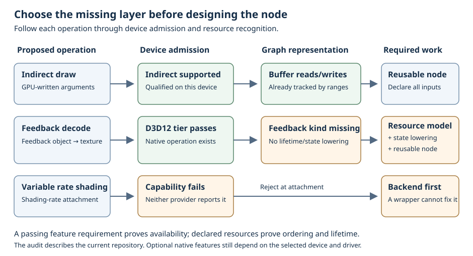

# Native feature coverage in the dependency graph

This audit compares the current D3D12 and Vulkan providers with the public RHI and the graph's declarations, reusable nodes, compiler and executor. It covers the capabilities exposed by this repository, not every feature in the native SDKs. Its purpose is to distinguish features that a node can use from features whose resources and execution the compiler actually understands.

Read [node registration and assembly](node-recipes.html), [resource dependencies](resources.html), and [binding preparation](ArdaInductor-Bindings.md) first. After this chapter, you should be able to decide whether a proposed node needs only a reusable wrapper, a new graph resource/operation declaration, or new backend implementation.

## What counts as graph support

There are four materially different levels of integration:

1. **Automatic declaration:** the node declares logical resources, views, parameters or pipeline stages; the compiler creates the native objects and derives dependencies, lifetimes and transitions.
2. **Reusable operation:** a supplied node or operand implements the operation and exposes its effects to the graph. A recipe in an example is reusable within that example; it is not necessarily part of the public node library.
3. **Callback only:** the operation can be issued through the command list, but the author must declare its resource effects. Commands hidden in a callback are not analyzed by ArdaInductor.
4. **Outside the graph or unsupported:** there is no graph representation for a required object or effect, or the provider cannot execute the operation at all.

Feature admission is a separate axis. Rejecting an unsupported node at attachment is useful, but a successful capability check cannot supply missing resource edges, materialize an unsupported logical object, or turn an opaque callback into a schedulable sequence. A node that uses a supported feature must still expose every resource it can touch.

The source boundary is [the capability model](../../Source/ArdaInfra/ArdaBackend/Public/RHI/ArdaRHICapabilities.h), [the command and device interfaces](../../Source/ArdaInfra/ArdaBackend/Public/RHI/ArdaRHIDevice.h), [graph declarations](../../Source/ArdaInfra/ArdaRenderGraph/Public/ArdaDependencyGraph.h), and [the supplied node library](../../Source/ArdaInfra/ArdaRenderGraph/Public/ArdaDependencyGraphNodes.h). The public capability catalog remains in the [backend API reference](../ArdaBackend/api-reference.html); this chapter describes integration rather than duplicating that catalog.

## Reading the backend results correctly

D3D12 and Vulkan names do not determine the supported feature set. Device initialization qualifies optional features and records the usable result. D3D12 queries native feature tiers and shader models. Vulkan records enabled extensions/features and created queue or descriptor infrastructure, including the enabled features of externally supplied devices. CUDA has its own qualified capability snapshot. A device can support graphics compute while CUDA is unavailable, or support CUDA buffer operations while CUDA surfaces are unavailable.

The implementation evidence is the initialization of capabilities in [D3D12](../../Source/ArdaInfra/ArdaBackendImpls/D3D12/ArdaD3D12Backend.cpp) and [Vulkan](../../Source/ArdaInfra/ArdaBackendImpls/Vulkan/ArdaVulkanBackend.cpp), and the independently defined [CUDA capability snapshot](../../Source/ArdaInfra/ArdaBackend/Public/RHI/ArdaRHICuda.h). The following descriptions are provider conditions, not a claim that every adapter or the reader's current machine satisfies them.

The accompanying admission change repairs two D3D12 reporting gaps identified by this audit: successfully created descriptor heaps now report the descriptor-heap capability, and the existing monotonic per-queue fence/GPU-wait path reports timeline synchronization. Direct resource/sampler indexing still has its separate shader-model qualification. Do not treat descriptor-heap availability as proof of direct indexing, or queue availability as proof of GPU-wait support. Vulkan reports its qualified descriptor-heap and timeline paths independently as well.

## Shader execution and pipelines

**Native compute is automatically integrated, with reusable application nodes and compiled documentation recipes.** Shader metadata supplies fixed layouts and resource bindings. Pipeline requests and stage contributions supply the compute PSO. The executor prepares per-frame bindings and parameters; the operation records its dispatch dimensions. There is no single public generic compute-dispatch node in the default library: applications derive the compute node base and implement their operation. See [the compiled compute recipe](Examples/Nodes/ComputeWriteNode.cpp) and [binding materialization](../../Source/ArdaInfra/ArdaRenderGraph/Private/ArdaInductorBindings.cpp).

**Rasterization is automatically integrated for stages, fixed pipeline state, binding sets and framebuffers.** The compiler recognizes vertex, hull, domain, geometry and pixel contributions and hashes the selected pipeline semantics. An operation still provides vertex/index buffer reads, draw arguments, viewport/scissor and relevant dynamic state. Triangle, terrain, Cornell presentation and the documentation raster recipe are self-contained node implementations, not a public generic draw node. The compiler does not inspect a callback to discover omitted vertex or index inputs. See [pipeline stage inference](../../Source/ArdaInfra/ArdaRenderGraph/Private/ArdaInductorPipeline.cpp), [the raster recipe](Examples/Nodes/RasterTriangleNode.cpp), and [triangle draw](../../Source/ArdaTests/RHITest/Private/Nodes/ArdaTriangleDrawNode.cpp).

The feature-admission change accompanying this audit exposes and checks geometry/tessellation support explicitly, closing the earlier gap where those stages were recognized by pipeline inference but their optional device support was absent from the capability snapshot. Recognizing a stage name remains distinct from successfully admitting its execution on the current device.

**Mesh and amplification shaders use the automatic meshlet pipeline path.** Both providers qualify the mesh tier before admitting meshlet pipelines. Stage inference, framebuffer creation, binding preparation and PSO reuse work through the same declarative system. The operation issues DispatchMesh. The default node library does not contain a generic mesh dispatch operation, and the public command surface has no indirect mesh dispatch. See [the mesh recipe](Examples/Nodes/MeshTriangleNode.cpp) and [pipeline declarations](../../Source/ArdaInfra/ArdaRenderGraph/Public/ArdaInductorPipeline.h).

**Work graphs have an automatic pipeline and execution-context path, but only D3D12 compute nodes are implemented.** D3D12 admits the compute-node tier when its work-graph feature query succeeds. Vulkan leaves the tier at None and uses the unsupported provider path. The RHI submits CPU entry records; graph execution fills the compiled pipeline and global bindings. The operation's internal GPU work-graph topology is opaque to ArdaInductor, so all possible resource effects belong to the containing graph node. Native work-graph mesh nodes, GPU-sourced entry records and a generic reusable work-graph library node are missing. The graph rejects global push-constant values for work graphs; use entry records or declared constant buffers. See [the compiled work-graph recipe](Examples/Nodes/WorkWriteNode.cpp), [execution context](../../Source/ArdaInfra/ArdaRenderGraph/Private/ArdaInductorRuntime.cpp), and [work-graph facade dispatch](../../Source/ArdaInfra/ArdaBackend/Private/RHI/ArdaRHIDevice.cpp).

**Shader bundles are available in both facades but remain callback-only and opaque to the graph.** They are not equivalent to native work graphs. The facade walks retained compute or mesh records, sets each record's pipeline/bindings, supplies its arguments, and dispatches it. There is no graph declaration that derives a bundle's per-record pipeline assignments, accesses or scheduling boundaries. Wrapping a mutable native bundle in one node therefore needs a conservative aggregate access declaration and explicit ownership. A more useful modular form would expand its records into ordinary graph nodes, preserving the option to batch their recording. See CreateShaderBundle, SetShaderBundleRecords and DispatchShaderBundle in [the facade](../../Source/ArdaInfra/ArdaBackend/Private/RHI/ArdaRHIDevice.cpp).

**Shader libraries and persistent native pipeline caches are infrastructure rather than missing execution nodes.** Both providers expose retained shader libraries. Disk cache support depends on successfully creating the provider cache/library. ArdaInductor already caches semantic pipeline patterns and resolves native PSOs; node preparation owns shader setup. Packaging another graph node around a shader-library creation call would not improve GPU scheduling. Shader arithmetic requirements still need explicit admission: wave/subgroup operations, subgroup width, float16, packed int8 and buffer device addresses are device facts, not inferred from shader source by the graph. See [capability reporting](../../Source/ArdaInfra/ArdaBackend/Public/RHI/ArdaRHICapabilities.h) and [pipeline cache inference](../../Source/ArdaInfra/ArdaRenderGraph/Private/ArdaInductorPipeline.cpp).

## Bindings, descriptors and shader tables

**Fixed bindings, bounded bindless tables and descriptor-index parameters are automatically integrated.** The graph creates layouts, descriptor tables and binding sets after resolving logical resources to each compiled frame slot. It uses declared buffer byte intervals and texture mip/slice/plane views for hazards. A descriptor index is only a lookup location: two different indices that refer to overlapping data still conflict. Shader-selected entries must all be declared, and sparse table holes must never be indexed. The graph keeps its prepared tables immutable across execution; backend support for update-after-bind does not imply that undeclared runtime table mutation is safe for graph scheduling. See [binding declarations](../../Source/ArdaInfra/ArdaRenderGraph/Public/ArdaDependencyGraph.h), [materialization](../../Source/ArdaInfra/ArdaRenderGraph/Private/ArdaInductorBindings.cpp), and [the numerical bindless regression](../../Source/ArdaInfra/ArdaRenderGraph/Tests/ArdaInductorGpuTests.cpp).

The bindless declaration passes through the supported layout choices, including unbounded shader declarations backed by finite capacity, variable descriptor counts, update-after-bind, descriptor-buffer selection and direct heap indexing. D3D12 qualifies its descriptor indexing against the provider's heap capacity and shader model; Vulkan qualifies each relevant descriptor-indexing feature and its created descriptor-buffer/heap paths. These are distinct requirements. A direct sampler heap must not be admitted merely because direct resource indexing exists. Absolute index relocation currently requires one descriptor bank in a direct-heap table; arbitrary multi-bank addresses are not generated automatically.

**Resource collections are a remaining modularity gap.** Both facades expose retained indexed collections, with an optional homogeneous direct-indexed descriptor table and mutable replacement. The graph has no collection declaration, collection import, membership version, or automatic expansion from a collection into per-member access ranges. An author can express the same static resource selection with graph bindless entries today. Merely retaining a native collection in node state does not let the compiler see later membership changes. See collection creation and update in [the facade](../../Source/ArdaInfra/ArdaBackend/Private/RHI/ArdaRHIDevice.cpp).

**Ray shader tables are automatically prepared and reused, with a cross-backend local-binding limit.** Ray pipelines may use a generated table when there is a unique ray-generation export, or explicit category-relative dense records. The graph resolves global and fixed local metadata, record exports, local argument bytes and geometry references, then creates/commits the table per frame slot. It validates missing exports, wrong stages, gaps and ambiguous ray-generation selection. Both providers report persistent tables and local payload infrastructure when ray pipelines are enabled. Vulkan's local descriptor implementation specifically requires compatible direct-heap local and global layouts; the graph's automatically generated fixed local binding layout does not provide that path. Raw local argument bytes alone are a different supported case. Automatic declarative ray-local bindless tables and local descriptor-index/address relocations remain missing. See [table preparation](../../Source/ArdaInfra/ArdaRenderGraph/Private/ArdaInductorBindings.cpp), [Vulkan local descriptor validation](../../Source/ArdaInfra/ArdaBackendImpls/Vulkan/ArdaVulkanBackend.cpp), and [table replay/failure tests](../../Source/ArdaInfra/ArdaRenderGraph/Tests/ArdaInductorGpuTests.cpp).

## Ray tracing and acceleration structures

**Ray pipeline dispatch is automatically integrated; inline queries are shader behavior with explicit feature requirements.** Pipeline stages, exports, hit groups, shader tables and global bindings are understood. Cornell supplies a reusable trace node within that example. A compute or graphics shader performing inline traversal can declare the AS input, but ArdaInductor does not inspect shader instructions to discover an inline-ray requirement. D3D12 qualifies inline queries and indirect ray dispatch at its ray-tracing tier 1.1 threshold. Vulkan qualifies acceleration structures, ray pipelines, inline queries and indirect ray dispatch separately. Infrastructure or hardware-ray support alone is insufficient to require all four. See [Cornell trace](../../Source/ArdaTests/Examples/CornellBox/Private/Nodes/ArdaCornellTraceNode.cpp) and the provider capability initialization.

**BLAS/TLAS build, update and compaction are only partially modular.** The graph can import an existing built or unbuilt acceleration structure and track whole-object AS reads/writes, retain its referenced storage, count its allocation, and include declared workspace. Cornell has independent build-BLAS, compact-BLAS and per-frame build-TLAS nodes. However, public graph resource declaration creates only buffers/textures; there is no node-owned logical AS creation API or generic BLAS/TLAS/update/compaction node library. The example creates the native AS objects outside the graph and supplies the operation's build flags and workspace estimate. Generalized build descriptors must expose geometry buffers, instance buffers, referenced BLAS objects, build/update constraints, scratch allocation and compaction-size results instead of hiding them in a native descriptor. See [logical resource declarations](../../Source/ArdaInfra/ArdaRenderGraph/Public/ArdaDependencyGraph.h), [Cornell TLAS build](../../Source/ArdaTests/Examples/CornellBox/Private/Nodes/ArdaCornellBuildTlasNode.cpp), [BLAS compaction](../../Source/ArdaTests/Examples/CornellBox/Private/Nodes/ArdaCornellCompactBlasNode.cpp), and [retained memory accounting](../../Source/ArdaInfra/ArdaBackend/Private/Allocator/ArdaMemoryPlanner.cpp).

The command interface includes building a TLAS from a GPU instance buffer with a CPU-provided count. This is not an indirect TLAS build whose arguments are read by the GPU. Both providers deliberately report indirect top-level build as unsupported because that command path is not exposed by the facade. Do not advertise it by observing only the native driver's abilities.

**Opacity micromaps need new graph resource support as well as reusable operations.** Vulkan reports OMM only when its native micromap path is enabled and implements creation/build/compaction. D3D12 explicitly reports no facade OMM implementation. Although imported acceleration structures retain and account for referenced micromap allocations and buffers, the graph has no micromap handle, import, output declaration, build/compact node, or micromap state lowering. A retained object counted by the memory planner is not a scheduled dependency. OMM build-to-BLAS ordering must not be inferred from that accounting. See [OMM commands and objects](../../Source/ArdaInfra/ArdaBackend/Public/RHI/ArdaRHIDevice.h), [Vulkan implementation](../../Source/ArdaInfra/ArdaBackendImpls/Vulkan/ArdaVulkanBackend.cpp), and [imported AS retention accounting](../../Source/ArdaInfra/ArdaBackend/Private/Allocator/ArdaMemoryPlanner.cpp).

## Transfers, indirect execution and feedback

**Buffer upload, buffer copy, integer buffer clear, readback and explicit joins are supplied reusable graph nodes.** The public library owns upload byte snapshots; buffer-copy declares its output; readback is an observable side effect and obtains its data through frame completion handling. Texture-to-buffer and buffer-to-texture helpers declare the exact copied texel rows and omit untouched row padding. Those texture transfer helpers currently execute on the graphics queue. D3D12 and Vulkan provide the underlying copy and staging paths. See [built-in operations](../../Source/ArdaInfra/ArdaRenderGraph/Private/ArdaDependencyGraphNodes.cpp) and [texture transfer operations](../../Source/ArdaInfra/ArdaRenderGraph/Private/ArdaDependencyGraphTextureTransfer.cpp).

**Texture-to-texture copy, MSAA resolve, texture clears, depth/stencil clears and pitched staging map/unmap lack equivalent public generic nodes.** Ordinary buffer/texture handles and source/destination states are already expressive enough for copy, resolve and clear callbacks, provided the author declares the correct complete ranges. This is primarily a reusable-operation gap. CPU staging objects and mapping lifetimes are outside graph resources and require an execution-completion contract; they should not be hidden inside an apparently pure GPU node. Format, sample-count, copy alignment and subresource legality still require validation beyond a general texture-copy capability flag. See [the public transfer/clear commands](../../Source/ArdaInfra/ArdaBackend/Public/RHI/ArdaRHIDevice.h).

**Indirect draw, indexed draw, compute dispatch and ray dispatch are callback-only.** The RHI exposes each operation, subject to the general indirect-command capability and the separate indirect-ray capability. A graph callback can use an argument buffer declared Read in IndirectArgument state, including its accessed byte range; the compiler then sees the producing compute/copy dependency. It does not derive that read from the command, validate an indirect argument schema at attachment, or know indirect execution as a distinct operation descriptor. There is no supplied generic indirect node. An argument buffer does not reveal all data a GPU-selected draw might access: vertex/index/shader/AS inputs still need explicit declarations. Public indirect mesh dispatch, predication and occlusion-query execution are absent; do not infer them from the general indirect/queries booleans. See [the command interface](../../Source/ArdaInfra/ArdaBackend/Public/RHI/ArdaRHIDevice.h) and [resource states](../../Source/ArdaInfra/ArdaBackend/Public/RHI/ArdaRHITypes.h).

**Sampler feedback is a D3D12 capability with no automatic graph object or operation.** D3D12 qualifies restricted or unrestricted addressing/view tiers and implements feedback creation, clear, decode and feedback-state operations. Vulkan leaves the feedback tier at None. Feedback objects are distinct from ordinary textures in the RHI, while the graph has no feedback handle or binding-argument variant. Consequently a callback cannot make the full feedback write/decode chain visible merely by passing an ordinary texture handle. A modular implementation needs feedback resource declaration and retention, paired sampled-texture/feedback bindings, clear/write/decode access semantics, a decode output texture and tier-specific validation. See [feedback command/resource contracts](../../Source/ArdaInfra/ArdaBackend/Public/RHI/ArdaRHIDevice.h), [the dedicated feedback UAV binding type](../../Source/ArdaInfra/ArdaBackend/Public/RHI/ArdaRHITypes.h), and [D3D12 feedback creation](../../Source/ArdaInfra/ArdaBackendImpls/D3D12/ArdaD3D12Backend.cpp).

## Memory, queues and lifetime infrastructure

**Heap placement and transient reuse span the backend allocator and graph compiler/executor.** Both providers report virtual resources, heaps and aliasing barriers. The backend memory planner queries requirements and chooses compatible storage reuse from graph-supplied lifetimes; ArdaInductor inserts the returned ordering edges and lowers aliasing transitions. The [device-wide GPU allocator](../ArdaBackend/Gpu-Allocator.md) retains compatible native objects across graphs after active references and submissions retire. Explicit placement remains limited to qualified descriptors: CUDA-interoperable, tiled, CPU-visible or multiply-versioned buffers and render-target/depth/MSAA texture cases do not all use that path. Imported and persistent allocations have their own lifetime rules. Expanding alias eligibility needs memory-planner/backend validation. See [placement eligibility and memory planning](../../Source/ArdaInfra/ArdaBackend/Private/Allocator/ArdaMemoryPlanner.cpp) and [physical transition execution](../../Source/ArdaInfra/ArdaRenderGraph/Private/ArdaInductorCommandExecutor.cpp).

**Sparse/reserved resources, tile mappings and streaming reservations are outside the graph.** D3D12 qualifies tiled-resource types from the native tiled-resource tier and offers budget telemetry/reservations when its DXGI adapter interface is available. Vulkan qualifies sparse binding by the enabled resource features and a sparse-capable queue, and budget telemetry by the enabled memory-budget path; budget reservation remains unsupported. The graph has no mapping-operation declaration or resident-page model. Its persistent memory planner explicitly rejects used tiled resources and multiply-versioned buffers, including those presented through existing resource descriptions. Therefore importing a sparse resource is not a supported workaround. A graph VRAM cap is an allocation/schedule budget, not native residency management or eviction. See [sparse commands and budget requests](../../Source/ArdaInfra/ArdaBackend/Public/RHI/ArdaRHIDevice.h) and ValidateRequests in [the memory planner](../../Source/ArdaInfra/ArdaBackend/Private/Allocator/ArdaMemoryPlanner.cpp).

**Queue placement, GPU waits, transitions and ownership are automatically lowered.** Graphics, compute and copy availability and native queue-family identities guide placement. A separate compute/copy queue is not a guarantee of independent hardware execution. D3D12 reports its created compute/copy queues as dedicated; Vulkan records whether families actually differ. The graph derives queue waits from resource and manual edges and uses paired transitions where the backend contract requires ownership transfer. It currently manages buffer state/ownership at whole-buffer granularity, so disjoint byte ranges can still need cross-queue waits. Within one compatible queue/state, disjoint UAV accesses can omit ordering barriers. Textures have per-mip/slice/plane transitions. See [queue capabilities](../../Source/ArdaInfra/ArdaBackend/Public/RHI/ArdaRHICapabilities.h), [range hazards](../../Source/ArdaInfra/ArdaRenderGraph/Private/ArdaDependencyHazards.cpp), and [the executor](../../Source/ArdaInfra/ArdaRenderGraph/Private/ArdaInductorCommandExecutor.cpp).

**Timers, event/fence queries and completion are partly automatic infrastructure.** Graph telemetry brackets node work with supported per-queue timer queries and polls completed results before updating timing estimates. Frame tickets and submission tracking handle execution completion. These are implemented uses of the query/wait capabilities; query support does not mean occlusion queries or predication exist. There is no reusable application query/result node or general logical external-fence input/output declaration. Applications needing such effects must preserve side effects and explicit synchronization and must not issue waits while recording a graph callback. See [timing collection](../../Source/ArdaInfra/ArdaRenderGraph/Private/ArdaInductorTiming.cpp), [frame execution/completion](../../Source/ArdaInfra/ArdaRenderGraph/Private/ArdaInductorRuntime.cpp), and [query methods](../../Source/ArdaInfra/ArdaBackend/Public/RHI/ArdaRHIDevice.h).

**Presentation remains application/adapter infrastructure.** Both providers expose custom presentation; graph examples import the acquired backbuffer, declare their final color work and execute the graph before presentation. The graph can manage that texture's final state and lifetime contract, but it does not acquire a swapchain image or compile a custom-present callback into an operation. This is a deliberate boundary to keep in mind when deciding whether an output node is a side effect. Stream-source output is explicitly unsupported by both provider facades. See the presentation examples and QueryStreamSourceSupport in [the facade](../../Source/ArdaInfra/ArdaBackend/Private/RHI/ArdaRHIDevice.cpp).

**VRS and conservative rasterization are unimplemented provider features, not merely missing node wrappers.** Both independent capability booleans remain false. A shading-rate source state exists and maps to native state names, but there is no public shading-rate attachment/combiner command path to make that a working VRS operation. D3D12 raster pipeline creation explicitly disables conservative rasterization. A graph node that requires either feature must be rejected instead of presenting the existence of a resource-state enum as support. See [capabilities](../../Source/ArdaInfra/ArdaBackend/Public/RHI/ArdaRHICapabilities.h), [D3D12 raster creation](../../Source/ArdaInfra/ArdaBackendImpls/D3D12/ArdaD3D12Backend.cpp) and [Vulkan state mapping](../../Source/ArdaInfra/ArdaBackendImpls/Vulkan/ArdaVulkanBackend.cpp).

## CUDA operands and external functions

**Compiled CUDA operands and registered external calls are integrated through one framework sequence/stream.** Logical buffer/surface parameters produce graph accesses. The compiler coalesces eligible adjacent CUDA nodes, resolves frame resources, supplies sequences and manages graphics/CUDA handoffs. The operand registry handles binary/architecture and kernel selection; external functions use the framework-provided execution context and must accurately declare bindings and temporary storage. A library call being callable from CUDA does not prove it is capture-compatible, uses the correct stream, or exposes all of its dependencies. See [graph CUDA adaptation](../../Source/ArdaInfra/ArdaRenderGraph/Public/ArdaDependencyGraphCuda.h), [operand preparation](../../Source/ArdaInfra/ArdaBackend/Public/Compute/ArdaComputeOperand.h), and [external CUDA calls](../ArdaBackend/CUDA-External-Calls.md).

The independent CUDA snapshot distinguishes D3D12 CiG, Vulkan CiG and the context-switch path, as well as native compute capability, block/grid/shared-memory limits, ordinary surfaces and layered surfaces. Graph resource declarations alone do not select another CUDA context or make surface interop available. A buffer-only operation should not require surfaces; a surface operation must verify the qualified surface path and its format/dimension contract. Explicit texture-to-buffer and buffer-to-texture transfer nodes provide an authored fallback when an operation is rewritten to use buffers; arbitrary surface kernels are not automatically converted into buffer kernels. Multiple CUDA streams remain outside the graph model.

CUDA is farther along in reusable operand packaging than native indirect/AS/feedback operations, but an arbitrary external call is still opaque inside one node. The compiler schedules the declared operation boundary and data effects; it does not optimize internal cuBLAS/cuDNN control flow. Per-operation external library/version/algorithm requirements need the node's environment validation in addition to generic device capabilities.

## Worked decision: turning an existing command into a safe node

Suppose a compute shader writes draw arguments and a later draw consumes them. Both objects are ordinary buffers, so no new resource kind is needed. The producer declares its argument-buffer write. A reusable indirect draw node should declare the exact argument-buffer read in IndirectArgument state, every possible vertex/index/shader input, color/depth outputs and its graphics pipeline request. Its attachment requirements include indirect commands and any shader-specific features. ArdaInductor can then order the write before the draw and prepare its ordinary pipeline/bindings. Adding only DrawIndirect inside Record would leave the critical argument dependency invisible.

Now replace the argument producer with sampler feedback decode. A feedback object is not an ordinary graph texture. Supplying a generic Read/Write texture access cannot encode the feedback object's state and lifetime. First add a feedback logical resource and the required binding/transition lowering; then supply reusable clear and decode operations. Capability admission alone cannot bridge this missing representation.

This distinction gives an implementation order that reduces repeated ad hoc setup:

1. **Complete reusable operations over existing resource kinds:** indirect draw/dispatch/rays, texture copy/resolve/clear and structured AS build/update/compaction wrappers. Derive ordinary accesses automatically from their typed parameters.
2. **Add logical resources and lowering for genuinely new effects:** feedback objects, micromaps, sparse mapping/residency operations and external synchronization. Define their versioning and lifetime contracts before exposing convenience nodes.
3. **Complete collection and table parameter forms:** immutable/versioned collection expansion and ray-local bindless arguments, including the qualified Vulkan direct-heap path. Keep all shader-selectable data ranges visible.
4. **Implement missing backend functionality separately:** VRS, conservative rasterization, indirect TLAS, indirect mesh dispatch, work-graph mesh/GPU-record paths and provider-specific missing features. A wrapper should not advertise functionality absent from the facade.

These are actionable gaps found by the audit, not claims that they have all been implemented in the same change as feature admission.

## Checkpoints and evidence

- A node declares two distinct descriptor indices that cover the same bytes. Does that make its writes independent? No: the graph resolves the views and compares the underlying byte intervals.
- A device reports ray-tracing infrastructure. Can a node require pipeline rays, inline queries, indirect dispatch and OMM together without further checks? No: these are independent qualified abilities.
- Can a generic tile-mapping callback make sparse allocations fit the current graph memory cap? No: the planner rejects tiled storage and has no resident-page or mapping-operation model.
- A backend exposes timer queries. Does the RHI also expose occlusion/predication? No: inspect the actual command interface.
- A requirement passes at attachment. Can the node omit an indirect argument or collection-member resource access? No: admission and dependency declaration solve different problems.

This audit was produced from the public headers, native/facade implementations, graph compiler/executor and example node sources. It does not substitute for executing a capability-specific conformance test on the target driver. Existing evidence includes [backend capability/parity tests](../../Source/ArdaInfra/ArdaBackend/Tests/ArdaExtendedRHIParityTests.cpp), [graph range and producer tests](../../Source/ArdaInfra/ArdaRenderGraph/Tests/ArdaInductorTests.cpp), [bindless and shader-table GPU tests](../../Source/ArdaInfra/ArdaRenderGraph/Tests/ArdaInductorGpuTests.cpp), and [compiled node recipe tests](../../Source/ArdaInfra/ArdaRenderGraph/Tests/ArdaGraphRecipeTests.cpp).

Continue with [ArdaInductor scheduling](ArdaInductor.md), [pipeline inference and reuse](ArdaInductor-Pipelines.md), [the graph API reference](api-reference.html), and [the backend API reference](../ArdaBackend/api-reference.html).
