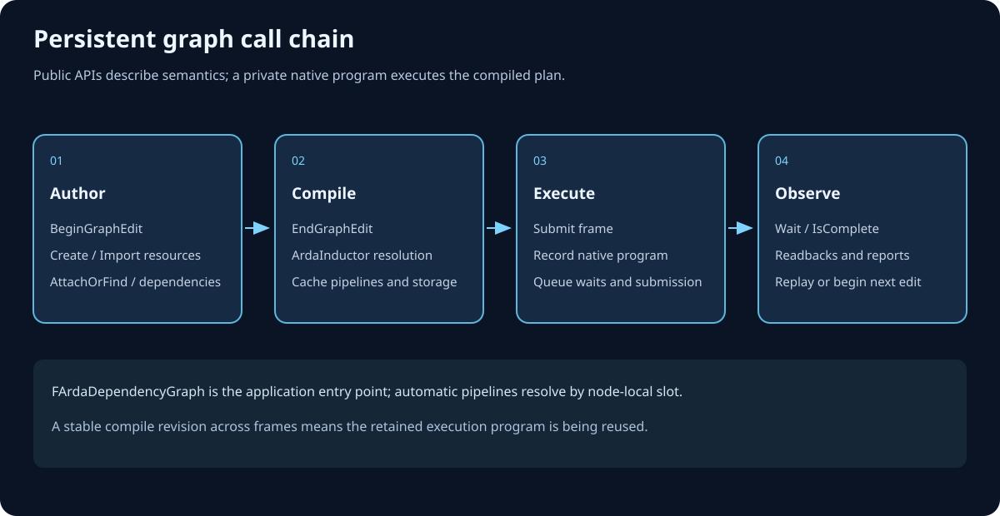

# 1. Getting started: run procedural terrain

[← Documentation home](README.md) · [Next: Core concepts →](02-Core-Concepts.md)

The fastest way to understand ArdaRenderGraph is to run its complete terrain
application and then follow one frame from declarations to GPU submission. The
canonical implementation is:

- graph and NVRHI recording:
  [`ArdaTerrainRenderer.cpp`](../../Source/ArdaTests/ARDGExample/Private/ArdaTerrainRenderer.cpp);
- compute and raster shaders:
  [`ArdaTerrain.hlsl`](../../Source/ArdaTests/ARDGExample/Shaders/ArdaTerrain.hlsl);
- device, window, swap-chain, and application loop:
  [`ArdaARDGExampleMain.cpp`](../../Source/ArdaTests/ARDGExample/ArdaARDGExampleMain.cpp); and
- example target and D3D12/Vulkan smoke tests:
  [`ARDGExample/CMakeLists.txt`](../../Source/ArdaTests/ARDGExample/CMakeLists.txt).

## Build and run

From the repository root:

```powershell
cmake -S . -B build -DARDASHIR_BUILD_ARDG_EXAMPLE=ON
cmake --build build --config Debug --target ARDGExample
ctest --test-dir build -C Debug --output-on-failure
```

Run the executable from its generated configuration directory:

```powershell
ARDGExample --backend d3d12
ARDGExample --backend vulkan
```

The application also accepts `--frames N`, `--hidden`, `--fullscreen`,
`--width N`, and `--height N`; the GPU regression uses one hidden frame.
Fullscreen mode uses a borderless window at the primary monitor's native
resolution. The build compiles DXIL and SPIR-V shader variants and copies them
beside the executable. D3D12 is available on Windows; Vulkan requires a usable
Vulkan backend.

## One frame: the canonical P0–P8 graph


`P8` is appended by `Compile()`. Registration order is the topological order;
the compiler removes `P3` but does not renumber or reorder the remaining
handles. The live execution order is:

```text
[P0, P1, P2, P4, P5, P6, P7, P8]
```

The passes have concrete runtime work:

- `P1` copies from the imported persistent `TerrainSettingsUpload` buffer into
  graph-created `TerrainSettings`.
- `P2` dispatches noise generation on async compute when that queue exists.
- `P3` declares a graphics SRV read but has no output, so backward culling
  removes it.
- `P4` rewrites the same heightmap UAV and requires a UAV barrier.
- `P5` reads the heightmap and writes vertex and index UAVs.
- `P6` clears and draws the indexed terrain to the imported back buffer.
- `P7` draws a blended full-screen overlay to the same attachment.
- `P8` returns the back buffer to `Present`.

The heightmap is `128 × 128`, `R32_FLOAT`, UAV-capable, and has two mips.
Every terrain pass selects only mip 0, so mip 1 remains untouched. The two
raster passes bind the same back-buffer texture and subresources and therefore
form raster group 0.

## What the graph derives

The parameter declarations produce the live data path:


`P3` also has `P2` as a producer. When `P4` rewrites the heightmap, setup adds
the synchronization-only edge `P3 - -> P4` so a live old-value read could not
race the rewrite. Culling follows producer edges, not synchronization edges,
so that hazard does not keep `P3` alive.

With copy and compute queues available, two cross-queue dependencies between
command-recording work passes produce runtime waits:


Unavailable copy or compute queues cause deterministic graphics fallback.
Same-queue pass edges need no explicit queue wait. Imported-resource boundary
metadata can also relate a sentinel to a work pass, but a sentinel has no
producer command-list instance and therefore adds no runtime wait.

The important state sequence is:

```text
TerrainSettingsUpload: CopySource -> CopySource
TerrainSettings: Common -> CopyDest -> NonPixelShaderResource
Heightmap mip 0: Common -> UnorderedAccess
                  -> UnorderedAccess (UAV barrier)
                  -> NonPixelShaderResource
Terrain buffers: Common -> UnorderedAccess -> VertexBuffer / IndexBuffer
BackBuffer: Present -> RenderTarget -> RenderTarget -> Present
```

The `ARDGExample` application exercises these products with real shaders,
binding sets, pipelines, dispatches, copy, draw calls, swap-chain acquisition,
and presentation. Its D3D12 and Vulkan CTest smoke tests run one hidden frame
when the corresponding backend is available.

## Follow the complete implementation call chain

The following source-ordered map expands the frame from public builder calls
through build-time edge discovery, compiler lowering, physical resource
materialization, command recording, queue waits, submission, and extraction.
The dedicated source walkthroughs later in this guide examine each stage in
detail.



## Read the canonical implementation

Start at `FArdaTerrainRenderer::RenderFrame` in
[`ArdaTerrainRenderer.cpp`](../../Source/ArdaTests/ARDGExample/Private/ArdaTerrainRenderer.cpp).
It demonstrates the normal application sequence:

1. acquire a swap-chain framebuffer;
2. construct one `FARDGBuilder`;
3. import persistent and swap-chain resources;
4. create transient resources and logical views;
5. register P1–P7 in producer-before-consumer order;
6. call the swap chain's pre-submit hook;
7. execute the graph; and
8. present.

Resource access must appear in an `ARDG_*` parameter struct. Capturing an NVRHI
handle in a callback does not declare an edge, state, barrier, or lifetime.
During recording, `FARDGPassExecutionContext::GetTexture` and `GetBuffer`
resolve declared logical resources and validate that the pass named them.

`AddDispatchPass` adds `Compute`, invokes the setup callback, and then records
the specified dispatch. Passing `AsyncCompute` requests the compute queue when
capabilities and states permit it.

## Frozen parameters are intentionally safe

Stack parameters may be reused after registration:

```cpp
FGenerateNoiseHeightmapParameters Parameters;
Parameters.mHeightmap = HeightmapUAV;

(void)Graph.AddDispatchPass(
    "GenerateNoiseHeightmap",
    &Parameters,
    FARDGDispatchArguments{16, 16, 1},
    BindGenerateState,
    EARDGPassFlags::AsyncCompute);

Parameters.mHeightmap = nullptr; // The registered copy is unchanged.
```

`AddPass` freezes a copy in graph-owned arena storage. Metadata traversal and
the callback both observe that same immutable declaration.

## The builder's one-way lifecycle


`Execute()` compiles automatically when needed and submits only once. It
completes CPU submission, not GPU execution. Presentation, readback waits, and
frame synchronization remain application responsibilities.

Compilation is device-independent, so topology can be inspected without
executing callbacks:

```cpp
const FARDGCompileResult& Compiled = Graph.Compile();
const eastl::string Description = Graph.DumpGraph();
```

`DumpGraph()` includes pass liveness, pipelines, edges, transitions, lifetimes,
raster groups, and queue dependencies.

---

[← Documentation home](README.md) · [Next: Core concepts →](02-Core-Concepts.md)
