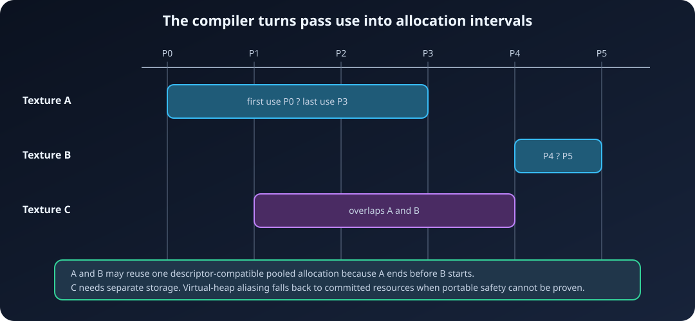

# 3. Resources and parameters: describe every access

[← Core concepts](02-Core-Concepts.md) · [Documentation home](README.md) ·
[Next: Passes and dependencies →](04-Passes-and-Dependencies.md)

In an immediate renderer, a function can receive an `nvrhi::ITexture*` and use
it however it wants. A render graph needs more information before that function
runs: is the texture read or written, which subresources are involved, and
which NVRHI state is required?

ArdaRenderGraph puts those answers in pass parameter structs:

```text
logical resource + view/range + required state
                        |
                        v
               parameter metadata
                        |
             +----------+----------+
             |                     |
       dependency edges      state transitions
```

This chapter builds the resources for the recurring runtime graph and covers
every parameter macro family used to declare them. The complete declarations
are in
[`ArdaTerrainRenderer.cpp`](../../Source/ArdaTests/ARDGExample/Private/ArdaTerrainRenderer.cpp).

## Create descriptions now, physical resources later

`CreateTexture` and `CreateBuffer` register logical records:

```cpp
nvrhi::TextureDesc HeightmapDesc;
HeightmapDesc.setDebugName("Heightmap")
    .setWidth(128)
    .setHeight(128)
    .setMipLevels(2)
    .setFormat(nvrhi::Format::R32_FLOAT)
    .setIsUAV(true);
FARDGTextureRef Heightmap = Graph.CreateTexture(HeightmapDesc);

nvrhi::BufferDesc VertexDesc;
VertexDesc.setDebugName("TerrainVertices")
    .setByteSize(MaxTerrainVertexCount * sizeof(FTerrainVertex))
    .setStructStride(sizeof(FTerrainVertex))
    .setIsVertexBuffer(true)
    .setCanHaveUAVs(true);
FARDGBufferRef TerrainVertices = Graph.CreateBuffer(VertexDesc);

nvrhi::BufferDesc IndexDesc;
IndexDesc.setDebugName("TerrainIndices")
    .setByteSize(MaxTerrainIndexCount * sizeof(uint32_t))
    .setStructStride(sizeof(uint32_t))
    .setIsIndexBuffer(true)
    .setCanHaveUAVs(true);
FARDGBufferRef TerrainIndices = Graph.CreateBuffer(IndexDesc);
```

The calls return pointers to `FARDGTexture` and `FARDGBuffer`, not physical
NVRHI objects. Their descriptors are retained for validation and later
materialization. Graph-created textures require a name and non-zero width,
height, depth, array size, and mip count. Buffers require a name and non-zero
byte size.

Creation accepts `EARDGResourceFlags::None` or `Transient`; `Transient` is the
default. Do not pass `External` or `Extracted` directly. Import and extraction
APIs assign those meanings because they require additional state and ownership
information.

If a graph-created descriptor has `Unknown` initial state, compilation and
execution normalize it to `Common`. The creation path is in
[`ArdaRenderGraphBuilder.cpp`](../../Source/ArdaRenderGraph/Private/ArdaRenderGraphBuilder.cpp),
and the records are in
[`ArdaRenderGraphResources.h`](../../Source/ArdaRenderGraph/Public/ArdaRenderGraphResources.h).

## Views select part of a logical parent

An SRV or UAV declaration is another logical record. It identifies a parent
texture or buffer and narrows how a pass sees it:

```cpp
FARDGTextureViewDesc HeightmapMip0View;
HeightmapMip0View.mTexture = Heightmap->GetHandle();
HeightmapMip0View.mSubresources = nvrhi::TextureSubresourceSet(0, 1, 0, 1);
HeightmapMip0View.mFormat = nvrhi::Format::R32_FLOAT;
FARDGTextureUAVRef HeightmapMip0UAV =
    Graph.CreateTextureUAV("Heightmap mip 0 UAV", HeightmapMip0View);

FARDGBufferViewDesc VertexRangeView;
VertexRangeView.mBuffer = TerrainVertices->GetHandle();
VertexRangeView.mRange =
    nvrhi::BufferRange(0, MaxTerrainVertexCount * sizeof(FTerrainVertex));
FARDGBufferUAVRef TerrainVerticesUAV =
    Graph.CreateBufferUAV("Terrain vertices UAV", VertexRangeView);
```

Texture view descriptors select mip levels, array slices, an optional format,
and an optional dimension. Buffer views select a byte range and optional typed
format. The parent must belong to the same graph, and the view name must be
non-empty.

There are four explicit creators:

- `CreateTextureSRV`;
- `CreateTextureUAV`;
- `CreateBufferSRV`; and
- `CreateBufferUAV`.

Overloaded `CreateSRV` and `CreateUAV` are short aliases.

### A logical view is not a physical child object

The graph stores view metadata and uses its parent/range to discover access:

```text
Texture T0 Heightmap
  +-- View V0: mip 0 UAV
  +-- View V1: mip 0 SRV
```

During a pass, `Context.GetTexture(HeightmapMip0UAV)` returns the parent
`nvrhi::ITexture*`. Likewise, `GetBuffer(TerrainVerticesUAV)` returns the
parent buffer. Use the view's descriptor when constructing the appropriate
NVRHI binding item. The checked getter verifies that the exact logical view
appeared in this pass's frozen parameters.

## Parameter macros generate data and metadata

A parameter struct remains ordinary standard-layout C++ data, but its macros
also generate static metadata:

```cpp
ARDG_BEGIN_PARAMETER_STRUCT(FTriangulateTerrainParameters)
    ARDG_PARAMETER(uint32_t, mGridResolution)
    ARDG_TEXTURE_SRV(mHeightmap)
    ARDG_BUFFER_UAV(mTerrainVertices)
ARDG_END_PARAMETER_STRUCT()
```

The generated struct has a default constructor and public members.
`FTriangulateTerrainParameters::GetStaticMetadata()` describes:

- the struct's name, size, and alignment;
- members in declaration order;
- each member's semantic type, offset, size, and alignment;
- array count and element stride;
- default resource state; and
- nested parameter metadata.

When `AddPass` receives an `FTriangulateTerrainParameters`,
`FARDGSetupContext` enumerates that metadata immediately. Ordinary values are
skipped for dependency
purposes. Null resource references are also skipped. Resource members are
resolved into logical texture/buffer states, views, uniform buffers, and edges.
See the macro implementation in
[`ArdaRenderGraphParameters.h`](../../Source/ArdaRenderGraph/Public/ArdaRenderGraphParameters.h)
and the traversal in
[`ArdaRenderGraphBuilder.cpp`](../../Source/ArdaRenderGraph/Private/ArdaRenderGraphBuilder.cpp).

## Complete parameter macro reference

The generated array members below are `eastl::array`. Metadata enumerates each
element in index order.

### Plain values

```cpp
ARDG_PARAMETER(CppType, MemberName)
ARDG_PARAMETER_ARRAY(CppType, MemberName, Count)
```

These store callback data but contribute no graph access:

```cpp
ARDG_BEGIN_PARAMETER_STRUCT(FTileParameters)
    ARDG_PARAMETER(uint32_t, mTileCount)
    ARDG_PARAMETER_ARRAY(float, mThresholds, 4)
ARDG_END_PARAMETER_STRUCT()
```

### Nested parameter structs

```cpp
ARDG_PARAMETER_STRUCT(StructType, MemberName)
ARDG_PARAMETER_STRUCT_ARRAY(StructType, MemberName, Count)
```

Nested structs are recursively enumerated:

```cpp
ARDG_BEGIN_PARAMETER_STRUCT(FLayerParameters)
    ARDG_TEXTURE(mInput)
    ARDG_PARAMETER(float, mWeight)
ARDG_END_PARAMETER_STRUCT()

ARDG_BEGIN_PARAMETER_STRUCT(FCompositeParameters)
    ARDG_PARAMETER_STRUCT(FLayerParameters, mBase)
    ARDG_PARAMETER_STRUCT_ARRAY(FLayerParameters, mLayers, 2)
ARDG_END_PARAMETER_STRUCT()
```

Metadata paths become `mBase.mInput`, `mLayers[0].mWeight`, and so on.

### Direct whole-resource reads

```cpp
ARDG_TEXTURE(MemberName)
ARDG_TEXTURE_ARRAY(MemberName, Count)
ARDG_BUFFER(MemberName)
ARDG_BUFFER_ARRAY(MemberName, Count)
```

Each member is a direct logical resource reference. The default state is
`ShaderResource`, and the whole texture or buffer is declared.

Use these for simple shader reads where no narrower logical view or dynamic
state is needed.

### Texture and buffer views

```cpp
ARDG_TEXTURE_SRV(MemberName)
ARDG_TEXTURE_SRV_ARRAY(MemberName, Count)
ARDG_TEXTURE_UAV(MemberName)
ARDG_TEXTURE_UAV_ARRAY(MemberName, Count)

ARDG_BUFFER_SRV(MemberName)
ARDG_BUFFER_SRV_ARRAY(MemberName, Count)
ARDG_BUFFER_UAV(MemberName)
ARDG_BUFFER_UAV_ARRAY(MemberName, Count)
```

SRV macros imply `ShaderResource`; UAV macros imply `UnorderedAccess`.
Texture views contribute their selected subresources. Buffer views contribute
their selected byte range.

### Runtime-selected state and range

```cpp
ARDG_TEXTURE_ACCESS(MemberName)
ARDG_TEXTURE_ACCESS_ARRAY(MemberName, Count)
ARDG_BUFFER_ACCESS(MemberName)
ARDG_BUFFER_ACCESS_ARRAY(MemberName, Count)
```

These store `FARDGTextureAccess` or `FARDGBufferAccess`. Use them when the
required state or selected range is decided while building:

```cpp
ARDG_BEGIN_PARAMETER_STRUCT(FCopyMipParameters)
    ARDG_TEXTURE_ACCESS(mSource)
    ARDG_TEXTURE_ACCESS(mDestination)
ARDG_END_PARAMETER_STRUCT()

FCopyMipParameters Copy;
Copy.mSource = {
    Source,
    nvrhi::ResourceStates::CopySource,
    nvrhi::TextureSubresourceSet(0, 1, 0, 1)
};
Copy.mDestination = {
    Destination,
    nvrhi::ResourceStates::CopyDest,
    nvrhi::TextureSubresourceSet(1, 1, 0, 1)
};
```

The state must not be `Unknown`. The same pattern works with
`nvrhi::BufferRange` for buffer accesses.

### Uniform buffers

```cpp
ARDG_UNIFORM_BUFFER(MemberName)
ARDG_UNIFORM_BUFFER_ARRAY(MemberName, Count)
```

These store `FARDGUniformBufferRef` and declare `ConstantBuffer` use:

```cpp
ARDG_BEGIN_PARAMETER_STRUCT(FViewConstants)
    ARDG_PARAMETER(float, mCameraNear)
    ARDG_PARAMETER(float, mCameraFar)
    ARDG_PARAMETER_ARRAY(float, mPadding, 2)
ARDG_END_PARAMETER_STRUCT()

ARDG_BEGIN_PARAMETER_STRUCT(FTerrainShadingParameters)
    ARDG_UNIFORM_BUFFER(mViewConstants)
    ARDG_BUFFER_ACCESS(mTerrainVertices)
ARDG_END_PARAMETER_STRUCT()

FViewConstants Constants;
Constants.mCameraNear = 0.1f;
Constants.mCameraFar = 10000.0f;
FARDGUniformBufferRef ViewConstants =
    Graph.CreateUniformBuffer("Terrain view constants", &Constants);

FTerrainShadingParameters Shading;
Shading.mViewConstants = ViewConstants;
Shading.mTerrainVertices = {
    TerrainVertices,
    nvrhi::ResourceStates::VertexBuffer,
    nvrhi::EntireBuffer
};
```

`CreateUniformBuffer` freezes the complete parameter object. At execution it
creates a dedicated NVRHI constant buffer and writes those bytes on the
graphics queue. The upload command list transitions buffers to
`ConstantBuffer`. Before a compute or copy queue submits its first graph pass,
that queue waits for the upload instance.

Uniform-buffer metadata is also recursively traversed when a pass references
the uniform buffer. Therefore a resource member nested in uniform-buffer
contents contributes dependencies and states to that pass. Remember that the
complete parameter object is uploaded byte-for-byte; design shader-facing
layout and padding deliberately.

This view-constant example is separate from the runtime
`UploadTerrainSettings` pass. That pass imports the persistent
`TerrainSettingsUpload` buffer in `CopySource` and copy-writes the
graph-created `TerrainSettings` buffer in `CopyDest`. Graph uniform buffers use
the executor's dedicated graphics upload path described above.

The public creation template is in
[`ArdaRenderGraphBuilder.h`](../../Source/ArdaRenderGraph/Public/ArdaRenderGraphBuilder.h);
creation and upload are implemented in
[`ArdaRenderGraphBuilder.cpp`](../../Source/ArdaRenderGraph/Private/ArdaRenderGraphBuilder.cpp)
and
[`ArdaRenderGraphExecutor.cpp`](../../Source/ArdaRenderGraph/Private/ArdaRenderGraphExecutor.cpp).

### Raster attachment slots

```cpp
ARDG_RENDER_TARGET_BINDING_SLOTS(MemberName)
```

This macro stores `FARDGRenderTargetBindingSlots`. There is no array variant:
the object already contains
`eastl::array<FARDGRenderTargetBinding, nvrhi::c_MaxRenderTargets> mColor`
and one `mDepthStencil` binding.

```cpp
ARDG_BEGIN_PARAMETER_STRUCT(FRenderTerrainParameters)
    ARDG_RENDER_TARGET_BINDING_SLOTS(mTargets)
ARDG_END_PARAMETER_STRUCT()

FRenderTerrainParameters RenderTerrain;
RenderTerrain.mTargets.mColor[0] = {
    BackBuffer,
    nvrhi::AllSubresources
};
```

Color bindings imply `RenderTarget`; depth/stencil implies `DepthWrite`.
Subresource selections contribute dependency and state information, and the
logical attachment signature contributes raster-group metadata.

The declaration does not create or bind an NVRHI framebuffer. The callback
still supplies a compatible framebuffer and graphics state.

## Metadata can support tools, too

`GetStaticMetadata()` is public. `FindMember("mName")` looks up a direct
member. `Enumerate(&Parameters, Visitor)` visits leaf values in declaration
order. Passing `true` as its third argument also reports nested struct
containers before their children.

Each `FARDGParameter` provides:

- `mMember`, the static declaration;
- `mValue`, the resolved address;
- `mPath`, including dotted names and array indices;
- `mArrayIndex`; and
- `GetValue<T>()`.

The tests assert paths such as `mInner.mTexture` and
`mLayers[1].mScale` in
[`ArdaGraphTests.cpp`](../../Source/ArdaRenderGraph/Tests/ArdaGraphTests.cpp).

## Which states mean write?

Edge discovery classifies an access as a write if its NVRHI state contains:

- `UnorderedAccess`;
- `RenderTarget`;
- `DepthWrite`;
- `CopyDest`;
- `ResolveDest`;
- `AccelStructWrite`;
- `OpacityMicromapWrite`; or
- `ConvertCoopVecMatrixOutput`.

Other legal states are reads. Multiple read states for one resource in one pass
can be merged. A write state cannot be combined with another incompatible state
for the same resource in that pass.

Textures track compile-time state and produced-before-read status per mip and
array slice. Dependency history itself is attached to the whole logical
texture. Buffers validate declared ranges, but dependency history, transition
state, and produced-before-read status are whole-buffer. Two disjoint UAV
writes to one logical buffer therefore still serialize and can require a
whole-buffer UAV barrier.

The state classification and setup walk are in
[`ArdaRenderGraphBuilder.cpp`](../../Source/ArdaRenderGraph/Private/ArdaRenderGraphBuilder.cpp);
state merging and transitions are in
[`ArdaRenderGraphCompiler.cpp`](../../Source/ArdaRenderGraph/Private/ArdaRenderGraphCompiler.cpp).

## Import caller-owned resources

The swap-chain image exists before the graph, so import it with a known state:

```cpp
FARDGTextureRef BackBuffer = Graph.RegisterExternalTexture(
    SwapChainTexture,
    nvrhi::ResourceStates::Present,
    "BackBuffer");
```

The equivalent buffer API is `RegisterExternalBuffer`. Overloads without an
explicit state use the NVRHI descriptor's `initialState`, but still reject
`Unknown`.

Import creates one logical wrapper around the supplied physical handle:

```text
GraphPrologue --initial producer--> BackBuffer logical record
                                      |
                                      +--> existing nvrhi::ITexture
```

Imported resources:

- carry `External`, not `Transient`;
- start with `GraphPrologue` as their latest producer;
- use the imported state as initial and default final state;
- keep their last write observable through `GraphEpilogue`; and
- return to their final state in the epilogue.

Importing the same physical handle twice in one builder returns the existing
logical record when initial states agree. Conflicting states are rejected.

## Extract graph-created resources

Extraction is the opposite boundary operation. It asks execution to expose a
graph-created physical handle:

```cpp
nvrhi::TextureHandle HistoryForNextFrame;
Graph.QueueTextureExtraction(
    History,
    HistoryForNextFrame,
    nvrhi::ResourceStates::ShaderResource);
```

Extraction:

1. adds the `Extracted` flag;
2. makes the resource ineligible for transient reuse;
3. connects its last producer to the epilogue;
4. extends its live interval through the epilogue;
5. requests a non-`Unknown` final state; and
6. writes the physical handle to caller-owned output storage after all graph
   command lists have been submitted.

Each logical resource can be extracted once, and one output address cannot
receive two extractions. A graph-created extracted resource must have a
producer by compilation time. Extraction does not wait for GPU completion.

## Lifetimes connect logical and physical resources



After culling, compilation assigns every live texture and buffer an inclusive
first/last execution-order interval:

```text
execution index:  0          1         2         3        4           5       6        7
                  P0         P1        P2        P4       P5          P6      P7       P8
                  Prologue   Upload    Generate  Erode    Triangulate Render  Overlay  Epilogue
TerrainSettingsUpload       [----------------------------------------------------------]
TerrainSettings            [---------------]
Heightmap                            [------------------]
TerrainVertices                                      [---------------]
TerrainIndices                                       [---------------]
BackBuffer                                                    [------------------------]
```

`DebugHeightmap` P3 is absent because culling rebuilds use intervals from live
passes only. The inclusive intervals are `TerrainSettingsUpload [1,7]`,
`TerrainSettings [1,2]`, `Heightmap [2,4]`, both terrain buffers `[4,5]`,
and `BackBuffer [5,7]`.

External and extracted resources extend through the epilogue. A resource is a
transient candidate only when it has `Transient` and is neither external nor
extracted.

During one `Execute()`, descriptor-compatible transient logical resources can
reuse a committed physical object when their intervals do not overlap
(`previous.last < next.first`) and all uses are in one queue reuse domain.
Cross-queue and non-transient resources do not reuse through this pool.

True placed-resource aliasing is currently disabled: NVRHI does not provide the
portable aliasing barrier and heap-compatibility information needed to make it
safe across supported backends. The allocator can calculate an ideal interval
layout, but execution uses committed-resource fallback. Consequently transient
candidates can set `mbUsedTransientFallback`, while
`mbUsedVirtualHeaps` and `mbUsedTransientAliasing` currently remain false.

Chapter 10 follows this path in detail. The source is
[`ArdaRenderGraphExecutor.cpp`](../../Source/ArdaRenderGraph/Private/ArdaRenderGraphExecutor.cpp).

---

[← Core concepts](02-Core-Concepts.md) · [Documentation home](README.md) ·
[Next: Passes and dependencies →](04-Passes-and-Dependencies.md)
