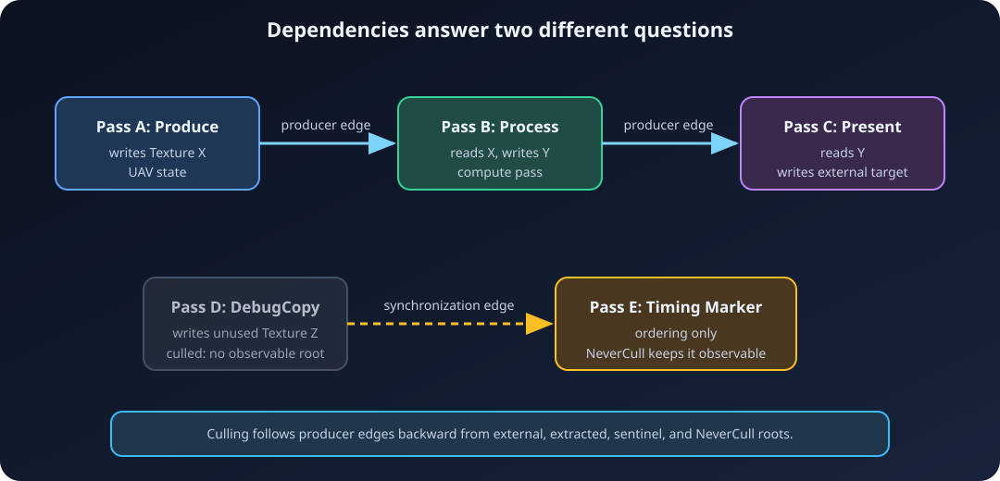

# 4. Passes and dependencies

[← Resources and parameters](03-Resources-and-Parameters.md) ·
[Documentation home](README.md) · [Next: Compilation →](05-Compilation.md)

## How automatic edges are built

Parameter metadata is traversed immediately when `AddPass` registers a pass.
For each logical texture or buffer:

1. Every read or write depends on the most recent writer.
2. A read is remembered as a reader since that writer.
3. A later write receives synchronization-only edges from those readers, then
   replaces the latest writer and clears the reader list.

The first rule is a **producer edge**: it controls ordering and culling
reachability. The third is a **synchronization edge**: it prevents a write from
overtaking earlier reads, but does not keep otherwise dead readers alive.



Texture dependencies are subresource-aware for validation and transitions, but
the latest-producer/readers bookkeeping is attached to the logical texture as a
whole. Buffer dependency tracking is also whole-buffer even when access ranges
are narrower.

## Manual dependencies

Use `AddDependency(Producer, Consumer)` for ordering that resource declarations
cannot express:

```cpp
FARDGPassHandle UploadMetadata = Graph.AddPass(
    "Upload metadata",
    EARDGPassFlags::None,
    [] {});

FARDGPassHandle BuildCommands = Graph.AddPass(
    "Build commands",
    EARDGPassFlags::Compute | EARDGPassFlags::NeverCull,
    [] {});

Graph.AddDependency(UploadMetadata, BuildCommands);
```

Manual dependencies are producer/culling edges. Both passes must already be
registered, must be distinct, and the producer must have a lower handle
(earlier registration) than the consumer.

## Culling

Normal compilation starts with all non-sentinel passes marked culled, then walks
producer edges backward from:

- the epilogue, which depends on the last writer of every external or extracted
  resource; and
- every `NeverCull` pass.

Anything not reached is omitted from `mExecutionOrder`. Consequences:

- Writing a graph-created resource that is never consumed or extracted is dead.
- A read-only pass with no live consumer is dead, even if it reads an external
  resource.
- Writing an imported swap-chain image is observable and stays live.
- A side-effecting callback invisible to resource declarations must use
  `NeverCull` or feed a manually connected live pass.
- Synchronization-only edges do not rescue dead work.

Immediate mode disables culling and keeps every registered pass.

## Compute-to-graphics example

The following declarations establish a compute UAV write followed by a raster
shader read and color-target write:

```cpp
ARDG_BEGIN_PARAMETER_STRUCT(FGenerateParameters)
    ARDG_TEXTURE_UAV(mGenerated)
ARDG_END_PARAMETER_STRUCT()

ARDG_BEGIN_PARAMETER_STRUCT(FDrawParameters)
    ARDG_TEXTURE_SRV(mGenerated)
    ARDG_RENDER_TARGET_BINDING_SLOTS(mTargets)
ARDG_END_PARAMETER_STRUCT()

FARDGTextureUAVRef GeneratedUAV =
    Graph.CreateUAV("Generated UAV", { Generated->GetHandle() });
FARDGTextureSRVRef GeneratedSRV =
    Graph.CreateSRV("Generated SRV", { Generated->GetHandle() });

FGenerateParameters Generate;
Generate.mGenerated = GeneratedUAV;
(void)Graph.AddDispatchPass(
    "Generate texture",
    &Generate,
    FARDGDispatchArguments{32, 32, 1},
    [ComputeState](FARDGPassExecutionContext& Context,
                   const FGenerateParameters& Frozen)
    {
        // Build binding items with Context.GetTexture(Frozen.mGenerated).
        Context.mCommandList.setComputeState(ComputeState);
    });

FDrawParameters Draw;
Draw.mGenerated = GeneratedSRV;
Draw.mTargets.mColor[0] = { ColorTarget, nvrhi::AllSubresources };
(void)Graph.AddPass(
    "Draw generated texture",
    &Draw,
    EARDGPassFlags::Raster,
    [GraphicsState](FARDGPassExecutionContext& Context,
                    const FDrawParameters& Frozen) mutable
    {
        (void)Context.GetTexture(Frozen.mGenerated);
        (void)Context.GetTexture(Frozen.mTargets.mColor[0].mTexture);
        Context.mCommandList.setGraphicsState(GraphicsState);
        Context.mCommandList.draw(
            nvrhi::DrawArguments().setVertexCount(3));
    });
```

`ComputeState` and `GraphicsState` stand for ordinary, valid NVRHI state objects
prepared by the renderer. In real code their binding sets/framebuffer must
refer to the physical resources resolved for this graph. The declarations
derive:

- generate → draw producer ordering;
- `Common` → `UnorderedAccess` → shader-resource transitions;
- a UAV ordering barrier where equal UAV states repeat; and
- render-target transition and observability when `ColorTarget` is external or
  extracted.

## External swap-chain raster pass

This pattern mirrors the project's NVRHI triangle integration. It assumes the
swap chain has returned an `nvrhi::FramebufferHandle`, and the graphics pipeline
is already compatible with it:

```cpp
ARDG_BEGIN_PARAMETER_STRUCT(FPresentParameters)
    ARDG_BUFFER_ACCESS(mVertexBuffer)
    ARDG_BUFFER_ACCESS(mIndexBuffer)
    ARDG_RENDER_TARGET_BINDING_SLOTS(mTargets)
ARDG_END_PARAMETER_STRUCT()

const nvrhi::FramebufferAttachment Attachment =
    Framebuffer->getDesc().colorAttachments[0];

FARDGTextureRef BackBuffer = Graph.RegisterExternalTexture(
    Attachment.texture,
    nvrhi::ResourceStates::Present,
    "Swap-chain color");
FARDGBufferRef Vertices = Graph.RegisterExternalBuffer(
    VertexBuffer,
    nvrhi::ResourceStates::VertexBuffer,
    "Vertices");
FARDGBufferRef Indices = Graph.RegisterExternalBuffer(
    IndexBuffer,
    nvrhi::ResourceStates::IndexBuffer,
    "Indices");

FPresentParameters Parameters;
Parameters.mVertexBuffer = {
    Vertices, nvrhi::ResourceStates::VertexBuffer, nvrhi::EntireBuffer };
Parameters.mIndexBuffer = {
    Indices, nvrhi::ResourceStates::IndexBuffer, nvrhi::EntireBuffer };
Parameters.mTargets.mColor[0] = {
    BackBuffer, Attachment.subresources };

(void)Graph.AddPass(
    "Render to swap chain",
    &Parameters,
    EARDGPassFlags::Raster,
    [Framebuffer, Pipeline](FARDGPassExecutionContext& Context,
                            const FPresentParameters& Frozen)
    {
        (void)Context.GetTexture(Frozen.mTargets.mColor[0].mTexture);

        nvrhi::GraphicsState State;
        State.setPipeline(Pipeline)
            .setFramebuffer(Framebuffer)
            .addVertexBuffer(
                nvrhi::VertexBufferBinding()
                    .setBuffer(Context.GetBuffer(
                        Frozen.mVertexBuffer.mBuffer)))
            .setIndexBuffer(
                nvrhi::IndexBufferBinding()
                    .setBuffer(Context.GetBuffer(
                        Frozen.mIndexBuffer.mBuffer))
                    .setFormat(nvrhi::Format::R16_UINT));

        Context.mCommandList.setGraphicsState(State);
        Context.mCommandList.drawIndexed(
            nvrhi::DrawArguments().setVertexCount(3));
    });

(void)Graph.Execute();
```

The imported back buffer starts in `Present`, transitions to `RenderTarget`,
and returns to `Present` in the epilogue. Its write roots the raster pass.
Acquire the framebuffer before building, call the swap chain's pre-submit hook
before graph submission if its API requires one, and present afterward.

The graph validates the declared logical attachment, but the independently
captured framebuffer is still an external NVRHI object. The application remains
responsible for ensuring they describe the same image/subresources.

## Raster bindings and groups

Consecutive, live graphics `Raster` passes with identical logical color/depth
attachment handles and subresources receive the same raster-group index.
Changing attachments or inserting a non-raster pass starts a new group.
`SkipRenderPass` excludes a pass from grouping.

Current execution records one command list per pass and does not automatically
create framebuffers, begin/end NVRHI render passes, or merge grouped passes.
Raster groups are compile metadata for diagnostics/future scheduling.

## `NeverParallel`

Dependency-independent passes at the same recording level can be recorded on
different CPU threads. Mark a callback `NeverParallel` if it touches shared CPU
state, a non-thread-safe allocator/cache, or an external API that requires
serialization. This affects CPU command-list recording, not GPU queue
selection.

---

[← Resources and parameters](03-Resources-and-Parameters.md) ·
[Documentation home](README.md) · [Next: Compilation →](05-Compilation.md)
