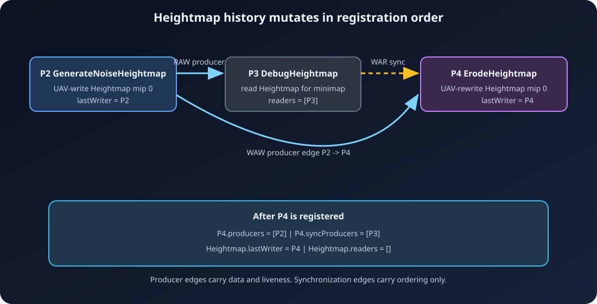

# 4. Passes and dependencies: edges appear while you build

[← Resources and parameters](03-Resources-and-Parameters.md) ·
[Documentation home](README.md) · [Next: Compilation →](05-Compilation.md)

A graph edge means one pass must happen before another. ArdaRenderGraph does not
ask callers to spell out most edges. It derives them while `AddPass` walks the
frozen parameter object.

The recurring live path is:


The terrain settings, heightmap, mesh buffers, and imported back buffer form the
live producer chain. `DebugHeightmap` is an intentionally unused
terrain-debug/minimap read. Its synchronization-only edge prevents a live old
heightmap read from racing the later erosion rewrite, but does not keep that
debug pass alive.

## Two edge kinds solve two different problems

ArdaRenderGraph stores:

1. **producer edges** — data-flow dependencies used for ordering *and* backward
   culling reachability;
2. **synchronization edges** — ordering-only dependencies used for recording
   levels and cross-queue waits, but ignored by culling.

Why split them? Consider an old value that a pass reads before a later pass
overwrites it:


The write must not overtake the read. But if no observable result needs the
reader, that ordering requirement should not make the reader live. A
synchronization edge preserves the hazard only when both endpoints survive for
other reasons.

The edge vectors are part of `FARDGPassState` in
[`ArdaRenderGraphPass.h`](../../Source/ArdaRenderGraph/Public/ArdaRenderGraphPass.h).

## The resource carries just enough build history

Every logical texture and buffer stores:

```text
lastProducer = latest pass that wrote it
readers      = passes that read it since lastProducer
```

When a pass declares access, the builder applies this logic:


This is implemented directly by `FARDGSetupContext::AddTexture` and
`AddBuffer` in
[`ArdaRenderGraphBuilder.cpp`](../../Source/ArdaRenderGraph/Private/ArdaRenderGraphBuilder.cpp).
The resource-side `mLastProducer` and `mReaders` fields are in
[`ArdaRenderGraphResources.h`](../../Source/ArdaRenderGraph/Public/ArdaRenderGraphResources.h).

The history is whole-resource. Texture state validation and transitions know
about mip/slice selections, and buffer declarations validate byte ranges, but
edge discovery uses one last-writer/readers history per logical texture or
buffer.



## RAW, WAW, and WAR one step at a time

These names describe access order to one resource: R is read, W is write.

### Read after write (RAW)


`P3` needs data produced by `P2`. The producer edge orders them, but because
culling walks backward from live consumers, that edge alone does not make the
otherwise unobservable debug pass a root.

### Write after write (WAW)


The later write depends on the earlier writer. This serializes writes and
preserves the declared version chain. Repeated UAV state can additionally
produce a UAV ordering barrier during compilation.

### Write after read (WAR)

Use the heightmap version produced by `P2`:


The producer edge from `P2` identifies the version both passes started from.
The synchronization edge stops `P4` from destroying that version before `P3`
reads it. Culling does not walk from `P4` to `P3`; because `P3` has no live
data-flow contribution, it disappears.

An imported resource starts with `GraphPrologue` as `P0`. A graph-created
resource cannot be read before a pass produces the relevant content;
compilation validation rejects that case.

## A complete CPU-only dependency example

This function builds, compiles, and dumps a two-pass live chain plus one dead
pass. It needs no device because callbacks are never executed:

```cpp
#include "ArdaRenderGraph.h"

using namespace arda::render_graph;

ARDG_BEGIN_PARAMETER_STRUCT(FWriteBufferParameters)
    ARDG_BUFFER_ACCESS(mOutput)
ARDG_END_PARAMETER_STRUCT()

ARDG_BEGIN_PARAMETER_STRUCT(FReadWriteBufferParameters)
    ARDG_BUFFER_ACCESS(mInput)
    ARDG_BUFFER_ACCESS(mOutput)
ARDG_END_PARAMETER_STRUCT()

ARDG_BEGIN_PARAMETER_STRUCT(FReadBufferParameters)
    ARDG_BUFFER_ACCESS(mInput)
ARDG_END_PARAMETER_STRUCT()

eastl::string BuildDependencyExample()
{
    FARDGBuilder Graph;

    nvrhi::BufferDesc Desc;
    Desc.setDebugName("Height samples")
        .setByteSize(1024)
        .setCanHaveUAVs(true);
    FARDGBufferRef HeightSamples = Graph.CreateBuffer(Desc);

    Desc.setDebugName("Terrain mesh data");
    FARDGBufferRef TerrainMesh = Graph.CreateBuffer(Desc);

    FWriteBufferParameters Generate;
    Generate.mOutput = {
        HeightSamples,
        nvrhi::ResourceStates::UnorderedAccess,
        nvrhi::EntireBuffer
    };
    const FARDGPassHandle GeneratePass = Graph.AddPass(
        "GenerateNoiseHeightmap",
        &Generate,
        EARDGPassFlags::Compute,
        [] {});

    FReadWriteBufferParameters Triangulate;
    Triangulate.mInput = {
        HeightSamples,
        nvrhi::ResourceStates::ShaderResource,
        nvrhi::EntireBuffer
    };
    Triangulate.mOutput = {
        TerrainMesh,
        nvrhi::ResourceStates::UnorderedAccess,
        nvrhi::EntireBuffer
    };
    const FARDGPassHandle TriangulatePass = Graph.AddPass(
        "TriangulateTerrain",
        &Triangulate,
        EARDGPassFlags::Compute,
        [] {});

    FReadBufferParameters Unused;
    Unused.mInput = {
        HeightSamples,
        nvrhi::ResourceStates::ShaderResource,
        nvrhi::EntireBuffer
    };
    const FARDGPassHandle UnusedPass = Graph.AddPass(
        "DebugHeightmap",
        &Unused,
        EARDGPassFlags::None,
        [] {});

    nvrhi::BufferHandle Extracted;
    Graph.QueueBufferExtraction(
        TerrainMesh,
        Extracted,
        nvrhi::ResourceStates::CopySource);

    (void)Graph.Compile();

    const FARDGPass* GenerateRecord = Graph.TryGetPass(GeneratePass);
    const FARDGPass* TriangulateRecord =
        Graph.TryGetPass(TriangulatePass);
    const FARDGPass* UnusedRecord = Graph.TryGetPass(UnusedPass);
    (void)GenerateRecord;     // live
    (void)TriangulateRecord;  // live
    (void)UnusedRecord;       // culled

    return Graph.DumpGraph();
}
```

The edge state after registration is:


The extraction of `TerrainMesh` causes compilation to connect
`TriangulateTerrain` to the epilogue. Backward traversal then reaches
`GenerateNoiseHeightmap`. `DebugHeightmap` remains unreached and is omitted
from `mExecutionOrder`. This behavior is exercised in
[`ArdaGraphTests.cpp`](../../Source/ArdaRenderGraph/Tests/ArdaGraphTests.cpp).

## Registration order is already topological order

The API has a strict forward-building model:


Compilation does not run Kahn's algorithm or a DFS topological sort. It builds
reverse consumer vectors and validates that every producer index is lower than
its consumer index. After culling, execution order is registry order with dead
passes removed.

This has useful consequences:

- output is deterministic;
- cycles cannot be introduced through legal forward edges;
- dependency levels can be calculated in one forward pass; and
- resource setup can derive edges immediately from the current last writer.

It also places responsibility on the caller: register passes in dependency
order.

## Manual dependencies represent non-resource causality

Use `AddDependency(Producer, Consumer)` when resource parameters cannot express
the ordering:

```cpp
const FARDGPassHandle UploadMetadata = Graph.AddPass(
    "Upload metadata",
    EARDGPassFlags::None,
    [] {});

const FARDGPassHandle BuildCommands = Graph.AddPass(
    "Build commands",
    EARDGPassFlags::Compute | EARDGPassFlags::NeverCull,
    [] {});

Graph.AddDependency(UploadMetadata, BuildCommands);
```

A manual dependency is a producer edge, so backward culling from
`BuildCommands` also keeps `UploadMetadata`. Both passes must already be
registered, handles must be valid and distinct, and the producer must have a
lower registry index.

Do not use manual edges to hide missing resource declarations. They order
callbacks but do not contribute resource states, transitions, lifetimes, or
checked physical access.

## Culling starts at observable roots and walks backward


Normal compilation initially marks every non-sentinel pass as culled. It seeds
a worklist with:

- `GraphEpilogue`; and
- every pass carrying `NeverCull`.

Compilation has already connected the epilogue to the last writer of every
external or extracted resource. The worklist follows **producer edges only**:

```text
roots: {Epilogue, each NeverCull pass}

while roots/worklist is not empty:
    pass = pop()
    mark pass live
    push each still-culled producer
```

Then the compiler scans the append-only pass registry and copies live handles
to `mExecutionOrder`. That scan is why registration order remains execution
order. The exact implementation is
[`CullPasses`](../../Source/ArdaRenderGraph/Private/ArdaRenderGraphCompiler.cpp).

### What survives?


- A write to an unconsumed graph-created resource is dead.
- A read-only terrain-debug/minimap pass with no live consumer is dead, even
  when a later live rewrite has a synchronization-only dependency on it.
- The last writer of an imported swap-chain image is observable and stays
  live.
- A callback with a side effect invisible to resource declarations needs
  `NeverCull` or a manual producer edge into a live pass.
- Synchronization edges alone never rescue dead work.
- Immediate debug mode bypasses this algorithm and keeps every pass.

## Terrain compute-to-raster data flow

The full runtime declaration connects copy, asynchronous compute, and graphics:


The exact parameter structs, binding sets, dispatch setup, and draw recording
are canonical in
[`ArdaTerrainRenderer.cpp`](../../Source/ArdaTests/ARDGExample/Private/ArdaTerrainRenderer.cpp);
the matching shader resources and entry points are in
[`ArdaTerrain.hlsl`](../../Source/ArdaTests/ARDGExample/Shaders/ArdaTerrain.hlsl).
This avoids a second implementation drifting from the runnable example while
the generic snippets above continue to teach dependency APIs.

## An external swap-chain write is a natural root

`RenderTerrain` imports the acquired back buffer in the `Present` state,
declares it in `ARDG_RENDER_TARGET_BINDING_SLOTS`, and captures the matching
NVRHI framebuffer for the actual draw. The graph then sees:


The write is observable because external resources are wired to the epilogue.
Compilation derives `Present -> RenderTarget -> Present`. The application still
owns acquire, any swap-chain pre-submit hook, presentation, and the invariant
that the captured framebuffer refers to the same image/subresources as the
declared logical attachment.

The repository's full terrain rendering pattern is in
[`ArdaTerrainRenderer.cpp`](../../Source/ArdaTests/ARDGExample/Private/ArdaTerrainRenderer.cpp).

## Raster groups and CPU recording are separate concerns

Consecutive live graphics `Raster` passes with identical logical color/depth
attachment handles and subresources receive the same raster-group index.
Changing attachments or inserting a non-raster pass starts another group.
`SkipRenderPass` opts a raster pass out.

Raster groups are currently compile metadata. Execution still records one
command list per pass; it does not create framebuffers, begin/end NVRHI render
passes, or merge grouped callbacks.

Independent passes at the same dependency level may be recorded on separate
CPU threads. `NeverParallel` puts one callback on the serial recording path
when it touches non-thread-safe CPU state. It does not affect culling or select
a GPU queue.

---

[← Resources and parameters](03-Resources-and-Parameters.md) ·
[Documentation home](README.md) · [Next: Compilation →](05-Compilation.md)
