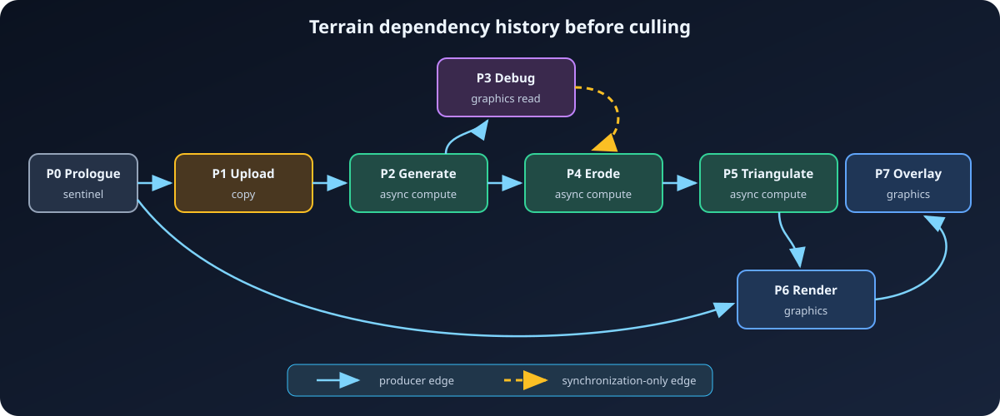
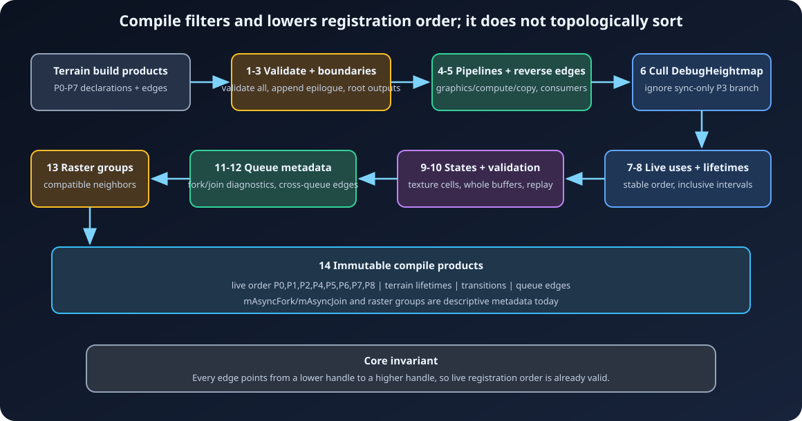
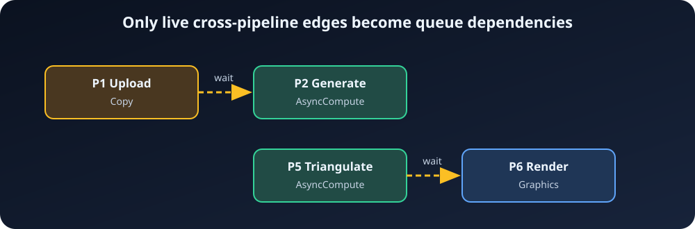

# 5. Compilation

[← Passes and dependencies](04-Passes-and-Dependencies.md) ·
[Documentation home](README.md) ·
[Next: Execution and queues →](06-Execution-and-Queues.md)

Building records what each pass says it will do. Compilation turns those
declarations into a live, queue-aware, barrier-ready graph. It is
device-independent: `Compile()` does not allocate GPU resources or record
commands. It runs once, returns a stable `const FARDGCompileResult&`, and closes
the builder to further graph mutation.

This chapter follows one small graph through every stage. The exact source-order
walk is in [Chapter 9](09-Compiler-Source-Walkthrough.md), and the earlier
metadata/edge-building work is in
[Chapter 8](08-Build-and-Edge-Walkthrough.md).

## Reading current and future behavior

Every behavior below is labeled where ambiguity matters:

- **Actual now** means the checked-in implementation does this.
- **Future direction** describes a useful extension, not a promise and not
  behavior applications may rely on.

The primary implementation is
[`FARDGCompiler::Compile`](../../Source/ArdaRenderGraph/Private/ArdaRenderGraphCompiler.cpp#L808-L888),
with declaration validation in
[`ArdaRenderGraphValidation.cpp`](../../Source/ArdaRenderGraph/Private/ArdaRenderGraphValidation.cpp)
and public compile products in
[`ArdaRenderGraphBuilder.h`](../../Source/ArdaRenderGraph/Public/ArdaRenderGraphBuilder.h#L21-L162).

## The recurring graph

Assume graphics, compute, and copy queues are available. Registration has
already produced these pass handles. This is the graph built every frame by
[`FArdaTerrainRenderer::RenderFrame`](../../Source/ArdaTests/ARDGExample/Private/ArdaTerrainRenderer.cpp):

| Handle | Pass | Declaration |
| --- | --- | --- |
| P0 | `GraphPrologue` | synthetic sentinel |
| P1 | `UploadTerrainSettings` | copy-read imported `TerrainSettingsUpload`, copy-write graph-created `TerrainSettings` |
| P2 | `GenerateNoiseHeightmap` | async-compute read `TerrainSettings`, UAV-write `Heightmap` mip 0 |
| P3 | `DebugHeightmap` | graphics read `Heightmap` mip 0, no observable output |
| P4 | `ErodeHeightmap` | async-compute UAV-rewrite `Heightmap` mip 0 |
| P5 | `TriangulateTerrain` | async-compute read `Heightmap` mip 0, UAV-write `TerrainVertices` and `TerrainIndices` |
| P6 | `RenderTerrain` | graphics read the vertex/index buffers, render-target write `BackBuffer` |
| P7 | `TerrainOverlay` | graphics render-target write the same `BackBuffer` attachment |

The resources are:

- `TerrainSettingsUpload`, an imported persistent buffer read as `CopySource`
  by P1;
- `TerrainSettings`, a graph-created whole buffer whose unknown initial state
  will be treated as `Common`;
- `Heightmap`, a graph-created `128 × 128`, `R32_FLOAT`, two-mip UAV texture,
  although this graph touches only mip 0;
- `TerrainVertices` and `TerrainIndices`, graph-created UAV-capable buffers
  that are later consumed in vertex/index states; and
- `BackBuffer`, imported in `Present`, with `Present` also its graph-exit state.

The build-time dependency history is already:



`P3` read `Heightmap` after `P2`; when `P4` became the next writer, `P4`
received an ordering-only edge from that reader. The distinction matters:
producer edges participate in liveness, while synchronization edges only order
passes that remain live.

## The compile pipeline at a glance



**Actual now:** the compiler runs these stages in this exact order:

1. pre-compile validation;
2. extracted-resource producer checks;
3. epilogue creation and output wiring;
4. queue/pipeline assignment;
5. reverse consumer-edge construction;
6. backward culling and execution-order formation;
7. live-use reconstruction;
8. lifetime compilation;
9. state and barrier lowering;
10. compiled-transition validation;
11. async fork/join metadata;
12. cross-queue dependency lowering;
13. raster compatibility grouping; and
14. publishing the immutable result and compiled flag.

The call list is visible together at
[`Compile`'s tail](../../Source/ArdaRenderGraph/Private/ArdaRenderGraphCompiler.cpp#L876-L887).

## Stage 1: validate declarations before removing anything

Validation happens before culling. A dead pass is not a license to contain a
bad range, state, ownership reference, or read-before-produce access.

### Resource and pass invariants

**Actual now:** validation checks:

- known pass and resource flag bits;
- external resources are not also transient;
- external records have physical backing, while graph-created records do not
  pretend to be external;
- known initial/final states are legal for the resource kind;
- each access handle resolves in this builder;
- texture subresource sets and buffer byte ranges resolve to non-empty,
  in-bounds ranges;
- UAV access has `TextureDesc::isUAV` or `BufferDesc::canHaveUAVs`;
- render-target/depth access has `TextureDesc::isRenderTarget`;
- texture states do not contain buffer-only states, and vice versa;
- a state has at most one write bit and does not mix write and read bits;
- `Common` and `Present` appear only by themselves;
- a pass explicitly flagged `Copy` declares only copy states;
- a pass explicitly flagged `AsyncCompute` declares no graphics-only state;
  and
- extraction records have valid, unique resources and output addresses.

See
[`ValidateState` and access validation](../../Source/ArdaRenderGraph/Private/ArdaRenderGraphValidation.cpp#L88-L225)
and
[`ValidateBeforeCompile`](../../Source/ArdaRenderGraph/Private/ArdaRenderGraphValidation.cpp#L365-L478).

A null parameter-struct pointer is rejected by `AddPass`, but a null
resource/view/uniform-buffer member is different: setup simply skips it. This
lets optional fields mean “no access.” A non-null object from another builder
is rejected during setup.

### Produced before read

The validator replays passes in registration order:

- every subresource of an external texture starts produced;
- every graph-created texture subresource starts unproduced;
- every external buffer starts produced;
- every graph-created buffer starts unproduced;
- texture writes mark individual `(arraySlice, mipLevel)` cells;
- any buffer write marks the entire logical buffer produced.

Before testing reads, the validator first collects all writes in the same pass.
Therefore a pass may read and write an otherwise unproduced resource in one
parameter struct. For textures, that exception applies only to subresources the
same pass writes. The algorithm is implemented in
[`ValidateProducedBeforeRead`](../../Source/ArdaRenderGraph/Private/ArdaRenderGraphValidation.cpp#L227-L362).

In the example, `P1` produces `TerrainSettings`, `P2` may then read it, and `P2`
produces only `Heightmap` mip 0. A later read of mip 1 would fail even though
the logical texture has a writer. By contrast, a 16-byte write to
`TerrainSettings`
would make a later read of another byte range pass this initialization check,
because buffer production is currently whole-resource.

**Future direction:** range-aware buffer initialization could reject that
second case more precisely. It does not exist today.

## Stage 2: require a producer for graph-created extraction

After general validation, compilation separately rejects an extracted,
non-external texture or buffer whose build-time `mLastProducer` is invalid.
The check is immediately before epilogue creation at
[`Compile` lines 819–838](../../Source/ArdaRenderGraph/Private/ArdaRenderGraphCompiler.cpp#L819-L838).

This is a whole-resource test. Texture production validation has already done
the finer subresource work for accesses, but extraction itself does not request
a subresource.

## Stage 3: append and wire `GraphEpilogue`

The prologue was allocated as P0 when the builder implementation was
constructed. Compilation now appends the epilogue after every user pass, so the
example gets P8. See
[`FImpl` construction](../../Source/ArdaRenderGraph/Private/ArdaRenderGraphBuilderInternal.h#L13-L25)
and
[`epilogue wiring`](../../Source/ArdaRenderGraph/Private/ArdaRenderGraphCompiler.cpp#L840-L874).

For each external or extracted resource:

1. if it has a last writer, P8 receives a producer edge from that writer;
2. every reader since that writer becomes a synchronization producer of P8.

For `BackBuffer`, the last writer is `TerrainOverlay`, so P7 → P8 makes the
final image observable. The read-only external `TerrainSettingsUpload` also
adds P1 as a synchronization producer of P8. Such graph-exit synchronization
does not make an otherwise dead read live.

Why connect the epilogue instead of special-casing outputs later? It gives
culling one ordinary root and gives final transitions a synthetic pass on which
to live.

## Stage 4: select a pipeline

Graphics capability is required when the builder is constructed. Every pass
starts this stage with a deterministic decision:

1. choose copy if this is a non-sentinel `Copy` pass, immediate mode is off,
   copy capability exists, and every declared state is `CopySource`,
   `CopyDest`, or their combination;
2. otherwise choose async compute if this is a non-sentinel
   `Compute | AsyncCompute` pass, immediate mode is off, compute capability
   exists, and all states are compute-compatible;
3. otherwise choose graphics.

An empty `Copy` pass is copy-compatible because there is no incompatible
access. Sentinels and all immediate-mode passes are graphics. The implementation
is
[`AssignPipelines`](../../Source/ArdaRenderGraph/Private/ArdaRenderGraphCompiler.cpp#L83-L174).

Async compatibility rejects render target, depth, present, and shading-rate
states. A state containing `PixelShaderResource` is accepted only if it also
contains `NonPixelShaderResource`. During state lowering that combined
`ShaderResource` state is normalized to `NonPixelShaderResource` on async
compute.

There are two different outcomes to understand:

- unavailable queue capability or pixel-only shader access causes fallback to
  graphics;
- an explicitly `Copy` pass with a non-copy state, or an explicitly
  `AsyncCompute` pass with a graphics-only state, already failed validation.

In the example: P1 selects copy; P2, P4, and P5 select async compute; and P0,
P3, P6, P7, and P8 select graphics. P3's assignment is still computed even
though it will soon be culled.

**Future direction:** there is no cost model, queue-load balancing, or overlap
heuristic. Queue choice is only flags + capability + state compatibility.

## Stage 5: build reverse consumer edges

Build-time setup stored incoming `mProducers` and
`mSynchronizationProducers`. The compiler clears all outgoing lists, sorts each
incoming list, validates that every edge points from a lower handle to a higher
handle, and mirrors it:

```text
consumer.producers contains producer
    => producer.consumers contains consumer

consumer.synchronizationProducers contains producer
    => producer.synchronizationConsumers contains consumer
```

This is
[`BuildConsumerEdges`](../../Source/ArdaRenderGraph/Private/ArdaRenderGraphCompiler.cpp#L176-L220).
The reverse lists support forward traversal for async joins and later execution
analysis. They do not change edge meaning.

## Stage 6: cull backward from observable roots

**Actual now:** normal culling marks every non-sentinel pass dead, then seeds a
worklist with:

- `GraphEpilogue`; and
- every `NeverCull` pass.

Popping a live candidate clears its culled bit and pushes only its producer
edges. Synchronization producers are deliberately not followed. Finally, the
compiler scans the registry and emits every non-culled handle in registration
order. See
[`CullPasses`](../../Source/ArdaRenderGraph/Private/ArdaRenderGraphCompiler.cpp#L222-L278).

For the example:

```text
P8 keeps P7
P7 keeps P6
P6 keeps P5 and P0
P5 keeps P4
P4 keeps P2, but does not keep synchronization-only P3
P2 keeps P1
```

The resulting execution order is:

```text
[P0, P1, P2, P4, P5, P6, P7, P8]
```

`DebugHeightmap` P3 is dead even though its synchronization edge points into
live P4. If this terrain-debug/minimap pass has a real CPU/GPU side effect, it
must be `NeverCull` or contribute to a live producer chain.

Immediate mode is the exception: every registered pass is marked live and
copied directly to execution order.

This is culling, not scheduling. The compiler does not topologically sort or
move independent passes. Public graph construction prevents cycles by requiring
all dependencies to point forward in append-only handle order, and compilation
rejects malformed reverse edges. Consequently registration order is already a
valid schedule.

**Future direction:** a scheduler could topologically reorder independent work
to improve overlap, but it would need stable tie-breaking and stronger lifetime
and queue analysis.

## Stage 7: rebuild use from live passes

Build-time `MarkUsed` calls included dead declarations, so their intervals are
not trustworthy after culling. The compiler clears every resource's first/last
use, walks only `mExecutionOrder`, and marks each pass access again. It then
marks every external or extracted resource at the epilogue. The code is
[`RebuildLiveResourceIntervals`](../../Source/ArdaRenderGraph/Private/ArdaRenderGraphCompiler.cpp#L280-L319).

P3 disappears from `Heightmap` use. `BackBuffer` includes P8 because graph-exit
state and external ownership matter there.

## Stage 8: compile inclusive lifetime intervals

Pass handles are registry indices, not lifetime coordinates. The compiler first
builds `executionIndex[passHandle]`, then converts each used resource's first
and last live handles to inclusive execution-order indices.

For the example:

| Resource | First use | Last use | Interval |
| --- | --- | --- | --- |
| `TerrainSettingsUpload` | P1 | P8 | `[1, 7]` |
| `TerrainSettings` | P1 | P2 | `[1, 2]` |
| `Heightmap` | P2 | P5 | `[2, 4]` |
| `TerrainVertices` | P5 | P6 | `[4, 5]` |
| `TerrainIndices` | P5 | P6 | `[4, 5]` |
| `BackBuffer` | P6 | P8 | `[5, 7]` |

`mbTransient` is true only when the resource has the `Transient` flag and is
neither external nor extracted. See
[`CompileResourceLifetimes`](../../Source/ArdaRenderGraph/Private/ArdaRenderGraphCompiler.cpp#L321-L384).

With `mbExtendResourceLifetimes` or immediate mode, every compiled interval
becomes `[0, executionOrder.size() - 1]`. This is intentionally conservative
and prevents interval-based reuse.

The lifetime is for the whole logical texture or buffer, even though texture
states are per subresource.

## Stage 9: lower declarations to state transitions

The barrier compiler maintains two different state models:

- one current state for every texture `(array slice, mip level)`; and
- one current state for each whole buffer.

Unknown graph-created entry state becomes `Common`. Known imported entry state
is preserved. Initialization is at
[`CompileBarriers` lines 386–413](../../Source/ArdaRenderGraph/Private/ArdaRenderGraphCompiler.cpp#L386-L413).

### Merge all requirements within one pass

A pass can mention the same resource through several fields, views, nested
structs, or uniform buffers. Before emitting transitions, compilation merges
those requirements:

- identical states stay identical;
- different read-only states combine with bitwise OR;
- any conflicting write combination fails;
- async `ShaderResource` drops its pixel bit.

Textures merge per subresource. Buffers merge once for the entire buffer,
ignoring declared byte ranges for state tracking. The merge rule is
[`MergePassState`](../../Source/ArdaRenderGraph/Private/ArdaRenderGraphCompiler.cpp#L63-L81).

### Emit a record for every required state

For each live non-sentinel pass, every required texture cell and buffer receives
a transition record containing `before` and `after`. Equal states still get a
record. This keeps physical state tracking explicit and lets equal UAV accesses
request ordering.

The example lowers to:

```text
P1 TerrainSettingsUpload: CopySource -> CopySource
P1 TerrainSettings: Common -> CopyDest
P2 TerrainSettings: CopyDest -> NonPixelShaderResource
P2 Heightmap mip 0: Common -> UnorderedAccess
P4 Heightmap mip 0: UnorderedAccess -> UnorderedAccess, UAV barrier
P5 Heightmap mip 0: UnorderedAccess -> NonPixelShaderResource
P5 TerrainVertices: Common -> UnorderedAccess
P5 TerrainIndices: Common -> UnorderedAccess
P6 TerrainVertices: UnorderedAccess -> VertexBuffer
P6 TerrainIndices: UnorderedAccess -> IndexBuffer
P6 BackBuffer: Present -> RenderTarget
P7 BackBuffer: RenderTarget -> RenderTarget
```

No transition is generated for culled P3. `Heightmap` mip 1 remains `Common`
because no live pass touches it.

### UAV and conservative barriers

If `before == after` and the state contains `UnorderedAccess`,
`mbUAVBarrier = true`. State equality alone is insufficient: UAV writes may
need memory ordering even without a layout/state change.

If `mbConservativeBarriers` is enabled and an equal state is neither `Common`
nor UAV, `mbForceBarrier = true`. Execution realizes this as a forced ordering
transition through `Common`. It is a diagnostic mode, not an optimized shipping
policy.

Texture lowering is
[`CompileBarriers` lines 429–525](../../Source/ArdaRenderGraph/Private/ArdaRenderGraphCompiler.cpp#L429-L525);
whole-buffer lowering is
[`lines 527–567](../../Source/ArdaRenderGraph/Private/ArdaRenderGraphCompiler.cpp#L527-L567).

### Put final transitions on the epilogue

Every external or extracted resource has epilogue use after live-use rebuilding
and is lowered to its final state on P8. An imported resource initially has
final state equal to its registered initial state; extraction replaces final
state with the requested state.

The example receives:

```text
P8 BackBuffer: RenderTarget -> Present
```

The compiler omits an ordinary equal final-state transition, but emits equal UAV
final state as a UAV ordering barrier. For textures, final state applies to
every mip and array slice of the logical resource, not only those touched by a
pass. See
[`epilogue barrier lowering`](../../Source/ArdaRenderGraph/Private/ArdaRenderGraphCompiler.cpp#L570-L633).

## Stage 10: independently validate the lowered state machine

Barrier lowering is checked by replaying its output from the same initial state:

1. every transition's `mStateBefore` must equal the replayed current state;
2. replay advances to `mStateAfter`;
3. every write access requires exact state equality;
4. every read requires the current state to contain all requested read bits;
5. every live external/extracted resource must finish in its final state.

This catches compiler continuity bugs separately from declaration errors. The
implementation is
[`ValidateTransitions`](../../Source/ArdaRenderGraph/Private/ArdaRenderGraphValidation.cpp#L480-L648).

The same texture-per-subresource versus buffer-whole-resource split is used in
both lowering and validation.

## Stage 11: compute async fork and join metadata

For each live async-compute pass, the compiler traverses both producer kinds
backward and both consumer kinds forward:

- the fork starts at prologue and becomes the greatest-handle live graphics
  predecessor reached;
- the join starts at epilogue and becomes the least-handle live graphics
  successor reached;
- traversal stops along a path when it reaches graphics;
- culled nodes are ignored.

For P2, the copy producer chain reaches no intervening graphics work, so its
fork remains P0. Following P2 → P4 → P5 → P6 finds the first live graphics
successor P6, so its join is P6. P4 and P5 also get fork P0 and join P6. The
culled graphics pass P3 is ignored.

The algorithm and visited sets are in
[`CompileAsyncMetadata`](../../Source/ArdaRenderGraph/Private/ArdaRenderGraphCompiler.cpp#L673-L771).

**Actual now:** fork/join are descriptive per-pass metadata. They do not by
themselves submit signals or waits.

**Future direction:** a scheduler could coalesce async regions around these
boundaries. Current execution instead consumes explicit queue dependencies.

## Stage 12: lower cross-queue dependencies

For every live consumer, compilation concatenates producer and synchronization
producer lists, sorts and deduplicates them, and emits
`FARDGQueueDependency` for each live edge whose endpoints have different
pipelines.

The two cross-queue dependencies between command-recording work passes are:



The P3 → P4 synchronization edge emits nothing because P3 was culled.
Same-queue edges emit nothing because ordinary queue submission order handles
them. Boundary metadata can also relate a sentinel to the first or last use of
an imported resource; sentinels have no work callback or producer command-list
instance, so they do not add a runtime queue wait. The lowering is
[`CompileQueueDependencies`](../../Source/ArdaRenderGraph/Private/ArdaRenderGraphCompiler.cpp#L636-L671).

These records, unlike fork/join diagnostics, are the compile products used to
derive inter-queue submission waits.

## Stage 13: group compatible raster neighbors

A pass participates when all are true:

- it is live;
- it has `Raster`;
- it does not have `SkipRenderPass`; and
- its selected pipeline is graphics.

Consecutive participating passes share a group only when their
`FARDGRasterBindingSignature` values are exactly equal: every logical color
handle and subresource set, plus the depth-stencil handle and subresource set.
Any non-participating pass breaks the run.

P6 and P7 are consecutive and bind the same `BackBuffer`, so both receive
raster group 0 and `mRasterGroupCount` is 1. The implementation is
[`CompileRasterGroups`](../../Source/ArdaRenderGraph/Private/ArdaRenderGraphCompiler.cpp#L773-L805).

**Actual now:** a raster group is metadata only. It does not merge command
lists, create a framebuffer, infer load/store actions, or begin one shared
render pass.

**Future direction:** those optimizations could consume the grouping metadata,
but applications must not assume them today.

## Stage 14: publish the compile result

`FARDGCompileResult` contains:

- `mPrologue` and `mEpilogue`;
- live `mExecutionOrder`, including both sentinels;
- `mRasterGroupCount`;
- deterministic texture/buffer `mResourceLifetimes`; and
- cross-pipeline `mQueueDependencies`.

Per-pass detail remains in `FARDGPassState`, including incoming/outgoing edges,
declared states, views, uniform buffers, transitions, selected pipeline,
culling, async fork/join, raster signature, and raster group. The structures
are defined in
[`ArdaRenderGraphPass.h`](../../Source/ArdaRenderGraph/Public/ArdaRenderGraphPass.h#L27-L190)
and
[`ArdaRenderGraphBuilder.h`](../../Source/ArdaRenderGraph/Public/ArdaRenderGraphBuilder.h#L21-L162).

The compiler sets `mbCompiled` only after every stage succeeds. A later
`Compile()` returns the existing result without rebuilding it.

## Read the deterministic dump

```cpp
const FARDGCompileResult& Result = Graph.Compile();
eastl::string Dump = Graph.DumpGraph();
```

`DumpGraph()` reports debug options, execution order, resource identity and
last writer, every pass including culled passes, pipelines, edges, transitions,
UAV/forced barrier flags, lifetimes, and queue dependencies. Its implementation
is
[`FARDGBuilder::DumpGraph`](../../Source/ArdaRenderGraph/Private/ArdaRenderGraphBuilder.cpp#L1250-L1399).

The dump is deterministic for the same declarations. It is deliberately a
compiler inspection format, not a serialized graph format and not a guarantee
that numeric handles remain meaningful across a differently built graph.

## What compilation deliberately does not do

**Actual now:**

- no general topological sort or pass reordering;
- no general cycle-search algorithm—the forward-handle invariant prevents
  public dependencies from creating cycles;
- no byte-range dependency or state history for buffers;
- no subresource-granular dependency history for textures;
- no physical allocation, alias placement, command recording, or submission;
- no automatic framebuffer, binding set, shader, or pipeline creation;
- no queue cost model; and
- no render-pass merge despite raster groups.

Those boundaries explain why declaration order and complete metadata matter:
the compiler can only optimize and validate the graph it can see.

---

[← Passes and dependencies](04-Passes-and-Dependencies.md) ·
[Documentation home](README.md) ·
[Next: Execution and queues →](06-Execution-and-Queues.md)
