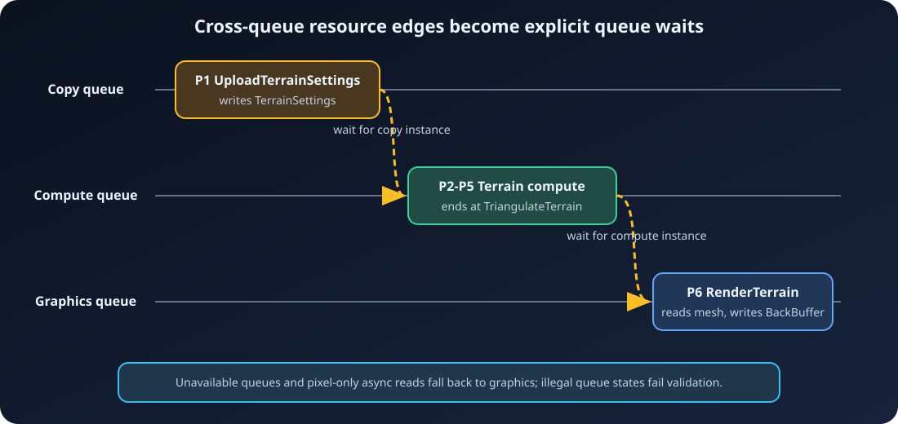

# 6. Execution and queues

[← Compilation](05-Compilation.md) · [Documentation home](README.md) ·
[Next: Debugging and practices →](07-Debugging-and-Practices.md)

`Execute()` performs CPU materialization, command recording, and queue
submission. It is asynchronous with respect to GPU completion.

## Execution sequence

1. Reject a repeated, failed, or device-less execution.
2. Compile automatically if necessary.
3. Materialize live resources and uniform buffers.
4. Rebuild transitions against actual pooled physical handles.
5. Optionally identify safe first-write clobbers.
6. Assign dependency levels and record pass command lists.
7. Upload graph uniform buffers on graphics.
8. Insert upload waits and compiled cross-queue waits.
9. Submit pass command lists in live execution order.
10. Fill extraction output handles.
11. Run NVRHI device garbage collection.

If any step throws, the graph becomes failed and cannot execute again.

## Physical resource materialization

External resources retain their imported handles. Every other live texture and
buffer is acquired from an execution-local descriptor pool.

Transient, descriptor-compatible resources with disjoint lifetimes may reuse a
physical handle only if all of each resource's uses belong to one queue domain.
Resources spanning graphics and compute/copy are assigned no reuse domain.
Non-transient and extracted resources do not reuse.

Because portable placed-resource aliasing is not currently enabled, transient
resources use committed NVRHI handles. See
[Resources and parameters](03-Resources-and-Parameters.md#lifetimes-pooling-and-transient-fallback).

Uniform buffers always receive dedicated constant buffers and are uploaded
before pass submission.

## Parallel command-list recording

The executor calculates a dependency level for each live pass using producer
and synchronization edges. Passes in the same level are independent for
recording.

```cpp
FARDGExecuteOptions Options;
Options.mbParallelRecording = true; // default
Options.mMaxRecordingThreads = 4;   // 0 means hardware concurrency
const FARDGExecutionResult& Result = Graph.Execute(Options);
```

Eligible passes are recorded with `std::async` in batches no larger than the
worker limit. `NeverParallel` passes record serially. Immediate mode disables
parallel recording. `mbUsedParallelRecording` is true only if at least two
passes were actually recorded concurrently, not merely because the option was
enabled.

Parallel recording requires pass callbacks and captured application objects to
be thread-safe. Access-gate bookkeeping and graph resource resolution are
internally synchronized.

Each pass receives its own command list on its selected NVRHI queue. Automatic
NVRHI barriers are disabled; compiled transitions are explicitly tracked and
committed before the callback. The pass name is emitted as an NVRHI marker.

Sentinels get command lists only when they carry boundary transitions.

## Async compute example

```cpp
ARDG_BEGIN_PARAMETER_STRUCT(FAsyncWriteParameters)
    ARDG_BUFFER_ACCESS(mBuffer)
ARDG_END_PARAMETER_STRUCT()

ARDG_BEGIN_PARAMETER_STRUCT(FGraphicsReadParameters)
    ARDG_BUFFER_ACCESS(mBuffer)
ARDG_END_PARAMETER_STRUCT()

FARDGRenderGraphContext Context;
Context.mDevice = Device;
Context.mQueueCapabilities.mbGraphics = true;
Context.mQueueCapabilities.mbCompute = true;
FARDGBuilder Graph(Context);

nvrhi::BufferDesc Desc;
Desc.setDebugName("Async result")
    .setByteSize(4096)
    .setCanHaveUAVs(true);
FARDGBufferRef Buffer = Graph.CreateBuffer(Desc);

FAsyncWriteParameters Write;
Write.mBuffer = {
    Buffer,
    nvrhi::ResourceStates::UnorderedAccess,
    nvrhi::EntireBuffer
};
(void)Graph.AddPass(
    "Async write",
    &Write,
    EARDGPassFlags::Compute |
        EARDGPassFlags::AsyncCompute,
    [](FARDGPassExecutionContext& PassContext,
       const FAsyncWriteParameters& Frozen)
    {
        // Bind/dispatch a compute pipeline in real code.
        PassContext.mCommandList.clearBufferUInt(
            PassContext.GetBuffer(Frozen.mBuffer.mBuffer), 7u);
    });

FGraphicsReadParameters Read;
Read.mBuffer = {
    Buffer,
    nvrhi::ResourceStates::NonPixelShaderResource,
    nvrhi::EntireBuffer
};
(void)Graph.AddPass(
    "Graphics-queue consumer",
    &Read,
    EARDGPassFlags::Compute | EARDGPassFlags::NeverCull,
    [](FARDGPassExecutionContext& PassContext,
       const FGraphicsReadParameters& Frozen)
    {
        (void)PassContext.GetBuffer(Frozen.mBuffer.mBuffer);
        // Bind and dispatch work on the graphics-capable queue.
    });

const FARDGExecutionResult& Result = Graph.Execute();
```

If the compute queue is available and states are compatible, compilation
creates an async-compute → graphics queue dependency. Before submitting the
consumer, execution calls `queueWaitForCommandList` with the producer's
submitted instance. If compute capability is false, both passes use graphics
and no cross-queue wait is needed.

The example uses `NonPixelShaderResource`, which is valid on async compute.
The generic `ShaderResource` combination is normalized to non-pixel access when
the selected pipeline is async compute. Pixel-only shader access forces
graphics fallback.

## Copy queue

A `Copy` pass is selected for a distinct copy queue only when copy capability
is available and all declarations are copy states:

```cpp
ARDG_BEGIN_PARAMETER_STRUCT(FCopyParameters)
    ARDG_BUFFER_ACCESS(mSource)
    ARDG_BUFFER_ACCESS(mDestination)
ARDG_END_PARAMETER_STRUCT()

FCopyParameters Copy;
Copy.mSource = { Source, nvrhi::ResourceStates::CopySource,
                 nvrhi::EntireBuffer };
Copy.mDestination = { Destination, nvrhi::ResourceStates::CopyDest,
                      nvrhi::EntireBuffer };

(void)Graph.AddPass(
    "Copy data",
    &Copy,
    EARDGPassFlags::Copy,
    [](FARDGPassExecutionContext& Context, const FCopyParameters& Frozen)
    {
        Context.mCommandList.copyBuffer(
            Context.GetBuffer(Frozen.mDestination.mBuffer), 0,
            Context.GetBuffer(Frozen.mSource.mBuffer), 0,
            Frozen.mSource.mBuffer->GetDesc().byteSize);
    });
```

Unsupported copy queues fall back to graphics. Illegal non-copy declarations on
a `Copy` pass are compile errors.

## Queue synchronization



Compilation lowers both data producers and synchronization-only edges when
their pipelines differ. Submission waits for the exact producer command-list
instance before submitting the consumer.

Uniform-buffer uploads happen on graphics. The first submitted pass on each
non-graphics queue waits once for the upload instance.

`Execute()` submits in deterministic live registration order. Queue waits allow
different queues to overlap where no dependency forbids it; the scheduler does
not reorder passes to maximize overlap.

## Execution result

`FARDGExecutionResult` reports:

- `mSubmittedCommandListCount`: submitted pass and boundary-transition command
  lists;
- `mQueueWaitCount`: explicit cross-queue and uniform-upload waits;
- `mTexturePoolReuseCount` and `mBufferPoolReuseCount`;
- `mbUsedParallelRecording`;
- `mbUsedVirtualHeaps` and `mbUsedTransientAliasing` (currently false);
- `mbUsedTransientFallback`;
- `mbUsedImmediateMode`;
- `mClobberedResourceCount`; and
- `mLastSubmittedInstances[3]` for graphics, compute, and copy queue enum
  indices.

`GetLastExecutionResult()` returns null before a fully successful execution and
the result afterward.

## Submission versus completion

After `Execute()` returns:

- command lists have been submitted;
- extraction output handles have been assigned; and
- NVRHI garbage collection has been advanced.

The GPU may still be running. Use queue instance tracking, device idle waits,
fences, or your frame system's synchronization before CPU readback, destruction
of externally owned objects, or reuse that is not already protected by NVRHI.

---

[← Compilation](05-Compilation.md) · [Documentation home](README.md) ·
[Next: Debugging and practices →](07-Debugging-and-Practices.md)
