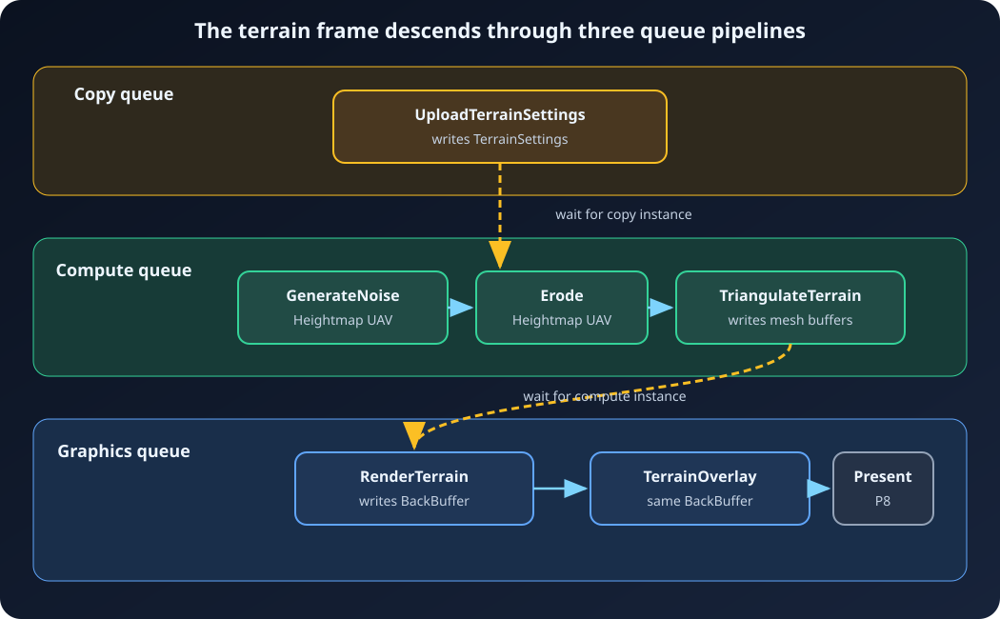
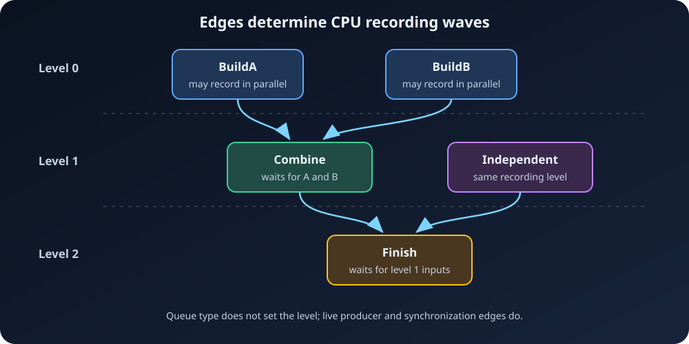

# 6. Execution and queues

[← Compilation](05-Compilation.md) ·
[Documentation home](README.md) ·
[Next: Debugging and recommended practices →](07-Debugging-and-Practices.md)

`FARDGBuilder::Execute()` turns a compiled, logical graph into NVRHI objects and
submitted command lists. It is useful to keep those two worlds separate:

- compilation produces an execution order, live intervals, state transitions,
  and cross-queue edges;
- execution creates or imports `nvrhi::ITexture` and `nvrhi::IBuffer` objects,
  records `nvrhi::ICommandList` objects, and submits them through
  `nvrhi::IDevice`.

The public entry point and result types are in
[`ArdaRenderGraphBuilder.h`](../../Source/ArdaRenderGraph/Public/ArdaRenderGraphBuilder.h).
The implementation is in
[`ArdaRenderGraphExecutor.cpp`](../../Source/ArdaRenderGraph/Private/ArdaRenderGraphExecutor.cpp).

## The runtime pipeline

Execution performs these phases:

1. Compile the graph if necessary and reject repeated execution.
2. Materialize live logical textures, buffers, and uniform buffers.
3. Rebuild transitions against the physical objects actually selected.
4. Record pass command lists, optionally in parallel by dependency level.
5. Record and submit the uniform-buffer upload list.
6. Submit pass command lists in deterministic execution order, inserting
   cross-queue waits.
7. Publish extracted handles and run NVRHI garbage collection.

Consider this graph:



The live terrain passes may be recorded on CPU worker threads when their
dependency levels permit it. Submission nevertheless remains registration
order with `DebugHeightmap` removed. Before `GenerateNoiseHeightmap` is
submitted, compute waits for the copy instance that wrote `TerrainSettings`;
before `RenderTerrain`, graphics waits for the compute instance from
`TriangulateTerrain`. The culled debug/minimap read contributes no command list
or queue wait. CPU recording concurrency and GPU queue synchronization are
related, but they are not the same mechanism.

## From logical records to NVRHI objects

A created `FARDGTexture` or `FARDGBuffer` initially stores an NVRHI descriptor
and an empty physical handle. At materialization:

- an external resource keeps the imported `nvrhi::TextureHandle` or
  `nvrhi::BufferHandle`;
- a graph-created texture is bound to a handle returned by
  `nvrhi::IDevice::createTexture`;
- a graph-created buffer is bound to a handle returned by
  `nvrhi::IDevice::createBuffer`; and
- every graph uniform buffer receives a dedicated constant-buffer handle.

NVRHI handles own/reference `nvrhi::ITexture` and `nvrhi::IBuffer`
implementations. Pass code receives raw interface pointers through the validated
execution context:

```cpp
nvrhi::ITexture* heightmap = Context.GetTexture(Frozen.mHeightmap);
nvrhi::IBuffer* vertices =
    Context.GetBuffer(Frozen.mTerrainVertices.mBuffer);
nvrhi::ICommandList& commands = Context.mCommandList;
```

The getters are open only while that pass callback is recording. They check
graph ownership, materialization, and that the exact resource, view, or uniform
buffer appeared in the pass's frozen parameters. Their implementation is in
[`ArdaRenderGraphBuilder.cpp`](../../Source/ArdaRenderGraph/Private/ArdaRenderGraphBuilder.cpp).

Logical SRV/UAV records are not separate NVRHI view objects. A texture view
resolves to its parent `nvrhi::ITexture`; a buffer view resolves to its parent
`nvrhi::IBuffer`. The view descriptor still supplies the subresource/range and
format override needed when application code builds an NVRHI binding item.

Materialization and transient reuse are covered in
[Allocation and materialization](10-Allocation-and-Materialization.md).

## What a pass records

Every pass with work gets an NVRHI command list whose queue type matches its
compiled pipeline:

- `EARDGPipeline::Graphics` maps to
  `nvrhi::CommandQueue::Graphics`;
- `EARDGPipeline::AsyncCompute` maps to
  `nvrhi::CommandQueue::Compute`; and
- `EARDGPipeline::Copy` maps to `nvrhi::CommandQueue::Copy`.

The command list opens, disables automatic NVRHI barriers, records graph
transitions, commits those barriers, executes the pass lambda inside a debug
marker, and closes. Sentinel passes have no lambda, but a prologue or epilogue
can still get a command list when it owns boundary transitions.

### Dispatch

`AddDispatchPass` is a convenience wrapper. Its callback first runs the supplied
setup lambda, then calls:

```cpp
Context.mCommandList.dispatch(GroupCountX, GroupCountY, GroupCountZ);
```

It always adds the `Compute` flag. `AsyncCompute` remains an eligibility request:
the compiler chooses compute only when capabilities and declared states allow
it. See the template in
[`ArdaRenderGraphBuilder.h`](../../Source/ArdaRenderGraph/Public/ArdaRenderGraphBuilder.h).

### Draw

Raster passes issue ordinary NVRHI commands in their lambda. The graph does not
build a framebuffer, graphics state, or draw call. A typical callback resolves
declared attachments and buffers, calls `setGraphicsState`, then `draw` or
`drawIndexed`. The executable terrain callbacks in
[`ArdaTerrainRenderer.cpp`](../../Source/ArdaTests/ARDGExample/Private/ArdaTerrainRenderer.cpp)
record both the indexed terrain draw and the overlay draw.

Compiled raster groups are metadata only. They report consecutive passes with
compatible logical attachments; execution does not merge render passes or
command lists.

### Copy and upload

A `Copy` pass likewise issues ordinary `copyTexture`, `copyBuffer`, `writeBuffer`,
or related NVRHI commands. The flag controls queue eligibility and validation,
not the callback's contents. On a real copy queue, all declared states must be
copy-compatible. Terrain P1 records `copyBuffer` from imported persistent
`TerrainSettingsUpload` to graph-created `TerrainSettings`; it falls back to
graphics when no copy queue exists.

## Dependency-level CPU recording

The executor assigns each live pass a dependency level:



A pass's level is one greater than the maximum level of its live producer and
synchronization-producer edges. Passes in the same level therefore have no
declared path that requires one to record after another.

For each level, eligible passes are recorded with `std::async` and
`std::launch::async`, in batches bounded by `mMaxRecordingThreads`. Zero uses
`std::thread::hardware_concurrency()` with a minimum of one. The executor waits
for all futures in a batch before continuing.

Recording is serial when:

- `mbParallelRecording` is false;
- immediate mode is active; or
- the pass has `EARDGPassFlags::NeverParallel`.

`mbUsedParallelRecording` means at least one batch contained more than one
worker-recorded pass. It does not claim that GPU queues overlapped.

The async-compute `mAsyncFork` and `mAsyncJoin` values are metadata only. They
describe nearby graphics points for diagnostics. They do not launch jobs,
partition recording, or insert waits. Real cross-queue synchronization comes
from `FARDGCompileResult::mQueueDependencies`.

## Explicit resource barriers

Pass command lists call `setEnableAutomaticBarriers(false)`. The graph is
therefore responsible for establishing NVRHI's tracked state:

1. `beginTrackingTextureState` or `beginTrackingBufferState` supplies the known
   physical state.
2. Optional forced ordering is emitted.
3. UAV barriers are enabled for resources whose requested state is
   `UnorderedAccess`.
4. `setTextureState` or `setBufferState` requests the compiled state.
5. `commitBarriers` emits the pending barriers before pass commands.

Texture tracking is per mip and array slice. Buffer tracking is whole-buffer,
even when a pass declared a narrower byte range.

When conservative barriers request an equal-state ordering point, recording
sets the resource to `Common`, commits, and then sets it back to the required
state. Repeated UAV use enables NVRHI UAV barriers explicitly, preserving
read/write ordering even when the state bits do not change.

For the canonical terrain graph, `P2` transitions `Heightmap` mip 0 from
`Common` to `UnorderedAccess`; `P4` requests the same UAV state and therefore
gets a UAV barrier; `P5` transitions that mip to
`NonPixelShaderResource` and creates the terrain buffers in
`UnorderedAccess`; and `P6` transitions those whole buffers to `VertexBuffer`
and `IndexBuffer` while transitioning `BackBuffer` from `Present` to
`RenderTarget`. `P7` has an equal render-target state record, and `P8`
returns the back buffer to `Present`. Culled `P3` has no transition record.

The executor rebuilds the transition's “before” state after allocation. This is
essential because two non-overlapping logical resources can reuse one physical
object. The second logical resource inherits the physical state left by the
first; it does not magically begin in its descriptor's initial state.

## Uniform buffers

`CreateUniformBuffer` freezes the parameter bytes in graph-owned CPU storage.
Materialization creates one dedicated NVRHI constant buffer per logical uniform
buffer. Uniform buffers are not placed in the texture/buffer reuse pools.

After pass recording, the executor creates a graphics command list that:

1. begins tracking each constant buffer from its normalized initial state;
2. writes its frozen bytes with `writeBuffer`;
3. requests `nvrhi::ResourceStates::ConstantBuffer`; and
4. commits, closes, and submits the list on graphics.

Graphics pass lists naturally follow that upload submission on the same queue.
Before the first submitted pass on each non-graphics queue, the executor inserts
one wait on the graphics upload instance. This is deliberately conservative:
the wait is queue-wide when the graph contains uniform buffers, rather than
being narrowed to only passes that reference one.

## Queue waits and command-list instances


`nvrhi::IDevice::executeCommandList` returns a `uint64_t` command-list instance.
The executor stores the instance by pass and records the latest submitted
instance for graphics, compute, and copy in
`FARDGExecutionResult::mLastSubmittedInstances`.

For each compiled cross-queue dependency, the consumer queue performs:

```cpp
Device.queueWaitForCommandList(
    ConsumerQueue,
    ProducerQueue,
    ProducerInstance);
```

The wait is inserted immediately before the consumer submission. Same-queue
edges need no explicit queue wait because submission order already orders them.
The result's `mQueueWaitCount` includes cross-queue dependency waits and
uniform-upload waits.

With copy and compute queues available and no graph uniform buffers, the
canonical terrain graph has two resource-edge waits: copy `P1` → compute `P2`,
and compute `P5` → graphics `P6`. The live compute-to-compute edges need no
queue wait, the `P3` → `P4` synchronization edge disappears with culled `P3`,
and the graphics `P6` → `P7` edge is ordered by same-queue submission.

Recording may finish in any worker order, but submission iterates
`mExecutionOrder`. This gives deterministic CPU submission and stable instance
bookkeeping while still allowing independent GPU queues to overlap between
their explicit waits.

The `ARDGExample.D3D12` and `ARDGExample.Vulkan` CTest smoke tests exercise one
hidden frame of this submission path on available backends; their registration
is in
[`ARDGExample/CMakeLists.txt`](../../Source/ArdaTests/ARDGExample/CMakeLists.txt).

## Extraction is submitted, not completed

After all command lists are submitted, extraction copies each materialized
NVRHI handle into the caller's output handle. Compilation has already kept the
resource alive through the epilogue and requested its extraction final state.

`Execute()` then calls `runGarbageCollection()` and returns. It means **CPU
submission is complete**, not that the GPU has completed the work. The returned
handle is valid to retain and use in later properly synchronized work, but the
caller must use backend/NVRHI synchronization where actual completion is
required. The runtime test explicitly calls `waitForIdle()` after checking the
submission result; see
[`ArdaGraphTests.cpp`](../../Source/ArdaRenderGraph/Tests/ArdaGraphTests.cpp).

## Reading `FARDGExecutionResult`

The stable result reports:

- submitted pass/boundary command-list count;
- queue-wait count;
- texture and buffer pool-reuse counts;
- whether parallel recording or immediate mode was used;
- whether committed transient fallback was used;
- virtual-heap and physical-aliasing flags;
- first-write clobber count; and
- the last submitted instance on each NVRHI queue.

At present, `mbUsedVirtualHeaps` and `mbUsedTransientAliasing` remain false.
Transient candidates use committed resources, optionally recycled by exact
descriptor and non-overlapping lifetime within one queue domain.

---

[← Compilation](05-Compilation.md) ·
[Documentation home](README.md) ·
[Next: Debugging and recommended practices →](07-Debugging-and-Practices.md)
