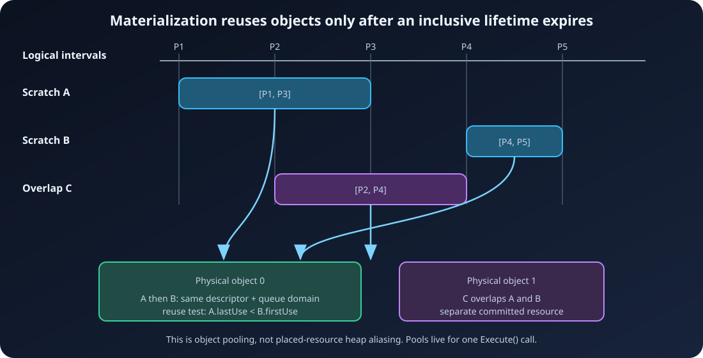

# 10. Allocation and materialization

[← Compiler source walkthrough](09-Compiler-Source-Walkthrough.md) ·
[Documentation home](README.md) ·
[Next: Executor source walkthrough →](11-Executor-Source-Walkthrough.md)

Compilation decides *when* a logical resource is live. Materialization decides
*which NVRHI object* backs it. That separation lets the graph reuse a committed
texture or buffer when two compatible logical lifetimes do not overlap, without
exposing allocation policy to pass code.

The relevant implementation is split between
[`ArdaRenderGraphAllocator.cpp`](../../Source/ArdaRenderGraph/Private/ArdaRenderGraphAllocator.cpp)
and
[`ArdaRenderGraphExecutor.cpp`](../../Source/ArdaRenderGraph/Private/ArdaRenderGraphExecutor.cpp).
The compile-time lifetime records come from
[`ArdaRenderGraphCompiler.cpp`](../../Source/ArdaRenderGraph/Private/ArdaRenderGraphCompiler.cpp).

## Inputs from compilation

For each live texture or buffer, `FARDGResourceLifetime` identifies:

- the resource kind and registry index;
- an inclusive `[mFirstUse, mLastUse]` interval in execution-order indices; and
- whether the resource is transient-eligible.

A resource is transient only when it has the `Transient` flag and is neither
external nor extracted. Imports already own physical backing. Extraction
extends a created resource through the epilogue and deliberately removes it
from transient eligibility.

For example:

```text
execution index       1       2       3       4       5

HeightTile A       [---------]
MeshScratch B                [---------]
TerrainDebug C                                 [---]

A = [1,3]
B = [3,4]   overlaps A at inclusive index 3: cannot reuse A
C = [5,5]   starts after A and B expire: may reuse either exact match
```



The strict reuse test is `availableAfter < firstUse`, not `<=`. A resource is
still live during its last-use pass.

## The materialization pass

`MaterializeResources` first evaluates what an ideal transient heap could look
like, then creates one texture pool and one buffer pool on its own stack. It
copies the compiled lifetimes and sorts them by:

1. first-use index;
2. resource type; and
3. registry index.

That stable lifetime order is important. By the time a later resource asks the
pool for backing, every earlier candidate has an accurate `availableAfter`
value. The final tie-breakers make the choice deterministic.

Each lifetime is then handled as follows:

- an external texture or buffer retains its imported NVRHI handle;
- a graph-created texture calls `TexturePool.Acquire` and binds the returned
  `nvrhi::TextureHandle`;
- a graph-created buffer calls `BufferPool.Acquire` and binds the returned
  `nvrhi::BufferHandle`; and
- after viewable resources, every uniform buffer is created separately.

The pools are execution-local. In fact, their descriptor buckets disappear when
`MaterializeResources` returns; resource handles stored in the graph keep the
selected NVRHI objects alive. There is no cache shared with another builder or
frame.

## Descriptor normalization

Before lookup or creation, both pools normalize the descriptor:

```text
Unknown initial state  -> Common
keepInitialState       -> false
isVirtual              -> false
```

The resulting resource is a normal committed NVRHI resource. Debug names and
the original logical record remain useful for diagnostics, but allocation
compatibility is based on the descriptor fields that affect the physical
resource.

## Hash first, equality second

Pool lookup uses an `unordered_map<size_t, vector<Entry>>`. The hash selects a
small bucket; the pool's explicit compatibility equality decides whether an
entry is reusable. This distinction matters because each hash intentionally
includes only a subset of fields.

The texture hash combines width, height, depth, array size, mip count, sample
count and quality, format, dimension, render-target capability, UAV capability,
and typelessness. Texture equality checks all of those plus shader-resource
capability, shading-rate capability, shared flags, tiled state, clear-value use,
and—when enabled—the clear-value bytes.

The buffer hash combines byte size, struct stride, format, UAV/typed/raw-view
capabilities, constant-buffer use, and CPU access. Buffer equality checks all of
those plus version count, vertex/index/indirect flags, acceleration-structure
build-input/storage roles, shader-binding-table use, volatility, and shared
flags.

Consequences:

- a hash collision cannot cause incompatible reuse, because equality is still
  required;
- fields omitted from the hash may place more entries in one bucket, affecting
  lookup cost but not correctness;
- debug names do not prevent otherwise compatible logical resources from
  sharing one physical object; and
- clear values compare only when `useClearValue` is true.

The exact comparisons and `HashCombine` implementation are in
[`ArdaRenderGraphExecutor.cpp`](../../Source/ArdaRenderGraph/Private/ArdaRenderGraphExecutor.cpp).

## Lifetime-sorted local pools

Each pool entry stores:

```text
normalized descriptor
physical NVRHI handle
available-after execution index
reuse-domain number
```

An entry is reused only if all three runtime conditions hold:

1. `Entry.availableAfter < Resource.firstUse`;
2. `Entry.reuseDomain == Resource.reuseDomain`; and
3. the normalized descriptors compare equal.

On reuse, `availableAfter` moves to the new resource's last use and the
corresponding result counter increments. Otherwise the pool calls
`createTexture` or `createBuffer`, stores the new entry, and returns it.

This is physical-object recycling, not placed-resource aliasing. Two logical
records may point at the same `nvrhi::ITexture` or `nvrhi::IBuffer` at different
times, but no two NVRHI resource objects are placed over one heap range.

### Example: one buffer serves two logical resources

```text
passes       P1          P2          P3
             |           |           |
ScratchA   write ------ read
ScratchB                           write

logical lifetimes:
ScratchA = [P1, P2]
ScratchB = [P3, P3]

same normalized BufferDesc + same queue domain
                    |
                    v
one nvrhi::IBuffer, rebound from ScratchA to ScratchB
```

The backend execution test creates two equal transient buffers with disjoint
lifetimes and observes `mBufferPoolReuseCount == 1`; see
[`ArdaGraphTests.cpp`](../../Source/ArdaRenderGraph/Tests/ArdaGraphTests.cpp).

## Queue reuse domains

The executor scans all live passes that use a candidate resource and maps the
selected pipeline to an NVRHI queue index:

- graphics is one domain;
- compute is one domain; and
- copy is one domain.

If every use is on the same queue, that queue index is the resource's reuse
domain. If uses span queues, the domain is `-1`. Non-transient resources also
request domain `-1`.

Pool search occurs only for a non-negative domain. Therefore:

- two same-queue transient lifetimes may reuse an exact descriptor match;
- resources used by different single queues do not share an entry;
- a transient resource used on multiple queues cannot reuse or be reused; and
- non-transient graph-created resources always receive their own committed
  object.

The restriction is conservative. A lifetime index alone describes logical
submission order, but safe cross-queue recycling would also need a precise
proof that all prior GPU use has completed before the new logical identity
begins. The current pool avoids that ambiguity by keeping reuse inside one
queue's ordered submissions.

## The ideal transient interval allocator

`FARDGTransientHeapAllocator::Allocate` models what placed virtual resources
could achieve. Each request contains an identifier, inclusive lifetime, size,
and power-of-two alignment. Requests are sorted by first use and identifier.

For each request, the allocator:

1. retires active allocations whose `lastUse < firstUse`;
2. adds their ranges to a free list;
3. sorts and merges adjacent free ranges;
4. performs a deterministic first fit at an aligned offset;
5. splits any unused prefix and suffix; or
6. appends at the aligned end of heap capacity when no range fits.

The output records each offset, size, whether memory was reused, total capacity,
and whether aliases exist. With aliasing disabled, every request appends and no
expired range is recycled.

For the allocator test:

```text
request 0: lifetime [1,3], size 256 -> offset   0
request 1: lifetime [2,4], size 128 -> offset 256
request 2: lifetime [5,6], size 192 -> offset   0 (reused)

ideal aliased capacity: 384 bytes
non-aliased capacity:   576 bytes
```

The algorithm and its validation are in
[`ArdaRenderGraphAllocator.cpp`](../../Source/ArdaRenderGraph/Private/ArdaRenderGraphAllocator.cpp);
the expected layout is tested in
[`ArdaGraphTests.cpp`](../../Source/ArdaRenderGraph/Tests/ArdaGraphTests.cpp).

## Why virtual-heap aliasing is disabled

When `nvrhi::Feature::VirtualResources` is available, execution creates
temporary virtual texture/buffer probes and asks NVRHI for memory size and
alignment. It feeds valid requirements to the ideal interval allocator with
aliasing enabled.

The resulting layout is intentionally not applied. NVRHI exposes placed
resources, but the supported portable interface does not provide both:

- a portable aliasing barrier; and
- a portable heap-compatibility query sufficient to prove that each selected
  resource can safely occupy the shared range on every backend.

Using offsets without those guarantees could make a layout correct on one
backend and invalid on another. The executor therefore treats the layout as an
evaluation only and uses committed-resource fallback. For every transient
candidate, `mbUsedTransientFallback` becomes true. The result flags
`mbUsedVirtualHeaps` and `mbUsedTransientAliasing` remain false.

When virtual resources are unsupported, probing is skipped and the same
committed fallback is reported directly.

## Physical rebinding changes transition history

Compilation tracks state by logical resource. Pooling can later create this
situation:

```text
Logical A: Common -> UnorderedAccess -> ShaderResource
                         same physical buffer
Logical B: Common -> CopyDest
```

If A and B share one `nvrhi::IBuffer`, B does not actually begin in `Common`.
The physical object is still in A's final `ShaderResource` state. Recording the
logical `Common -> CopyDest` transition unchanged would give NVRHI a false
starting state.

`BuildPhysicalTransitions` repairs this after binding:

1. key state maps by `nvrhi::ITexture*` and `nvrhi::IBuffer*`, not logical
   handles;
2. initialize a physical object's state only on its first encounter;
3. walk passes in compiled execution order;
4. replace each transition's before-state with the current physical state; and
5. update the physical map to the requested after-state.

Texture maps contain one state per mip/array-slice pair. Buffer maps contain one
whole-buffer state. Equal physical UAV states regenerate UAV ordering.
Conservative forced barriers survive only when the rebuilt physical before and
after states are still equal.

This rebuild is the correctness bridge between logical lifetime pooling and
explicit NVRHI state tracking.

## Uniform buffers take a separate path

`CreateUniformBuffer` constructs an NVRHI `BufferDesc` with:

- byte size equal to the frozen parameter structure;
- `isConstantBuffer = true`; and
- initial state `ConstantBuffer`.

Materialization calls `createBuffer` once for each uniform buffer and binds the
handle. These buffers are dedicated: descriptor hashing, lifetime intervals,
queue reuse domains, and the transient pools do not apply.

The frozen bytes are uploaded later on a graphics command list. The list begins
state tracking, calls `writeBuffer`, requests `ConstantBuffer`, commits
barriers, and is submitted before pass command lists. Compute and copy queues
wait on that upload instance before their first submission. Creation is
described in
[`ArdaRenderGraphBuilder.cpp`](../../Source/ArdaRenderGraph/Private/ArdaRenderGraphBuilder.cpp);
upload is in
[`ArdaRenderGraphExecutor.cpp`](../../Source/ArdaRenderGraph/Private/ArdaRenderGraphExecutor.cpp).

## Practical interpretation

The current runtime optimizes object creation within one execution while
preserving a conservative portability model:

- exact descriptor equality protects physical compatibility;
- inclusive lifetime ordering prevents live overlap;
- queue domains avoid cross-queue reuse hazards;
- physical-state rebuilding repairs logical-to-physical rebinding;
- committed resources avoid unsupported portable aliasing assumptions; and
- execution-local pools make ownership simple, at the cost of no reuse across
  frames.

That is why the ideal allocator and the active pool can both exist: the former
quantifies a future placed-resource strategy, while the latter is the safe
strategy actually submitted today.

---

[← Compiler source walkthrough](09-Compiler-Source-Walkthrough.md) ·
[Documentation home](README.md) ·
[Next: Executor source walkthrough →](11-Executor-Source-Walkthrough.md)
