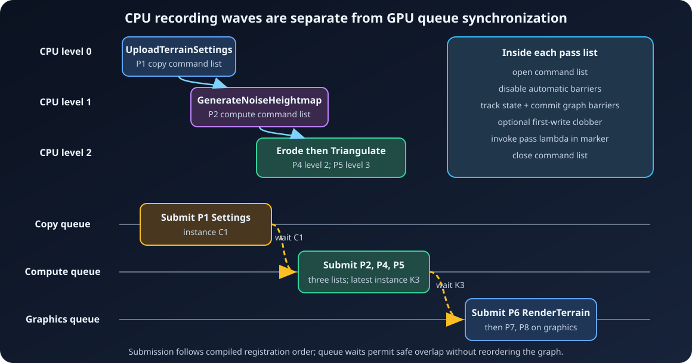

# 11. Executor source walkthrough

[← Allocation and materialization](10-Allocation-and-Materialization.md) ·
[Documentation home](README.md) ·
[Next: End-to-end examples →](12-End-to-End-Examples.md)

This chapter follows `FARDGExecutor::Execute` in source order. The function is
near the end of
[`ArdaRenderGraphExecutor.cpp`](../../Source/ArdaRenderGraph/Private/ArdaRenderGraphExecutor.cpp);
the helpers above it implement each major step.

Keep one distinction in mind while reading:

```text
CPU build       CPU compile       CPU record        CPU submit       GPU work
   |                 |                 |                 |               |
logical API ---> schedule/state ---> ICommandList ---> queue calls ---> executes
```

`Execute()` reaches the CPU-submit point. It does not wait for the final GPU
point.

## 1. Enter once, with a usable device

The function starts a trace timer and obtains the builder's private graph
record. It rejects three invalid states:

- execution already started;
- an earlier graph operation permanently failed; or
- the context has no `nvrhi::IDevice`.

It then calls `Builder.Compile()`. Compilation is cached, so this either produces
the immutable compile result or returns the existing one. Execution marks
`mbExecutionStarted` immediately afterward.

`FARDGExecutionFailureGuard` is a small scope guard. Unless the function reaches
its successful end and sets `mbCompleted`, destruction marks the graph failed.
That makes a recording or submission exception terminal rather than leaving a
partly executed builder reusable.

The compile result supplies the executor with:

- `mExecutionOrder`;
- `mResourceLifetimes`;
- per-pass selected pipelines and transition records; and
- `mQueueDependencies`.

Async fork/join values and raster groups are also present in pass state, but
both are metadata only. `Execute()` never consults either to merge work or
schedule synchronization.

## 2. Reset the report

The executor value-initializes `mExecutionResult` and copies the immediate-mode
choice into `mbUsedImmediateMode`. Counts, queue instances, and the remaining
feature flags therefore begin at zero/false for this one execution.

The result structure is declared in
[`ArdaRenderGraphBuilder.h`](../../Source/ArdaRenderGraph/Public/ArdaRenderGraphBuilder.h).

## 3. Materialize logical resources

The first substantial call is:

```cpp
MaterializeResources(Graph, *Graph.mContext.mDevice, Graph.mExecutionResult);
```

### 3.1 Evaluate the ideal heap

`EvaluateTransientHeapLayout` checks
`nvrhi::Feature::VirtualResources`. Without it, every transient lifetime is
reported as committed fallback.

With the feature, the helper creates virtual resource probes:

- texture descriptor: normalized initial state, `keepInitialState = false`,
  `isVirtual = true`;
- buffer descriptor: the same changes;
- query with `getTextureMemoryRequirements` or
  `getBufferMemoryRequirements`; and
- add non-zero size/alignment requests to the interval allocator.

The allocator computes an ideal aliasing layout. The executor intentionally
discards it because NVRHI has no portable aliasing barrier and heap
compatibility query sufficient for all supported backends. Actual resources
remain committed; `mbUsedTransientFallback` is true while virtual-heap and
aliasing flags stay false.

### 3.2 Construct execution-local pools

`FARDGTexturePool` and `FARDGBufferPool` live only inside
`MaterializeResources`. They are not device-global caches and do not persist
across builders or frames.

Compiled lifetimes are copied and sorted by first use, then resource type, then
registry index. For each graph-created resource, `Acquire`:

1. normalizes `Unknown` to `Common`;
2. clears `keepInitialState`;
3. forces `isVirtual = false`;
4. hashes the normalized descriptor;
5. searches that bucket with the pool's compatibility equality, a matching
   queue reuse domain, and `availableAfter < firstUse`; and
6. reuses the handle or calls `createTexture`/`createBuffer`.

Hashes are only bucket selectors. The pool's explicit texture or buffer
descriptor equality prevents a collision from causing incompatible reuse.

Transient resources receive a queue reuse domain only when all live uses map
to one NVRHI queue. Cross-queue resources receive `-1` and cannot reuse pool
entries. Non-transient resources also use `-1`, so they always create unique
committed backing.

External resources skip acquisition and retain their imported handles.
Extracted created resources are non-transient because compilation extends them
through the epilogue.

### 3.3 Create uniform buffers

After textures and buffers, every `FARDGUniformBuffer` calls
`Device.createBuffer` with the constant-buffer descriptor prepared by
`CreateUniformBufferInternal`. Uniform buffers are dedicated and unpooled.
Creation binds the `nvrhi::BufferHandle`; bytes are uploaded later.

The complete allocation policy is developed in
[Allocation and materialization](10-Allocation-and-Materialization.md).

## 4. Rebuild transitions by physical identity

Next, `BuildPhysicalTransitions` converts logical transition history into the
history of the selected `nvrhi::ITexture*` and `nvrhi::IBuffer*` objects.

Why is this a separate phase? Suppose the pool makes `ScratchB` reuse
`ScratchA`:

```text
compiled logical history

ScratchA: Common -> UAV -> ShaderResource
ScratchB: Common -----------------------> CopyDest

materialized physical history

Physical0: Common -> UAV -> ShaderResource -> CopyDest
```

The compiled before-state for `ScratchB` is wrong for `Physical0`. The rebuild
walks execution order and keys state maps by physical pointer. It emits
`ShaderResource -> CopyDest`, which is the transition NVRHI must actually see.

Textures use a vector of states indexed by array slice and mip. A compiled range
is resolved and expanded into one runtime record per mip/slice pair. Buffers use
one whole-buffer state.

For each runtime transition the helper:

- takes `stateBefore` from current physical history;
- preserves the compiled requested `stateAfter`;
- marks equal UAV state as an ordering case;
- keeps a compiled forced barrier only if rebuilt before/after are still equal;
  and
- advances the physical state map.

### Optional first-write clobbers

The same helper builds debug clobber work when
`mbClobberFirstWrites` is enabled. It tracks production per texture
mip/slice and per whole buffer. On a supported first write it schedules:

- depth/stencil clear to depth `0.12345` and stencil `0xCD`;
- integer color clear to `0xCDCDCDCD`;
- other color clear to magenta; or
- whole UAV buffer clear to `0xCDCDCDCD`.

Copy passes cannot issue clobbers. Resource format/capabilities and the declared
write range must support the selected clear. These records are attached to the
pass's runtime transition bundle and counted when recorded.

## 5. Compute dependency levels

The executor allocates:

- `Recorded`, indexed by pass registry index, to hold command list, queue, and
  clobber count; and
- `Levels`, also indexed by pass, initialized to zero.

It walks compiled execution order. The prologue is skipped. For every live
producer and synchronization producer, the pass level becomes:

```text
max(current level, producer level + 1)
```

This produces CPU recording waves:

```text
level 0       BuildA       BuildB
                 \         /
level 1          Combine       Independent
                     \         /
level 2               Finish
```

Edges define recording order. Queue selection does not: independent graphics
and compute passes can record in the same wave, while dependent passes on the
same queue occupy later waves.

## 6. Record each dependency level

The worker limit is `mMaxRecordingThreads`, or hardware concurrency when the
option is zero, always clamped to at least one.

For each level, the executor scans `mExecutionOrder` and ignores:

- the prologue;
- passes from another level; and
- a sentinel with no texture or buffer transition.

All ordinary live passes count as work even if their transition lists are empty,
because their lambda must record.

Eligible passes enter `ParallelPasses` when parallel recording is enabled,
immediate mode is off, and `NeverParallel` is absent. Everything else enters
`SerialPasses`.

Parallel passes are divided into worker-sized batches. Each job uses:

```cpp
std::async(std::launch::async, [&] {
    Recorded[Handle.GetIndex()] = RecordPass(...);
});
```

The future loop calls `get()` for every job before moving on. A batch with more
than one pass sets `mbUsedParallelRecording`. Serial passes at that level record
after the parallel batches.

Parallelism here is CPU command encoding. No NVRHI command list has been
submitted yet, and therefore no GPU overlap has started.

## 7. `RecordPass`: map one pass to one command list

`RecordPass` maps the compiled pipeline:

- graphics to `nvrhi::CommandQueue::Graphics`;
- async compute to `nvrhi::CommandQueue::Compute`; and
- copy to `nvrhi::CommandQueue::Copy`.

It creates one command list with that queue type and propagates the debug
immediate-execution setting. Failure to create it is fatal.

### 7.1 Open and take control of barriers

The command list opens and immediately calls:

```cpp
setEnableAutomaticBarriers(false);
```

For every texture runtime transition, recording begins state tracking with the
rebuilt physical before-state and exact subresource. For every buffer runtime
transition it does the same at whole-buffer granularity.

If a conservative forced barrier is present, the command list:

1. requests `Common`;
2. commits barriers immediately; then
3. continues toward the pass's required state.

When the after-state includes `UnorderedAccess`,
`setEnableUavBarriersForTexture` or `setEnableUavBarriersForBuffer` is enabled.
The final state is requested with `setTextureState`/`setBufferState`. One
`commitBarriers()` after the loops emits all remaining transitions before pass
work.

The graph does not rely on NVRHI automatic barriers for pass lists. UAV
ordering and forced equal-state ordering are explicit graph policy.

### 7.2 Record diagnostic clobbers

The precomputed first-write clears come next, after state barriers and before
the pass callback. Each issued clear increments the recorded pass's clobber
count.

### 7.3 Invoke pass work

A non-sentinel pass records inside an NVRHI marker named after the pass.
`FARDGPassExecutionContext` opens the physical-access gate, exposes the command
list and selected pipeline, and validates getters against the pass's
declarations.

Views resolve their parent resources:

- texture SRV/UAV -> parent `nvrhi::ITexture*`;
- buffer SRV/UAV -> parent `nvrhi::IBuffer*`.

No NVRHI view object is materialized by the graph.

The stored pass lambda then performs ordinary NVRHI work:

- `AddDispatchPass` runs setup and calls `dispatch`;
- draw passes build/bind graphics state and call `draw`/`drawIndexed`; and
- copy passes call the appropriate copy/write commands.

The graph does not synthesize framebuffers, binding sets, pipelines, draw calls,
or copies. It supplies declared physical resources, barriers, a queue-compatible
command list, and ordering.

Finally the marker ends, the access context closes its gate, and the command
list closes.

## 8. Upload uniform buffers

Only after all pass command lists are recorded does
`UploadUniformBuffers` run. With no uniform buffers it returns instance `0`.

Otherwise it creates a graphics command list, opens it, and for every uniform
buffer:

1. begins tracking from the descriptor's normalized initial state;
2. calls `writeBuffer` with the frozen graph-arena contents and byte size; and
3. requests `nvrhi::ResourceStates::ConstantBuffer`.

It commits barriers, closes, submits on graphics, and returns the
`executeCommandList` instance ID.

Although upload recording occurs after pass recording, upload submission occurs
before every pass submission. Recording only builds command streams; submission
establishes GPU order.

## 9. Submit in deterministic execution order



The executor creates:

- one “upload already waited” bit per NVRHI queue; and
- one submitted instance ID per pass.

It then walks the same compiled `mExecutionOrder` regardless of the order in
which worker jobs completed. Missing command lists—such as a no-op sentinel—are
skipped.

### 9.1 Wait for uniform upload

Graphics submissions are naturally behind the upload list on the graphics
queue. Before the first compute or copy pass, that consumer queue calls
`queueWaitForCommandList` on the graphics upload instance. Each non-graphics
queue waits at most once.

### 9.2 Wait for cross-queue producers

For every `FARDGQueueDependency` whose consumer is the current pass, execution
looks up the producer's submitted instance. When non-zero it calls:

```cpp
queueWaitForCommandList(
    ConsumerQueue,
    ProducerQueue,
    ProducerInstance);
```

An instance ID is the NVRHI submission marker returned by
`executeCommandList`; it is the value the other queue waits to reach. Same-queue
dependencies need no explicit wait because deterministic queue submission
already preserves order.

Async `mAsyncFork` and `mAsyncJoin` are not read here. The concrete queue
dependency records are the synchronization authority.

### 9.3 Submit and remember the instance

The current command list is submitted to its recorded queue. Its returned
instance is stored:

- by pass, so later cross-queue consumers can wait on it; and
- in `mLastSubmittedInstances[queueIndex]`, so the result exposes the latest
  graphics, compute, and copy submissions.

The executor increments submitted-list and clobber counters. Recording order may
have been concurrent, but this loop makes CPU submission reproducible.
Independent queues can still overlap on the GPU between explicit waits.

The cross-queue execution test checks parallel recording, queue waits, and
non-zero graphics/compute instances in
[`ArdaGraphTests.cpp`](../../Source/ArdaRenderGraph/Tests/ArdaGraphTests.cpp).

## 10. Complete extraction

After submissions, `CompleteExtractions` assigns:

```text
caller texture output <- logical texture's materialized TextureHandle
caller buffer output  <- logical buffer's materialized BufferHandle
```

This publishes ownership-bearing NVRHI handles, not copied resource contents.
Compilation has already made extraction observable, extended its lifetime
through the epilogue, and generated the requested final transition.

The assignment happens after CPU submission, not after GPU completion. A caller
may retain the handle immediately, but must synchronize later GPU/CPU use by
the normal backend rules.

## 11. Finish the CPU submission boundary

The executor calls `Device.runGarbageCollection()`, marks the graph executed,
and disarms the failure guard. It emits trace counters for submitted command
lists, queue waits, and clobbered resources, then returns the stable
`FARDGExecutionResult&`.

There is no `waitForIdle`, fence wait, or polling loop in `Execute()`. The
triangle renderer calls `Execute()` and then presents through its swap-chain
integration; its one-time upload path explicitly waits for idle because CPU
initialization needs completion. See
[`ArdaTriangleRenderer.cpp`](../../Source/ArdaTests/NVRHITest/Private/ArdaTriangleRenderer.cpp).

## Source-order checklist

When debugging the executor, verify the stages in the same order as the code:

1. lifecycle/device guards and compile;
2. result reset;
3. resource materialization;
4. physical transition rebuild and optional clobber planning;
5. dependency-level calculation;
6. parallel/serial pass recording;
7. uniform upload submission;
8. upload and cross-queue waits;
9. deterministic pass submission and instance capture;
10. extraction;
11. garbage collection and successful completion.

This ordering explains several otherwise surprising facts: physical resource
getters work during parallel recording because materialization is already
complete; pass lists may be recorded before uniform bytes are uploaded because
upload submission still comes first; and extracted handles are available when
`Execute()` returns even though the GPU may still be running.

---

[← Allocation and materialization](10-Allocation-and-Materialization.md) ·
[Documentation home](README.md) ·
[Next: End-to-end examples →](12-End-to-End-Examples.md)
