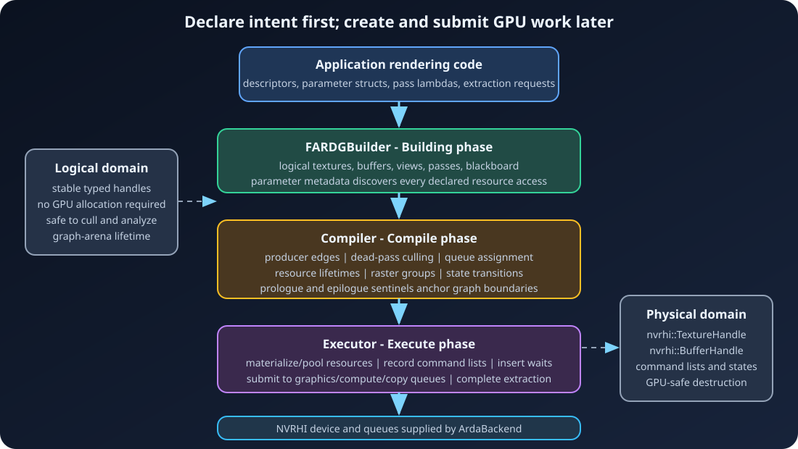
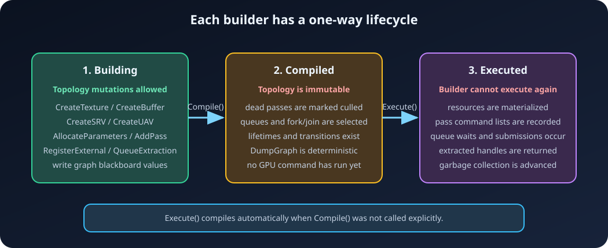

# ArdaRenderGraph

ArdaRenderGraph is Ardashir's deferred render dependency graph for
[NVRHI](https://github.com/NVIDIA-RTX/NVRHI). Application code declares logical
textures, buffers, resource states, and passes. The graph then validates the
declarations, removes dead work, derives dependencies and barriers, selects
queues, manages resource lifetimes, records command lists, and submits them.

This guide assumes basic C++, computer-science, and graphics knowledge. NVRHI
device creation, shader compilation, binding layouts, pipelines, and swap-chain
setup are intentionally out of scope; use the
[NVRHI programming guide](https://github.com/NVIDIA-RTX/NVRHI/blob/main/doc/ProgrammingGuide.md)
and [repository](https://github.com/NVIDIA-RTX/NVRHI) for those topics.



## Guide

1. [Getting started](01-Getting-Started.md) — build integration, graph context,
   lifecycle, and a minimal executable buffer graph.
2. [Core concepts](02-Core-Concepts.md) — logical versus physical resources,
   passes, handles, frozen parameters, flags, and the blackboard.
3. [Resources and parameters](03-Resources-and-Parameters.md) — textures,
   buffers, views, every parameter macro, states, external resources, uniform
   buffers, extraction, lifetimes, and pools.
4. [Passes and dependencies](04-Passes-and-Dependencies.md) — automatic and
   manual edges, culling, raster declarations, compute-to-graphics, and
   swap-chain rendering.
5. [Compilation](05-Compilation.md) — validation, queue selection, barriers,
   UAV ordering, raster groups, compile products, and graph dumps.
6. [Execution and queues](06-Execution-and-Queues.md) — materialization,
   recording, submission, async compute, queue waits, and execution results.
7. [Debugging and practices](07-Debugging-and-Practices.md) — diagnostic modes,
   common failures, recommended patterns, and current limitations.

## The short mental model

1. Construct one `FARDGBuilder` for one graph submission.
2. Register external resources and create deferred logical resources.
3. Describe each pass's accesses in an `ARDG_*` parameter struct.
4. Add passes in forward dependency order.
5. Extract graph-created resources that must survive the graph, or write an
   imported external resource to make the result observable.
6. Call `Execute()`. It calls `Compile()` automatically if needed.
7. Create a new builder for the next graph.



## Public entry point

Include the aggregate header:

```cpp
#include "ArdaRenderGraph.h"

using namespace arda::render_graph;
```

Link the CMake target:

```cmake
target_link_libraries(MyTarget PRIVATE Ardashir::ArdaRenderGraph)
```

ArdaRenderGraph requires C++17 and links NVRHI publicly.

## What the graph does not replace

The graph does not create shaders, binding layouts, graphics/compute pipelines,
swap chains, or application synchronization around presentation. Pass lambdas
still issue ordinary NVRHI commands. The graph's job is to make declared
resource use, ordering, states, allocation intervals, and queue synchronization
explicit and consistent.

---

[Next: Getting started →](01-Getting-Started.md)
