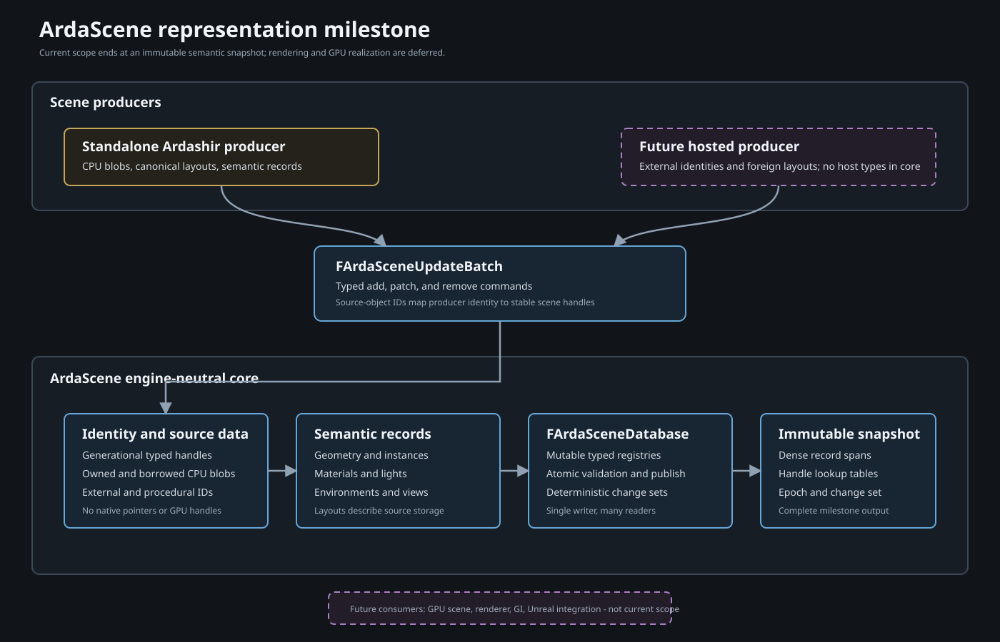
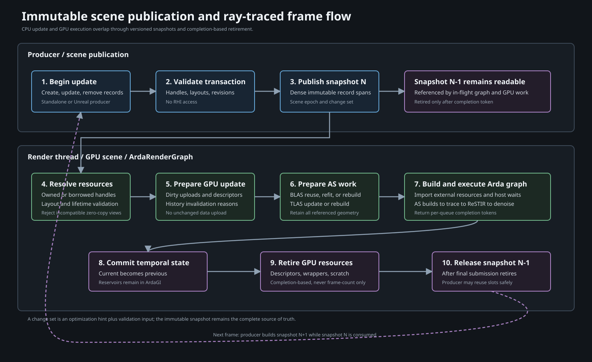
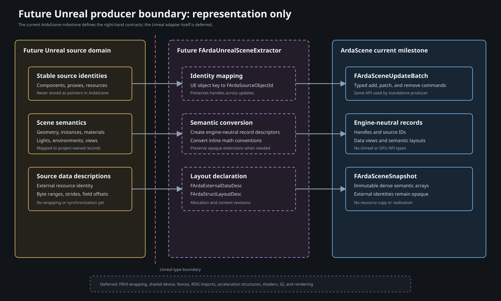

# ArdaScene Representation Plan

## Status and scope

This document plans only the engine-neutral representation of a renderable
scene in `Source/ArdaScene`.

The current milestone does not plan or implement:

- global illumination or ReSTIR algorithms;
- path tracing, ray dispatch, denoising, or presentation;
- BLAS or TLAS construction;
- GPU scene upload or bindless descriptor management;
- ArdaRenderGraph ray-tracing extensions;
- shared-device, queue, fence, or resource-state integration;
- an Unreal plugin or renderer replacement;
- material shader compilation or translation.

Those systems will eventually consume `ArdaScene`, but they are deliberately
outside the current plan. The goal now is to define scene data that can be
created by a standalone Ardashir application and, later, populated by an
Unreal adapter without redesigning the core model.

## Architectural decision

`ArdaScene` will be a renderer-facing scene database that publishes immutable,
versioned snapshots of semantic records.

It will not be:

- a gameplay ECS;
- a world simulation;
- an owner of backend or ArdaRenderGraph objects;
- a container of Unreal types;
- a hard-coded GPU memory layout;
- a list of rendering callbacks.



Both standalone and hosted producers use the same update API:

```text
Standalone authoring ---------+
                              +--> FArdaSceneUpdateBatch
Future Unreal extractor ------+             |
                                            v
                                  FArdaSceneDatabase
                                            |
                                            v
                                  FArdaSceneSnapshot
```

The immutable snapshot is the complete output of this milestone.

## Required properties

### Standalone first

Ardashir must create and use a scene without Unreal, an external device, or a
foreign resource registry.

A standalone producer can provide:

- immutable CPU geometry blobs;
- application-owned resource declarations;
- procedural source tokens;
- transforms, materials, lights, environments, and views.

The standalone path is not a fallback adapter. It is the reference producer
used by the initial tests.

### Host neutral

No public `ArdaScene` header may include:

- Unreal Engine headers;
- native graphics API headers;
- ArdaBackend headers;
- ArdaRenderGraph headers;
- D3D12 or Vulkan headers.

Future adapters communicate through project-owned IDs, descriptors, layouts,
and update batches.

### Representation, not realization

The scene describes:

- what objects exist;
- how records refer to one another;
- where source data can be found;
- how source data is laid out;
- what changed between snapshots.

It does not decide:

- where GPU memory is allocated;
- whether data is copied or consumed directly;
- which acceleration structures are built;
- which shaders or passes execute;
- how resources are synchronized.

### Stable identity

Handles remain stable while records move between dense storage locations.
Stale handles must be detected after removal and slot reuse.

### Immutable publication

Producers mutate an update transaction. Consumers only read a published
snapshot. The producer may build snapshot N+1 while consumers retain snapshot
N.

### Extensible source layouts

Ardashir-native data should use simple canonical layouts. Foreign data should
be describable through semantic field layouts without forcing the scene module
to understand Unreal's internal structs.

This enables a future zero-copy consumer, but the scene representation itself
does not perform importing or copying.

## Module boundary

Only `ArdaScene` is in the current implementation scope.

Planned public headers:

```text
Source/ArdaScene/Public/
  ArdaScene.h
  ArdaSceneHandles.h
  ArdaSceneMath.h
  ArdaSceneFormats.h
  ArdaSceneSources.h
  ArdaSceneLayouts.h
  ArdaSceneGeometry.h
  ArdaSceneMaterials.h
  ArdaSceneLights.h
  ArdaSceneView.h
  ArdaSceneUpdates.h
  ArdaSceneSnapshot.h
  ArdaSceneDatabase.h
```

Planned private files:

```text
Source/ArdaScene/Private/
  ArdaSceneDatabase.cpp
  ArdaSceneRegistry.h
  ArdaSceneSnapshot.cpp
  ArdaSceneValidation.cpp
```

`ArdaScene` should depend only on EASTL and project-owned, backend-neutral
interfaces. It must not link a concrete native backend module directly.

Future modules such as `ArdaSceneGPU`, `ArdaInterop`, `ArdaGI`, and
`Integrations/Unreal/ArdaUnreal` are consumers or producers of this API. They
are not deliverables in this plan.

## Type conventions

All proposed types follow the project convention:

- `FArda` for structs, classes, and aliases;
- `IArda` for interfaces;
- `EArda` for enums;
- `TArda` for templates;
- `m` prefix for data members;
- `mb` prefix for boolean data members.

Code fragments in this document are interface sketches, not implementation.

## Generational handle model

Use one typed generational handle template:

```cpp
template <typename TagType>
class TArdaSceneHandle
{
public:
    [[nodiscard]] bool IsValid() const noexcept;
    [[nodiscard]] uint32_t GetIndex() const noexcept;
    [[nodiscard]] uint32_t GetGeneration() const noexcept;

private:
    uint32_t mIndex = InvalidIndex;
    uint32_t mGeneration = 0;
};
```

Public aliases:

```cpp
using FArdaSourceHandle = TArdaSceneHandle<FArdaSourceTag>;
using FArdaDataHandle = TArdaSceneHandle<FArdaDataTag>;
using FArdaLayoutHandle = TArdaSceneHandle<FArdaLayoutTag>;
using FArdaGeometryHandle = TArdaSceneHandle<FArdaGeometryTag>;
using FArdaMaterialHandle = TArdaSceneHandle<FArdaMaterialTag>;
using FArdaInstanceHandle = TArdaSceneHandle<FArdaInstanceTag>;
using FArdaLightHandle = TArdaSceneHandle<FArdaLightTag>;
using FArdaEnvironmentHandle = TArdaSceneHandle<FArdaEnvironmentTag>;
using FArdaViewHandle = TArdaSceneHandle<FArdaViewTag>;
```

Required behavior:

- handles are type incompatible;
- removal invalidates the old generation;
- slot reuse increments generation;
- snapshots can resolve a valid handle to a dense index;
- invalid and stale handles never alias live records;
- handle values do not expose pointers or storage addresses.

The existing `TARDGHandle` is a type-safety precedent, but scene handles need a
generation because the database is long-lived and supports removal.

## Source identity

Every data source is identified independently from a scene handle:

```cpp
struct FArdaSourceId
{
    uint64_t mHigh;
    uint64_t mLow;
};
```

Examples:

- the standalone application;
- an asset loader;
- a procedural generator;
- a future Unreal world or renderer instance.

Every source-owned object has a stable source-local key:

```cpp
struct FArdaSourceObjectId
{
    FArdaSourceId mSource;
    uint64_t mObject;
};
```

The database maintains the optional mapping:

```text
FArdaSourceObjectId <-> typed FArdaSceneHandle
```

This lets a future Unreal extractor update or remove records by component or
proxy identity without placing Unreal pointers in scene records.

Source IDs are semantic identities. They are not native resource pointers,
descriptor indices, or GPU addresses.

## Data-source representation

Scene records refer to source data through `FArdaDataHandle`. A data record
describes where bytes originate without interpreting them as a GPU allocation.

```cpp
enum class EArdaDataSourceKind
{
    OwnedCpuBlob,
    BorrowedCpuBlob,
    ExternalResource,
    Procedural
};
```

### Owned CPU blob

Used by standalone asset loading and tests.

`FArdaOwnedCpuBlobDesc` contains:

- immutable shared byte storage;
- byte size and alignment;
- content hash;
- debug name;
- content revision.

Snapshots share ownership of immutable blob storage. Producers replace a blob
to change it; they do not mutate published bytes.

### Borrowed CPU blob

Used when the application owns immutable CPU memory.

`FArdaBorrowedCpuBlobDesc` contains:

- a non-owning byte span;
- a reference-counted lifetime token;
- byte size and alignment;
- content revision.

The lifetime token must outlive every snapshot that refers to the bytes.

### External resource

Used for future Unreal or application-managed GPU resources.

```cpp
struct FArdaExternalDataDesc
{
    FArdaSourceObjectId mIdentity;
    EArdaExternalResourceKind mKind;
    FArdaExternalResourceDesc mDescription;
    uint64_t mAllocationRevision;
    uint64_t mContentRevision;
};
```

`FArdaExternalResourceDesc` uses engine-neutral fields:

- buffer byte size or texture extent;
- format;
- usage capabilities;
- dimensions, mips, and array layers;
- optional stride;
- debug name.

It does not contain backend-specific handles, `FRHI*`, native pointers, resource states,
queues, or fences. Those belong to a future realization layer.

### Procedural source

Used when geometry or attributes are generated later.

`FArdaProceduralDataDesc` contains:

- a stable producer token;
- declared output kind and dimensions;
- parameter data handle;
- generation revision;
- bounds when known.

The scene does not execute the producer.

## Formats and layouts

### Engine-neutral format enum

Define `EArdaDataFormat` for representation-relevant values:

- scalar integer and floating-point widths;
- normalized integer formats;
- two-, three-, and four-component vectors;
- packed normal/tangent formats;
- index formats;
- matrix component formats;
- common texture formats required by materials and environments.

The enum must not mirror all native API formats. It should describe scene data
semantics. Future consumers map it to their own APIs.

### Data views

```cpp
struct FArdaDataView
{
    FArdaDataHandle mData;
    uint64_t mByteOffset;
    uint64_t mByteSize;
    uint32_t mStride;
    uint32_t mElementCount;
    EArdaDataFormat mFormat;
    FArdaLayoutHandle mLayout;
};
```

Invariants:

- offset and size lie within the data record;
- structured views have non-zero stride;
- element count and stride fit within byte size;
- typed views use compatible formats;
- empty optional views are explicitly invalid.

### Semantic structure layouts

```cpp
enum class EArdaDataSemantic
{
    Position,
    Normal,
    Tangent,
    BitangentSign,
    TexCoord0,
    TexCoord1,
    Color0,
    CurrentTransform,
    PreviousTransform,
    MaterialIndex,
    GeometryIndex,
    InstanceMask,
    Custom
};
```

`FArdaStructFieldDesc` contains:

- semantic;
- byte offset;
- format;
- array count;
- optional custom semantic name or ID.

`FArdaStructLayoutDesc` contains:

- stride;
- required alignment;
- matrix storage and multiplication convention;
- ordered field list;
- layout version;
- deterministic layout hash;
- debug name.

The database interns layouts by full descriptor equality or hash. Published
layouts are immutable.

Canonical standalone layouts can be declared as constants. A future Unreal
producer can register layouts that describe its source buffers.

## Math and coordinate conventions

`ArdaSceneMath.h` should define or adopt platform-neutral POD types:

- `FArdaFloat2`, `FArdaFloat3`, `FArdaFloat4`;
- `FArdaMatrix3x4`;
- `FArdaMatrix4x4`;
- `FArdaQuaternion`;
- `FArdaBox`;
- `FArdaSphere`;
- `FArdaTransform`.

The module must document one canonical convention:

- handedness;
- world-up axis;
- matrix storage order;
- vector multiplication side;
- clip-space depth convention for views;
- transform composition order;
- units.

Foreign producers convert semantic scalar values and inline transforms to this
convention. Foreign buffer layouts may retain their original representation,
but their layout descriptor must state the convention explicitly.

## Geometry representation

```cpp
enum class EArdaGeometryKind
{
    Triangles,
    ProceduralAabbs,
    Curves,
    Spheres,
    Extension
};
```

`FArdaGeometryRecord` contains:

- stable geometry handle;
- source object ID;
- geometry kind;
- position data view;
- optional index data view;
- optional normal, tangent, UV, color, and custom attribute views;
- primitive count;
- vertex count;
- index format;
- topology;
- winding;
- object-space bounds;
- ordered geometry segments;
- geometry flags;
- content and layout revisions;
- optional extension type and payload handle.

`FArdaGeometrySegment` contains:

- first primitive;
- primitive count;
- material slot;
- opacity classification;
- two-sided flag;
- segment-local flags;
- optional segment bounds.

The record does not contain:

- BLAS handles;
- build flags;
- scratch requirements;
- shader binding table offsets;
- native API geometry descriptors.

Those are derived by a future renderer from geometry semantics.

## Instance representation

`FArdaInstanceRecord` contains:

- stable instance handle;
- source object ID;
- geometry handle;
- current transform;
- previous transform;
- optional parent instance handle;
- ordered material overrides;
- visibility mask;
- layer mask;
- object category flags;
- world-space bounds;
- producer payload ID;
- transform, material, and visibility revisions.

The core representation favors inline current and previous transforms because
they are deterministic and standalone-friendly.

To support a future externally managed transform array, the record may
optionally contain:

- a transform data view;
- an element index;
- a transform layout handle.

Inline and external transform sources are mutually exclusive and validated.

The scene does not generate motion vectors or TLAS instance descriptors.

## Material representation

The current milestone represents material identity and source data, not shader
execution.

```cpp
enum class EArdaMaterialModel
{
    CanonicalSurface,
    Volume,
    Emissive,
    External,
    Extension
};
```

`FArdaMaterialRecord` contains:

- stable material handle;
- source object ID;
- material model;
- opacity classification;
- two-sided flag;
- scalar/vector parameter block data view;
- texture parameter bindings;
- optional external material payload;
- emissive summary metadata;
- material revision;
- optional extension type.

`FArdaTextureParameterBinding` contains:

- semantic parameter ID;
- texture data handle;
- sampler declaration ID;
- texture-coordinate set;
- transform or scale metadata;

For `CanonicalSurface`, define a representation-only parameter schema covering
common closure inputs such as:

- base color;
- metallic;
- roughness;
- specular or IOR;
- transmission;
- normal mapping;
- opacity;
- emissive color and intensity.

This schema does not prescribe the future GI algorithm or shader
implementation.

For `External`, preserve:

- external source object ID;
- parameter data views;
- texture bindings;
- opaque material type token;
- revision.

A future Unreal adapter can populate this record even before material
translation exists.

## Light representation

```cpp
enum class EArdaLightKind
{
    Directional,
    Point,
    Spot,
    Rectangle,
    Disk,
    Sphere,
    Environment,
    MeshEmissive,
    Extension
};
```

`FArdaLightRecord` contains:

- stable light handle;
- source object ID;
- light kind;
- transform or position/direction;
- radiometric color and intensity;
- geometric dimensions;
- attenuation/range metadata;
- visibility or layer mask;
- optional texture data handle;
- optional instance and geometry segment for mesh emissives;
- light revision;
- optional extension payload.

The scene does not build light trees, CDFs, alias tables, reservoirs, or any
other sampling structure.

## Environment representation

`FArdaEnvironmentRecord` contains:

- stable environment handle;
- environment texture or procedural source;
- orientation;
- intensity and tint;
- atmosphere or background extension payload;
- environment revision.

Only one active environment may be selected per view in the initial model.
The representation can later support blending through an ordered list.

## View representation

`FArdaViewRecord` contains:

- stable view handle;
- source object ID;
- current and previous camera transforms;
- projection description;
- view and projection matrices when explicitly supplied;
- viewport and target extent;
- jitter;
- aperture and focus metadata;
- exposure metadata;
- active environment handle;
- layer and visibility masks;
- frame sequence number;
- camera-cut and history-valid flags;
- view revision.

This is camera and output metadata only. The scene does not allocate history
buffers or define temporal rendering behavior.

## Optional hierarchy

`ArdaScene` is not a scene-graph transform engine, but instances may optionally
refer to a parent instance.

Rules:

- published records contain resolved world transforms;
- parent handles preserve authoring relationships and change propagation hints;
- cycles are invalid;
- consumers never need to traverse the hierarchy to render a snapshot;
- removing a parent does not implicitly remove children unless the producer
  requests those removals.

Hierarchy resolution occurs while building an update batch or publishing a
snapshot, not while reading the snapshot.

## Scene update model



Use a transaction-oriented API:

```cpp
class FArdaSceneDatabase
{
public:
    [[nodiscard]] FArdaSceneUpdateWriter BeginUpdate();
    [[nodiscard]] FArdaScenePublishResult Publish(
        FArdaSceneUpdateWriter&& Update);
};
```

The writer exposes typed commands:

```cpp
FArdaGeometryHandle AddGeometry(const FArdaGeometryDesc& Desc);
void UpdateGeometry(FArdaGeometryHandle Handle, const FArdaGeometryPatch& Patch);
void RemoveGeometry(FArdaGeometryHandle Handle);

FArdaInstanceHandle AddInstance(const FArdaInstanceDesc& Desc);
void UpdateInstance(FArdaInstanceHandle Handle, const FArdaInstancePatch& Patch);
void RemoveInstance(FArdaInstanceHandle Handle);
```

Equivalent operations exist for data, layouts, materials, lights,
environments, and views.

Patch types make changed fields explicit. They prevent callers from replacing
an entire record merely to update a transform.

`Publish` is atomic from a consumer perspective:

1. validate all commands;
2. resolve source-object mappings;
3. apply commands to mutable registries;
4. resolve hierarchy and bounds requirements;
5. build dense immutable arrays;
6. generate a deterministic change set;
7. advance the scene epoch;
8. publish the new snapshot.

If validation fails, no partial snapshot is published.

## Change-set representation

```cpp
enum class EArdaSceneChangeFlags : uint32_t
{
    None = 0,
    Data = 1u << 0u,
    Layout = 1u << 1u,
    Geometry = 1u << 2u,
    Transform = 1u << 3u,
    Material = 1u << 4u,
    Visibility = 1u << 5u,
    Light = 1u << 6u,
    Environment = 1u << 7u,
    View = 1u << 8u,
    Residency = 1u << 9u
};
```

`FArdaSceneChangeSet` contains typed added, modified, and removed handle lists.
Modified entries include field-level flags and old/new revisions.

The change set is an optimization hint and audit record. The complete snapshot
remains the source of truth.

Ordering must be deterministic:

- type order is fixed;
- handles are ordered by stable index;
- duplicate patches are coalesced;
- add-then-remove in one transaction produces no published record;
- remove-then-add produces a new generation.

## Immutable snapshot

`FArdaSceneSnapshot` contains:

- scene epoch;
- source registry;
- immutable data records;
- immutable layout records;
- dense geometry records;
- dense material records;
- dense instance records;
- dense light records;
- dense environment records;
- dense view records;
- typed handle-to-dense-index lookup tables;
- the change set from the preceding epoch;
- validation and diagnostic metadata.

Read API:

```cpp
class FArdaSceneSnapshot
{
public:
    [[nodiscard]] uint64_t GetEpoch() const noexcept;
    [[nodiscard]] FArdaSpan<const FArdaGeometryRecord> GetGeometries() const;
    [[nodiscard]] FArdaSpan<const FArdaInstanceRecord> GetInstances() const;
    [[nodiscard]] const FArdaGeometryRecord* FindGeometry(
        FArdaGeometryHandle Handle) const noexcept;
};
```

The actual span type should be project-owned or an EASTL-compatible immutable
view.

Snapshot records are compact values and handles. They do not use one virtual
object per primitive.

## Storage organization

The mutable database uses one generational slot registry per record type.

The published snapshot uses dense arrays:

```text
Handle registry:
  slot -> generation + dense index

Dense arrays:
  geometry[0..N)
  instances[0..M)
  materials[0..K)
  lights[0..L)
```

Benefits:

- stale-handle detection;
- stable semantic identity;
- compact sequential consumer traversal;
- no pointer chasing through a polymorphic hierarchy;
- freedom to reorder dense arrays without invalidating handles.

Dense ordering should remain stable when practical, but correctness must not
depend on dense indices persisting across snapshots.

## Ownership and lifetime

`FArdaSceneDatabase` owns mutable registry state.

`FArdaSceneSnapshotRef` owns immutable snapshot storage through reference
counting.

Data records use:

- shared ownership for immutable owned CPU blobs;
- explicit lifetime tokens for borrowed CPU blobs;
- pure identity and metadata for external resources;
- no ownership for future GPU objects.

Removing a scene record:

- invalidates its handle in the next snapshot;
- does not mutate earlier snapshots;
- releases source data only after all retaining snapshots are destroyed;
- does not destroy an external resource.

## Threading model

Initial policy:

- one writer transaction at a time;
- any number of immutable snapshot readers;
- publication under a short database lock;
- no locks during ordinary snapshot traversal;
- snapshots may cross threads through reference-counted handles.

The first implementation does not need lock-free mutation.

Required concurrency behavior:

- a producer can build update N+1 while a reader consumes snapshot N;
- publication never exposes partially applied records;
- borrowed data lifetime remains valid across reader threads;
- destruction waits only on snapshot references, not renderer-specific fences.

GPU completion lifetime is a future realization-layer responsibility.

## Validation rules

### Handle validation

- referenced handles must be valid in the transaction's resulting state;
- stale generations are rejected;
- cross-type handles cannot compile;
- removal is rejected while required references remain unless those references
  are removed or patched in the same transaction.

### Data-view validation

- byte ranges fit in the source record;
- stride and count are consistent;
- format and semantic are compatible;
- layout fields fit within stride;
- layout hash matches descriptor contents;
- borrowed data has a lifetime token.

### Geometry validation

- required position data exists;
- index and vertex ranges are valid;
- segment ranges do not exceed primitive count;
- material slots are valid or explicitly unbound;
- bounds are finite;
- topology is supported by the geometry kind.

### Instance validation

- geometry exists;
- material overrides reference valid slots and materials;
- transforms and bounds are finite;
- hierarchy is acyclic;
- inline and external transform sources are not both active.

### Material, light, and view validation

- required data for the selected kind exists;
- texture and data handles resolve;
- numeric values are finite;
- ranges and dimensions are non-negative;
- an active environment resolves;
- previous-state flags are internally consistent.

## Error model

Scene update errors should return structured diagnostics:

```cpp
enum class EArdaSceneError
{
    InvalidHandle,
    StaleGeneration,
    MissingReference,
    InvalidDataRange,
    InvalidLayout,
    InvalidGeometry,
    InvalidHierarchy,
    DuplicateSourceObject,
    LifetimeUnavailable,
    UnsupportedExtension
};
```

`FArdaSceneDiagnostic` contains:

- error code;
- record type and handle;
- source object ID;
- field path;
- human-readable message.

Validation should collect independent errors when safe instead of stopping at
the first malformed record.

## Extension mechanism

Avoid subclassing every record type.

Each extensible record may contain:

- `FArdaExtensionTypeId`;
- `FArdaDataHandle` for immutable payload data;
- extension revision.

Extension IDs are globally stable project IDs. Unknown extensions remain
preserved in snapshots but are not interpreted by core validation beyond data
range and lifetime checks.

This supports future specialized geometry or host metadata without adding
Unreal-specific fields to core records.

## Future Unreal producer boundary



The future Unreal adapter will be only a producer of update batches at this
layer.

It will map:

- component or proxy identity to `FArdaSourceObjectId`;
- Unreal geometry to `FArdaGeometryRecord`;
- Unreal-owned buffers to `FArdaExternalDataDesc`;
- Unreal buffer fields to `FArdaStructLayoutDesc`;
- primitive instances to `FArdaInstanceRecord`;
- materials to canonical or external material records;
- lights and views to corresponding semantic records;
- removals and revisions to update commands.

This plan does not define:

- how `FRHI*` resources are wrapped;
- how Unreal command lists synchronize with Arda;
- how Unreal materials become shaders;
- how Unreal GPU Scene data is read;
- where the adapter runs in Unreal's renderer.

The representation is considered successful if a mock producer can create the
same snapshot shape that a future Unreal extractor would create.

## Standalone producer boundary

The standalone reference producer will:

- register itself as a source;
- create immutable CPU geometry blobs;
- register canonical layouts;
- create materials, instances, lights, environments, and views;
- submit update batches;
- retain and inspect snapshots.

No backend initialization is required for `ArdaScene` unit or integration
tests.

A future standalone renderer will consume these snapshots, but rendering is
not part of the current acceptance criteria.

## Testing plan

### Handle tests

- default handles are invalid;
- type-specific handles are incompatible;
- removal invalidates the old generation;
- slot reuse creates a new generation;
- stale handles fail lookup;
- dense reordering does not change handle identity.

### Source and data tests

- source object IDs map deterministically to handles;
- duplicate source IDs are rejected;
- immutable owned blobs survive snapshot retention;
- borrowed blobs require and retain lifetime tokens;
- external resources retain only identity and metadata;
- procedural source revisions are tracked.

### Layout tests

- layouts intern deterministically;
- field overlap policy is enforced;
- fields outside stride are rejected;
- equivalent layouts have equal hashes;
- custom semantics round-trip through snapshots;
- matrix conventions are preserved.

### Record tests

- triangle geometry with canonical views validates;
- malformed ranges and segments fail;
- instances resolve geometry and material references;
- hierarchy cycles fail;
- current and previous transforms are preserved;
- each light and view kind validates required fields;
- external material records preserve opaque payload identity.

### Transaction tests

- add, patch, and remove operations are atomic;
- failed publication leaves the previous snapshot active;
- duplicate patches coalesce deterministically;
- add-then-remove publishes no record;
- cross-record references may be added in one transaction;
- source-object mappings update with record lifetime.

### Snapshot tests

- snapshots are immutable;
- readers can retain N while N+1 is published;
- dense arrays and handle lookup agree;
- change sets match full snapshot differences;
- prior snapshots retain removed records and owned data;
- snapshot destruction releases data at the correct time.

### Standalone representation test

Construct a complete non-rendered scene containing:

- one indexed triangle geometry;
- one canonical material;
- one instance with current and previous transforms;
- one analytic light;
- one environment;
- one view.

Publish a second snapshot changing only the transform and verify:

- semantic handles remain stable;
- geometry and material revisions do not change;
- only transform change flags are emitted;
- snapshot one remains readable;
- no native backend, RDG, or Unreal dependency is required.

### Mock hosted-producer test

Use engine-neutral mock external resource IDs and a foreign vertex layout to
produce the same semantic scene shape. Verify that:

- no native pointer is stored;
- layout offsets and revisions survive publication;
- allocation and content revisions are distinct;
- replacing an external allocation does not change geometry identity;
- the scene module performs no copy or realization.

## Current delivery sequence

Only the following sequence belongs to this plan.

### Phase 1: foundational types

Define:

- typed generational handles;
- source and source-object IDs;
- math and coordinate conventions;
- engine-neutral formats;
- diagnostics and extension IDs.

Exit criterion: foundational types compile without a native graphics API or Unreal.

### Phase 2: data and layout records

Define:

- owned and borrowed CPU data records;
- external and procedural data declarations;
- data views;
- semantic field layouts;
- layout validation and hashing.

Exit criterion: canonical and mock foreign layouts can be represented and
validated.

### Phase 3: semantic scene records

Define:

- geometry and segments;
- instances and optional hierarchy;
- materials and texture parameter bindings;
- lights and environments;
- views.

Exit criterion: a complete standalone scene description can be expressed with
no renderer.

### Phase 4: database and transactions

Define:

- typed mutable registries;
- update writer and patch operations;
- source-object mapping;
- atomic validation and publication;
- deterministic change-set generation.

Exit criterion: all record types support atomic add, patch, and removal.

### Phase 5: immutable snapshots

Define:

- dense immutable storage;
- typed lookup;
- reference-counted snapshot lifetime;
- epoch and change-set access;
- multi-reader publication behavior.

Exit criterion: snapshot N remains valid while N+1 is built and published.

### Phase 6: representation verification

Add:

- focused unit tests;
- standalone complete-scene test;
- mock foreign-producer test;
- public API documentation.

Exit criterion: the scene representation works independently of all rendering
and host-integration modules.

## Deferred plans

Separate future plans will cover:

- GPU scene realization;
- ArdaBackend and ArdaRenderGraph resource import;
- acceleration structures;
- bindless resource management;
- shared-device and synchronization contracts;
- Unreal renderer integration;
- material shader adaptation;
- path tracing and GI algorithms;
- ReSTIR reservoirs and temporal rendering;
- denoising and presentation;
- Vulkan host interop.

None of these is a dependency for completing the current ArdaScene
representation milestone.

## Acceptance criteria

The representation plan is complete when:

1. `ArdaScene` builds and tests without a native backend module, ArdaRenderGraph, or
   Unreal.
2. A standalone application can represent a complete scene using immutable CPU
   data and canonical layouts.
3. A mock hosted producer can represent the same scene using external resource
   identities and foreign layouts.
4. Typed generational handles detect stale references.
5. Transactions publish atomically and produce deterministic change sets.
6. Snapshots are immutable, dense, and safely retained across publications.
7. Core records contain no GPU handles, graph references, native pointers,
   queues, fences, shader tables, or rendering callbacks.
8. No GI, rendering, AS, or synchronization implementation is required to
   satisfy the milestone.

## Related existing foundations

- `Source/ArdaScene/Public/ArdaScene.h`: current placeholder API.
- `Source/ArdaScene/CMakeLists.txt`: current module dependency declaration.
- `Source/ArdaRenderGraph/Public/ArdaRenderGraphDefinitions.h`: precedent for
  typed handles, but not a dependency of this module.
- `Conventions/ArdaCodingConventions.md`: naming, ownership, and public-header
  conventions.

