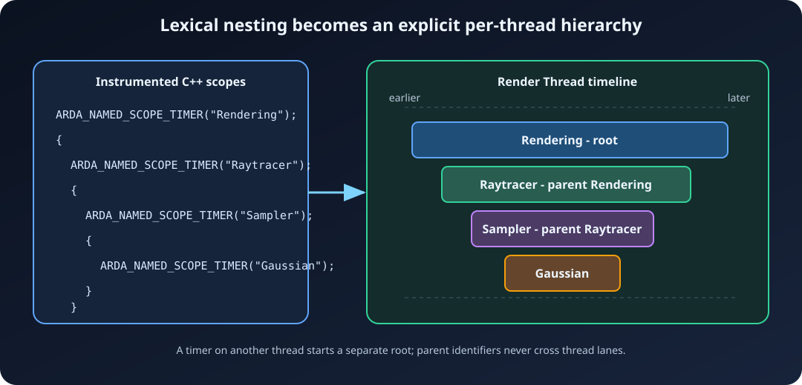

# Instrumentation

ArdaTrace instrumentation describes events; it does not print timing strings
from the measured process. Names are registered once, event records use integer
identifiers, and the viewer reconstructs hierarchy from explicit parent scope
identifiers.



## Automatic function scopes

`ARDA_SCOPE_TIMER()` uses the enclosing function's `__func__` value:

```cpp
void BuildAccelerationStructure()
{
    ARDA_SCOPE_TIMER();
    // Traced as "BuildAccelerationStructure".
}
```

Use it near the beginning of a function to measure the remaining function
body. The RAII timer records the end timestamp on normal return, early return,
or C++ stack unwinding.

## Explicitly named scopes

Use a stable string literal when a function contains multiple meaningful
phases:

```cpp
void RenderFrame()
{
    ARDA_NAMED_SCOPE_TIMER("Rendering");

    {
        ARDA_NAMED_SCOPE_TIMER("Raytracer");
        TraceScene();
    }

    {
        ARDA_NAMED_SCOPE_TIMER("Post Processing");
        ApplyPostProcessing();
    }
}
```

The named macro caches its label at that call site. Do not pass a temporary or
a value intended to change between invocations. Use a stable string literal.

## Hierarchical scope paths

Each thread maintains its own active scope identifier. Constructing a timer
stores the currently active identifier as its parent; destroying it restores
that parent. Nested function calls work without manually repeating prefixes:

```cpp
void Render()
{
    ARDA_NAMED_SCOPE_TIMER("Rendering");
    Raytrace();
}

void Raytrace()
{
    ARDA_NAMED_SCOPE_TIMER("Raytracer");
    SampleLighting();
}

void SampleLighting()
{
    ARDA_NAMED_SCOPE_TIMER("Gaussian Sampler");
}
```

The viewer can display:

```text
Rendering
└── Raytracer
    └── Gaussian Sampler
```

Parent relationships never cross threads. Work transferred to another thread
starts a new root hierarchy on that thread.

## Thread names

Name each participating thread from that thread:

```cpp
void RenderThreadMain()
{
    arda::trace::SetCurrentTraceThreadName("Render Thread");
    ARDA_NAMED_SCOPE_TIMER("Render Thread Loop");
    // ...
}
```

Calling the function again updates the viewer label for the same trace thread.
Names are copied by the recorder.

## Counter samples

Counters are timestamped `double` samples:

```cpp
ARDA_TRACE_COUNTER("Visible Objects", VisibleObjectCount);
ARDA_TRACE_COUNTER("Upload Queue MiB", QueuedBytes / (1024.0 * 1024.0));
```

Sample at a meaningful cadence, such as once per frame or after a state change.
Avoid emitting unchanged values from extremely hot loops.

## Markers

Markers identify instantaneous events:

```cpp
ARDA_TRACE_MARKER("Frame Begin");
ARDA_TRACE_MARKER("Shader Reload Requested");
```

The viewer draws markers vertically across the shared timeline, making them
useful for correlating activity on multiple threads.

## Direct API

Macros are preferred because they create one static `FArdaTraceName` per call
site. Code that needs a reusable registered name can call the API directly:

```cpp
static const arda::trace::FArdaTraceName QueueDepthName("Queue Depth");
arda::trace::RecordTraceCounter(QueueDepthName, QueueDepth);
```

`FArdaTraceName` labels must remain valid for the process lifetime. String
literals satisfy this requirement.

## Scope placement guidance

- Instrument subsystem boundaries and operations that are large enough to
  diagnose or optimize.
- Prefer stable names so aggregate rows combine equivalent work.
- Avoid a timer around every trivial accessor or iteration.
- Name worker threads before their first important event.
- Use counters for changing values, markers for points in time, and scopes for
  intervals.
- Keep capture start/stop outside instrumented worker activity.

## Runtime behavior and overhead

When capture is active, a scope records two steady-clock timestamps and appends
one completed event to its thread-local chunk. Counter and marker calls append
one timestamped event. Full chunks are published under synchronization; the
normal event path does not format strings or perform web operations.

Instrumentation still has measurable cost. Compare captures at the same
instrumentation level, and disable tracing for builds where that cost is not
acceptable:

```powershell
cmake -S . -B build-shipping -DARDASHIR_ENABLE_TRACE=OFF
```
