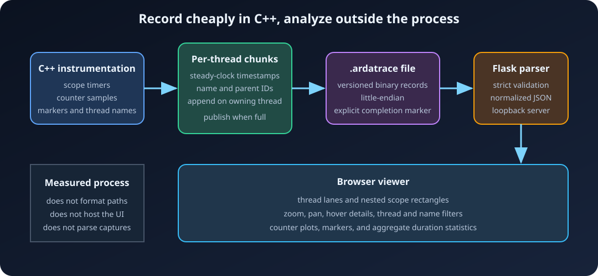
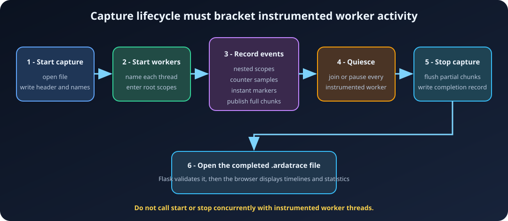

# Viewer, Capture Format, and Practices

The ArdaTrace viewer is an offline local web application. Flask validates and
normalizes a completed capture, then a dependency-free browser UI renders the
timeline with HTML, CSS, JavaScript, and Canvas.

## Start the viewer

From the repository root:

```powershell
.\Scripts\RunTraceViewer.bat frame.ardatrace
```

Direct invocation exposes additional options:

```powershell
python Tools\ArdaTraceViewer\app.py frame.ardatrace --port 5001
```

The default address is `http://127.0.0.1:5000`. Loopback binding keeps the
viewer local. Supplying `--host` or `--debug` is an explicit relaxation and
should only be done in a trusted environment.

To open another capture, use **Open capture** in the page. HTTP uploads are
limited to 256 MiB and held in memory. The server does not expose arbitrary
filesystem browsing.

## Timeline controls

- Scroll the mouse wheel over the timeline to zoom around the pointer.
- Drag horizontally to pan.
- Hover a scope rectangle to see its label, thread, duration, start time, and
  scope identifier.
- Select a thread to isolate one lane.
- Enter a name filter to limit scopes, counters, markers, and aggregate rows.
- Select **Reset view** to restore the complete time range.

The counter panel shares the selected time range with the scope timeline.
Markers appear as vertical dashed lines. Scope statistics are grouped by name
and report count, total, average, minimum, and maximum duration.

## Binary data flow



An `.ardatrace` file begins with:

1. the eight-byte `ARDATRC1` magic;
2. format version `1`;
3. the `0x01020304` byte-order marker; and
4. the capture's steady-clock origin in nanoseconds.

The body contains typed records:

| Record | Main fields |
|---|---|
| Name | Name identifier and UTF-8 label |
| Thread | Thread identifier and UTF-8 display name |
| Scope | Thread/name IDs, scope/parent IDs, start/end nanoseconds |
| Counter | Thread/name IDs, timestamp, `double` value |
| Marker | Thread/name IDs and timestamp |
| Capture end | Declares successful completion |

All integer and floating-point fields are little-endian. The C++ writer streams
full event chunks during capture and flushes partial per-thread chunks when
`StopTraceCapture()` runs.

The format is an internal, versioned contract. Consumers must reject unknown
versions and record types rather than guessing their layout.

## Validation

The native and Python readers validate structure and references before exposing
a session. The Python viewer additionally validates UTF-8 labels. Checks across
the readers include:

- magic, version, byte order, and completion record;
- record truncation and unknown record types;
- duplicate or reserved identifiers;
- valid UTF-8 labels with bounded lengths;
- defined name and thread references;
- finite counter values;
- scope start/end order;
- existing, same-thread parent scopes;
- parent-cycle prevention and temporal containment; and
- absence of bytes after the completion record.

This strictness distinguishes a complete capture from a crash-truncated or
incompatible file.

## Threading and lifecycle requirements

The recorder supports events from multiple threads, but lifecycle operations
have a stronger contract:

1. Call `StartTraceCapture()` before instrumented workers begin.
2. Start or release the workers.
3. Record scopes, counters, markers, and thread names concurrently.
4. Join or pause all instrumented workers.
5. Call `StopTraceCapture()`.



Do not stop while another thread is appending an event. The current recorder
expects lifecycle calls to occur at a process-level synchronization point.

## Troubleshooting

### The viewer says the capture is incomplete

Ensure `StopTraceCapture()` executed successfully. Check `GetTraceError()` and
avoid forced process termination during finalization.

### No scopes appear

- Confirm `ARDASHIR_ENABLE_TRACE=ON` for the target.
- Confirm `StartTraceCapture()` succeeded before entering the scopes.
- Check that the target links `Ardashir::ArdaTrace`.
- Remove active name/thread filters in the viewer.

### Thread names remain generic

Call `SetCurrentTraceThreadName()` from each worker thread after capture starts
or before its first recorded event.

### The capture changes program performance

Reduce instrumentation density and counter sampling frequency. Trace subsystem
boundaries instead of tiny operations. The recorded duration excludes event
serialization after the end timestamp, but instrumentation still consumes CPU
time and can perturb scheduling.

### The upload is rejected

Captures larger than 256 MiB cannot be uploaded through the web endpoint.
Reduce capture duration or channel density. The limit can be changed in the
local viewer only after considering parsing memory requirements.

## Current limitations

- Captures are offline rather than live-streamed to the viewer.
- Only CPU scopes, counters, markers, names, and thread metadata are recorded.
- There is no GPU/CPU clock calibration or GPU timestamp-query integration.
- The browser loads the normalized session in memory.
- Labels are call-site-stable rather than dynamically changing per event.
