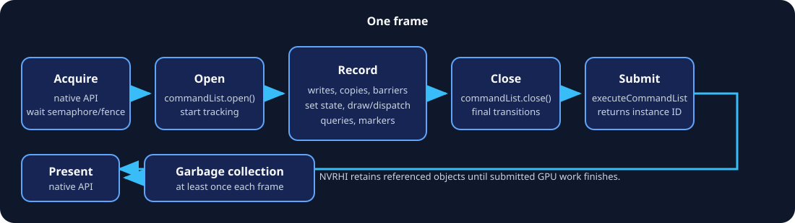

# Getting Started

[Home](README.md) · Next: [Core concepts](02-Core-Concepts.md)

This chapter builds the smallest useful mental and code model: native initialization, an NVRHI device, swap-chain wrappers, one graphics pipeline, and one submitted frame.

## 1. Add NVRHI to CMake

For the normal static-library configuration:

```cmake
add_subdirectory(ThirdParty/NVRHI)

target_link_libraries(MyRenderer PRIVATE
    nvrhi
    nvrhi_d3d12 # Windows, if enabled
    nvrhi_vk    # Vulkan, if enabled
)
```

Relevant options include:

```cmake
set(NVRHI_WITH_VALIDATION ON)
set(NVRHI_WITH_DX11 ON)       # Windows only
set(NVRHI_WITH_DX12 ON)       # Windows only
set(NVRHI_WITH_VULKAN ON)
set(NVRHI_BUILD_SHARED OFF)
set(NVRHI_WITH_NVAPI OFF)
set(NVRHI_WITH_RTXMU OFF)
set(NVRHI_WITH_AFTERMATH OFF)
set(NVRHI_D3D12_WITH_DXR12_OPACITY_MICROMAP OFF) # experimental native DXR 1.2 path
```

NVRHI can fetch Vulkan-Headers and DirectX-Headers when their targets are not already present. Link only the backends your executable can select. The `nvrhi` target contains the common interface, utilities, and—when enabled—the validation wrapper.

Include the common and selected backend headers:

```cpp
#include <nvrhi/nvrhi.h>
#include <nvrhi/utils.h>
#include <nvrhi/validation.h>
#include <nvrhi/d3d12.h> // if used
#include <nvrhi/vulkan.h> // if used
```

For a shared NVRHI build, call `nvrhi::verifyHeaderVersion()` during startup. It detects a header/library API mismatch.

## 2. Supply a message callback

NVRHI reports information, warnings, errors, and fatal conditions through `IMessageCallback`. Treat errors as test failures in development builds.

```cpp
class MessageCallback final : public nvrhi::IMessageCallback
{
public:
    void message(nvrhi::MessageSeverity severity, const char* text) override
    {
        LogNvrhi(severity, text);
        if (severity == nvrhi::MessageSeverity::Fatal)
            std::terminate();
    }
};
```

The callback must outlive the NVRHI device.

## 3. Create native objects first

NVRHI does not choose adapters or create the native device. Before calling a backend factory, create:

- D3D11: `ID3D11Device` and immediate context;
- D3D12: `ID3D12Device` and at least a graphics command queue;
- Vulkan: `VkInstance`, `VkPhysicalDevice`, `VkDevice`, at least a graphics queue, and the enabled extension list.

Create the window surface and swap chain with DXGI or Vulkan as usual. Queue, surface, and swap-chain policy remain application code.

### D3D12 wrapper

```cpp
nvrhi::d3d12::DeviceDesc desc;
desc.errorCB = &messageCallback;
desc.pDevice = d3dDevice.Get();
desc.pGraphicsCommandQueue = graphicsQueue.Get();
desc.pComputeCommandQueue = computeQueue.Get(); // optional
desc.pCopyCommandQueue = copyQueue.Get();       // optional
desc.enableRayTracingValidation = false;
desc.enableEnhancedBarriers = true;

nvrhi::DeviceHandle nativeDevice = nvrhi::d3d12::createDevice(desc);
```

### Vulkan wrapper

```cpp
nvrhi::vulkan::DeviceDesc desc;
desc.errorCB = &messageCallback;
desc.instance = instance;
desc.physicalDevice = physicalDevice;
desc.device = vkDevice;
desc.graphicsQueue = graphicsQueue;
desc.graphicsQueueIndex = graphicsQueueFamily;
desc.computeQueue = computeQueue;          // optional
desc.computeQueueIndex = computeFamily;
desc.transferQueue = transferQueue;        // optional
desc.transferQueueIndex = transferFamily;
desc.deviceExtensions = enabledExtensions.data();
desc.numDeviceExtensions = enabledExtensions.size();

nvrhi::DeviceHandle nativeDevice = nvrhi::vulkan::createDevice(desc);
```

Pass the exact Vulkan extensions and optional features enabled on the native device. NVRHI cannot safely infer all of them.

### Validation wrapper

Keep both handles. Backend-specific operations may need the native NVRHI device, while ordinary renderer code should use the validation wrapper.

```cpp
nvrhi::DeviceHandle device =
    nvrhi::validation::createValidationLayer(nativeDevice);
```

Use the native GAPI validation layer as well. It validates native API correctness; NVRHI validation checks higher-level NVRHI contracts such as binding compatibility and command ordering.

## 4. Wrap swap-chain images

NVRHI does not acquire or present images. Wrap each native back buffer once and build a framebuffer for it:

```cpp
auto textureDesc = nvrhi::TextureDesc()
    .setDimension(nvrhi::TextureDimension::Texture2D)
    .setWidth(width)
    .setHeight(height)
    .setFormat(nvrhi::Format::BGRA8_UNORM)
    .setIsRenderTarget(true)
    .setInitialState(nvrhi::ResourceStates::Present)
    .setKeepInitialState(true)
    .setDebugName("Swap-chain image");

auto texture = nativeDevice->createHandleForNativeTexture(
    nvrhi::ObjectTypes::D3D12_Resource, // VK_Image for Vulkan
    nvrhi::Object(nativeBackBuffer),
    textureDesc);

auto framebuffer = device->createFramebuffer(
    nvrhi::FramebufferDesc().addColorAttachment(texture));
```

Use the native NVRHI device to wrap native objects, then use the resulting handles through the validation device. On resize:

1. stop submitting frames;
2. wait for work referencing old images;
3. release framebuffers and NVRHI image handles;
4. resize/recreate the native swap chain; and
5. wrap the new images.

## 5. Create shaders and input layout

NVRHI consumes compiled binaries. Typical choices are DXIL for D3D12 and SPIR-V for Vulkan. D3D11 generally consumes DXBC or compatible bytecode.

```cpp
auto vs = device->createShader(
    nvrhi::ShaderDesc()
        .setShaderType(nvrhi::ShaderType::Vertex)
        .setDebugName("Triangle VS"),
    vsBytes.data(), vsBytes.size());

auto ps = device->createShader(
    nvrhi::ShaderDesc()
        .setShaderType(nvrhi::ShaderType::Pixel)
        .setDebugName("Triangle PS"),
    psBytes.data(), psBytes.size());

nvrhi::VertexAttributeDesc attributes[] = {
    nvrhi::VertexAttributeDesc()
        .setName("POSITION")
        .setFormat(nvrhi::Format::RGB32_FLOAT)
        .setOffset(0).setElementStride(sizeof(Vertex)),
    nvrhi::VertexAttributeDesc()
        .setName("COLOR")
        .setFormat(nvrhi::Format::RGBA32_FLOAT)
        .setOffset(12).setElementStride(sizeof(Vertex))
};

auto inputLayout = device->createInputLayout(
    attributes, uint32_t(std::size(attributes)), vs);
```

The vertex shader argument is required for D3D11 input-layout creation; it can be null on modern backends.

## 6. Create resources

```cpp
auto vertexBuffer = device->createBuffer(
    nvrhi::BufferDesc()
        .setByteSize(sizeof(vertices))
        .setIsVertexBuffer(true)
        .enableAutomaticStateTracking(nvrhi::ResourceStates::VertexBuffer)
        .setDebugName("Triangle vertices"));

auto commandList = device->createCommandList();
commandList->open();
commandList->writeBuffer(vertexBuffer, vertices, sizeof(vertices));
commandList->setPermanentBufferState(
    vertexBuffer, nvrhi::ResourceStates::VertexBuffer);
commandList->close();
device->executeCommandList(commandList);
```

`writeBuffer` hides upload allocation and copy details. The permanent-state call is recorded while the list is open and makes future use of this static buffer cheaper to track.

## 7. Create the pipeline

A graphics pipeline is compatible with framebuffers whose `FramebufferInfo` matches its color/depth formats and sample configuration.

```cpp
auto pipeline = device->createGraphicsPipeline(
    nvrhi::GraphicsPipelineDesc()
        .setInputLayout(inputLayout)
        .setVertexShader(vs)
        .setPixelShader(ps),
    nvrhi::FramebufferInfo().addColorFormat(nvrhi::Format::BGRA8_UNORM));
```

The defaults describe triangle-list rendering with depth testing enabled. If there is no depth attachment, explicitly disable depth testing:

```cpp
nvrhi::RenderState renderState;
renderState.depthStencilState.disableDepthTest().disableDepthWrite();
```

Then pass it with `.setRenderState(renderState)`.

## 8. Record and submit one frame



```cpp
// Native API: acquire the next swap-chain image and wait as required.

commandList->open();

nvrhi::utils::ClearColorAttachment(
    commandList, framebuffers[imageIndex], 0, nvrhi::Color(0.02f, 0.04f, 0.08f, 1.f));

auto state = nvrhi::GraphicsState()
    .setPipeline(pipeline)
    .setFramebuffer(framebuffers[imageIndex])
    .setViewport(nvrhi::ViewportState().addViewportAndScissorRect(
        nvrhi::Viewport(float(width), float(height))))
    .addVertexBuffer(nvrhi::VertexBufferBinding()
        .setBuffer(vertexBuffer).setSlot(0).setOffset(0));

commandList->setGraphicsState(state);
commandList->draw(nvrhi::DrawArguments().setVertexCount(3));
commandList->close();

// Native API: arrange acquire/submit semaphore or fence interaction.
device->executeCommandList(commandList);
// Native API: present.
device->runGarbageCollection();
```

The local `NVRHITest` demonstrates Vulkan semaphore bridging. Its D3D12 backend deliberately serializes each smoke-test frame with `waitForIdle()` before presentation; that is simple and correct for a test, but production code should use per-frame native fences instead. NVRHI's abstraction does not replace swap-chain synchronization.

## 9. Shutdown order

1. Stop frame production.
2. Call `device->waitForIdle()` and handle a false result as device loss.
3. Release renderer-owned pipelines, sets, resources, framebuffers, and command lists.
4. Run garbage collection or release the NVRHI devices.
5. Destroy native swap-chain and device objects.
6. Destroy the callback last.

## First-run checklist

- Validation wrapper and native validation are enabled.
- Every created object has a useful debug name.
- Swap-chain image descriptors match the native format and dimensions.
- Pipeline `FramebufferInfo` matches the active framebuffer.
- Each command list is opened, closed, and submitted to its declared queue type.
- Present synchronization is implemented in native backend code.
- `runGarbageCollection()` executes at least once per frame.
- Optional features are checked with `queryFeatureSupport`.

