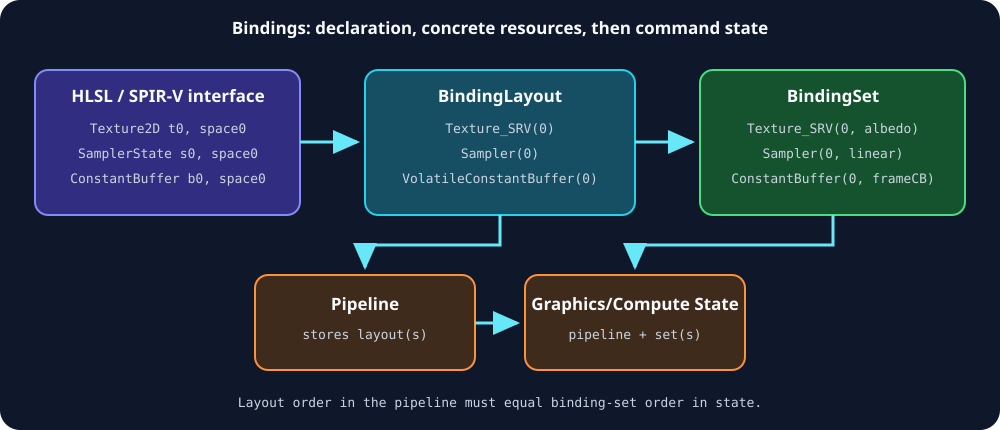

# Bindings and Shaders

[Previous](03-Resources-and-Memory.md) · [Home](README.md) · Next: [Graphics](05-Graphics.md)



## Shader binaries

NVRHI does not compile shaders. Compile and package binaries separately:

- D3D11: bytecode accepted by the D3D11 backend;
- D3D12: normally DXIL;
- Vulkan: SPIR-V.

Create one `IShader` per entry point/stage:

```cpp
auto shader = device->createShader(
    nvrhi::ShaderDesc()
        .setShaderType(nvrhi::ShaderType::Compute)
        .setEntryName("MainCS")
        .setDebugName("Culling CS"),
    bytes.data(), bytes.size());
```

Supported stages are compute; vertex, hull/tessellation control, domain/tessellation evaluation, geometry, pixel/fragment; amplification/task, mesh; and all ray-tracing shader stages.

Ray-tracing binaries are created as `IShaderLibrary`, then entry points are obtained with `getShader(entryName, shaderType)`.

### Specialization

`createShaderSpecialization` applies `UInt32`, `Int32`, or `Float` constants identified by constant ID. Guard it with `Feature::ShaderSpecializations`; backend behavior and binary requirements differ.

### NVIDIA shader extensions

`ShaderDesc::hlslExtensionsUAV` and the RT pipeline equivalent identify the fake UAV slot used by NVAPI HLSL extensions. `FastGeometryShaderFlags`, custom semantics, and coordinate swizzling expose NVAPI fast-geometry/single-pass behavior. These are optional vendor paths: require the corresponding feature and build configuration.

## Register model

NVRHI preserves HLSL-style categories:

- SRV resources use `t#`;
- UAV resources use `u#`;
- constant buffers use `b#`;
- samplers use `s#`;
- register spaces distinguish groups on D3D12 and can map to descriptor sets on Vulkan.

Vulkan has one binding namespace per descriptor set. When cross-compiling HLSL with DXC, use matching resource-class offsets. `VulkanBindingOffsets` defaults to:

- SRV: `0`;
- sampler: `128`;
- constant buffer: `256`;
- UAV: `384`.

The offsets used to compile SPIR-V and those in `BindingLayoutDesc` must agree.

## Regular binding layouts

A layout declares slots, resource kinds, shader visibility, register space, and array sizes:

```cpp
auto layout = device->createBindingLayout(
    nvrhi::BindingLayoutDesc()
        .setVisibility(nvrhi::ShaderType::Compute)
        .setRegisterSpaceAndDescriptorSet(0)
        .addItem(nvrhi::BindingLayoutItem::Texture_SRV(0))
        .addItem(nvrhi::BindingLayoutItem::StructuredBuffer_UAV(0))
        .addItem(nvrhi::BindingLayoutItem::VolatileConstantBuffer(0))
        .addItem(nvrhi::BindingLayoutItem::Sampler(0)));
```

Resource types:

- texture SRV/UAV;
- typed, structured, and raw buffer SRV/UAV;
- regular and volatile constant buffer;
- sampler;
- ray-tracing acceleration structure;
- push constants; and
- sampler-feedback UAV.

Use `.setSize(N)` on a `BindingLayoutItem` for a fixed descriptor array. Push-constant size means bytes, not array length. A volatile constant buffer's array size must be one.

All items in one layout share visibility and register-space policy. Split layouts when stages need different visibility or Vulkan offsets.

### Register spaces as Vulkan sets

`registerSpaceIsDescriptorSet` must have the same value for every layout in one pipeline.

- `false`: register space is meaningful on D3D12; nonzero use on other APIs is invalid.
- `true`: register space also selects the Vulkan descriptor set. No two layouts in one pipeline may then use the same register space.

This explicit mode makes pipeline layout ordering independent from descriptor-set numbering.

## Binding sets

A set supplies concrete resources matching one layout:

```cpp
auto set = device->createBindingSet(
    nvrhi::BindingSetDesc()
        .addItem(nvrhi::BindingSetItem::Texture_SRV(0, inputTexture))
        .addItem(nvrhi::BindingSetItem::StructuredBuffer_UAV(0, outputBuffer))
        .addItem(nvrhi::BindingSetItem::ConstantBuffer(0, constants))
        .addItem(nvrhi::BindingSetItem::Sampler(0, sampler)),
    layout);
```

Validation requires:

- matching resource type and slot;
- every declared regular binding present and no undeclared binding;
- each array element represented with `.setArrayElement(index)`;
- legal format, dimension, buffer range, and texture subresources;
- binding sets supplied in the same order as pipeline layouts.

Binding item order inside a regular set is not semantically important. Layout order in the pipeline is.

Views are implicit. A binding item can select:

- a compatible texture view format and dimension;
- a mip/slice subresource set;
- a typed-buffer format; or
- a buffer byte range.

NVRHI creates/caches native view objects as needed.

## Liveness and state tracking

Regular sets default to `trackLiveness = true`. They strongly own their resources, and submitted command lists retain the set while the GPU needs it. NVRHI can also derive resource states from each binding type.

Setting `trackLiveness = false` reduces retention overhead for extremely stable sets. It transfers responsibility to the application: do not release the set or resources until all referencing GPU work completes.

## Constants

### Regular constant buffers

Use for persistent or explicitly managed data. Partial views must have 256-byte-aligned offset and size.

### Volatile constant buffers

Use for frequently rewritten per-draw/per-dispatch constants. Write each opened command-list instance before use. On Vulkan, size `maxVersions` correctly.

### Push constants

Declare the same byte size in layout and set:

```cpp
auto layoutDesc = nvrhi::BindingLayoutDesc()
    .setVisibility(nvrhi::ShaderType::Compute)
    .addItem(nvrhi::BindingLayoutItem::PushConstants(0, sizeof(Constants)));

auto setDesc = nvrhi::BindingSetDesc()
    .addItem(nvrhi::BindingSetItem::PushConstants(0, sizeof(Constants)));
```

After `setComputeState`:

```cpp
commandList->setPushConstants(&constants, sizeof(constants));
commandList->dispatch(x, y, z);
```

Limits and rules:

- maximum 128 bytes;
- only one push-constant binding across all layouts in a pipeline;
- set only after `set*State`;
- a new `set*State` invalidates them.

## Samplers

`SamplerDesc` controls min/mag/mip filtering, anisotropy, mip bias, U/V/W addressing, border color, and reduction:

- standard;
- comparison;
- minimum; or
- maximum.

```cpp
auto sampler = device->createSampler(
    nvrhi::SamplerDesc()
        .setAllFilters(true)
        .setMaxAnisotropy(8.f)
        .setAllAddressModes(nvrhi::SamplerAddressMode::Wrap));
```

Cache samplers globally. They are immutable and usually few in number.

## Bindless layouts and descriptor tables

Bindless access uses an `IBindingLayout` created by `createBindlessLayout` and a mutable `IDescriptorTable`:

```cpp
auto bindlessLayout = device->createBindlessLayout(
    nvrhi::BindlessLayoutDesc()
        .setVisibility(nvrhi::ShaderType::All)
        .setFirstSlot(0)
        .setMaxCapacity(65536)
        .addRegisterSpace(nvrhi::BindingLayoutItem::Texture_SRV(1)));

auto table = device->createDescriptorTable(bindlessLayout);
device->resizeDescriptorTable(table, 4096);
device->writeDescriptorTable(
    table, nvrhi::BindingSetItem::Texture_SRV(index, texture));
```

For an immutable table, the item's slot identifies the table entry under the layout's mapping; `None(index)` erases an entry. Mutable direct-heap layouts need extra care on D3D12: the binding layout does not establish a descriptor set, and the shader-visible heap index is:

```text
descriptorTable->getFirstDescriptorIndexInHeap() + tableEntry
```

The table's first heap index may change when the table is resized, so do not cache it across a resize. Publish the current base index to shaders or GPU data after allocation/resizing.

`BindlessLayoutDesc::LayoutType` supports:

- `Immutable`: fixed resource type(s) described by register spaces;
- `MutableSrvUavCbv`: direct resource heap indexing;
- `MutableCounters`: counter-resource heap;
- `MutableSampler`: direct sampler heap indexing.

The mutable forms bridge HLSL `ResourceDescriptorHeap` / `SamplerDescriptorHeap` behavior between D3D12 and Vulkan. Compile SPIR-V with matching DXC resource-heap bindings.

### Bindless safety contract

Descriptor tables:

- are mutable and resizable;
- do not retain referenced resources;
- do not provide automatic barrier information;
- can be read by in-flight GPU work while the CPU wants to update them.

Therefore:

1. Keep every referenced resource alive manually.
2. Place resources in known/permanent states or transition them explicitly.
3. Do not overwrite a descriptor an in-flight frame may read.
4. Use frame-versioned regions, deferred updates, or queue completion.
5. Keep descriptor indices stable or update all GPU references coherently.
6. Treat resize as a potentially disruptive allocation event and refresh direct-heap base indices.

## Binding design patterns

### Frequency-based layouts

Use separate layouts/sets for:

- frame/view data;
- pass data;
- material data; and
- object/draw data.

This allows stable sets to remain cached while only high-frequency sets vary.

### Backend-portable shaders

- Keep slot and space declarations in shared shader headers.
- Keep DXC Vulkan offsets in one build configuration.
- Use `nvrhiHLSL.h` where its shared C++/HLSL definitions fit the project.
- Avoid local RT bindings if Vulkan is required; Vulkan does not support NVRHI local RT layouts.
- Capability-gate heap-direct indexing and specialization paths.

### Cache keys

A binding-set cache key must include all semantics that affect views: resource identity, slot, array element, format, dimension, subresources/range, and layout identity. Do not key only by resource pointer.

