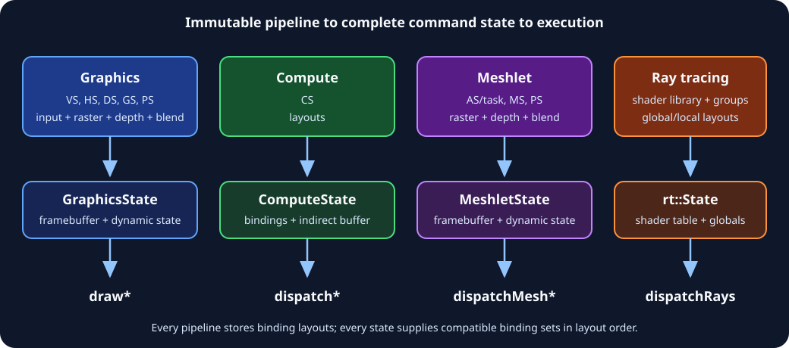

# Graphics

[Previous](04-Bindings-and-Shaders.md) · [Home](README.md) · Next: [Compute](06-Compute.md)



## Graphics pipeline anatomy

`GraphicsPipelineDesc` contains:

- primitive topology and optional patch control-point count;
- input layout;
- vertex, hull, domain, geometry, and pixel shaders;
- immutable blend, depth/stencil, raster, stereo, and pipeline VRS state; and
- up to eight binding layouts.

Creation also requires `FramebufferInfo`:

```cpp
auto pipeline = device->createGraphicsPipeline(
    nvrhi::GraphicsPipelineDesc()
        .setPrimType(nvrhi::PrimitiveType::TriangleList)
        .setInputLayout(inputLayout)
        .setVertexShader(vs)
        .setPixelShader(ps)
        .setRenderState(renderState)
        .addBindingLayout(frameLayout)
        .addBindingLayout(materialLayout),
    framebufferInfo);
```

Pipeline objects are immutable. Cache variants by all descriptor fields plus framebuffer compatibility.

## Input layouts

Each `VertexAttributeDesc` defines:

- semantic name;
- format and optional array size;
- source buffer index;
- byte offset;
- full element stride; and
- per-vertex or instanced frequency.

All attributes from the same buffer index should use the same stride. `bufferIndex` maps to `VertexBufferBinding::slot`.

For procedural vertices generated from `SV_VertexID`, omit the input layout and vertex-buffer bindings.

## Primitive types

NVRHI exposes point, line, triangle, adjacency, fan, and patch lists. Backend support is not identical: triangle fan is a Vulkan concept and may not be portable. Tessellation uses `PatchList`, a nonzero patch-control-point count, and hull/domain shaders.

## Raster state

`RasterState` includes:

- solid/wireframe fill;
- front/back/no culling and front-face winding;
- depth clip and scissor enable;
- multisample and antialiased-line enable;
- constant, clamp, and slope-scaled depth bias;
- forced sample count;
- programmable sample positions;
- conservative rasterization; and
- NVIDIA quad-fill behavior.

Extended fields are capability- and backend-dependent. Check `ConservativeRasterization` and other related features before creating variants.

## Depth/stencil

`DepthStencilState` defaults to depth test/write with `Less`. Configure:

- depth test, write, and comparison;
- stencil read/write masks;
- front/back fail, depth-fail, pass operations and comparison;
- static stencil reference; or
- dynamic stencil reference supplied by `GraphicsState`.

If `dynamicStencilRef` is enabled in the pipeline, set `GraphicsState::dynamicStencilRefValue`.

For reverse-Z, typically clear depth to `0`, use `Greater`/`GreaterOrEqual`, and build projection matrices consistently.

## Blending

`BlendState` has one `RenderTarget` record per color attachment and optional alpha-to-coverage. Each target controls:

- color/alpha source and destination factors;
- color/alpha operation; and
- write mask.

If a blend factor uses constant color, supply `GraphicsState::blendConstantColor`.

Common straight-alpha blend:

```cpp
auto target = nvrhi::BlendState::RenderTarget()
    .enableBlend()
    .setSrcBlend(nvrhi::BlendFactor::SrcAlpha)
    .setDestBlend(nvrhi::BlendFactor::InvSrcAlpha);
renderState.blendState.setRenderTarget(0, target);
```

For premultiplied alpha use source `One`.

## Framebuffers and attachments

```cpp
auto framebuffer = device->createFramebuffer(
    nvrhi::FramebufferDesc()
        .addColorAttachment(color)
        .setDepthAttachment(depth));
```

Attachments can select a mip, array range, view format, and read-only depth. Read-only depth allows simultaneous depth testing and shader reads when supported and correctly bound.

All active framebuffer attachments must be dimension/sample compatible. The pipeline's `FramebufferInfo` must exactly match formats and sample settings.

## Dynamic graphics state

```cpp
auto state = nvrhi::GraphicsState()
    .setPipeline(pipeline)
    .setFramebuffer(framebuffer)
    .setViewport(viewports)
    .addBindingSet(frameSet)
    .addBindingSet(materialSet)
    .addVertexBuffer(nvrhi::VertexBufferBinding()
        .setBuffer(vertexBuffer).setSlot(0).setOffset(vertexOffset))
    .setIndexBuffer(nvrhi::IndexBufferBinding()
        .setBuffer(indexBuffer).setFormat(nvrhi::Format::R32_UINT).setOffset(0));

commandList->setGraphicsState(state);
```

`ViewportState` may contain up to 16 viewports and scissor rectangles. If raster scissoring is enabled, supply matching scissor state. NVRHI caches state; repeatedly setting unchanged structures avoids many native calls but still has comparison cost.

## Direct drawing

`DrawArguments` is shared by direct indexed and non-indexed calls:

- `vertexCount` means vertex count for `draw` and index count for `drawIndexed`;
- instance count;
- start index;
- start/base vertex;
- start instance.

```cpp
commandList->draw(args);
commandList->drawIndexed(args);
```

Ensure index binding format is `R16_UINT` or `R32_UINT` as supported.

## Indirect drawing

Create the argument buffer with `isDrawIndirectArgs = true`, then place it in `GraphicsState::indirectParams`.

- `drawIndirect(offset, count)` consumes packed `DrawIndirectArguments`.
- `drawIndexedIndirect(offset, count)` consumes packed `DrawIndexedIndirectArguments`.
- `drawIndexedIndirectCount(paramOffset, countOffset, maxCount)` also reads a GPU-produced count from `indirectCountBuffer`.

D3D11's counted path falls back to `maxDrawCount`; do not expect GPU count limiting there. Indirect argument buffers require the `IndirectArgument` state.

GPU-driven pattern:

1. Compute writes argument and count buffers as UAV.
2. A UAV ordering point is established.
3. Buffers transition to `IndirectArgument`.
4. Graphics state binds both buffers.
5. Counted indirect draw executes.

## Meshlet pipelines

Meshlet rendering replaces vertex/tessellation/geometry stages with:

- optional amplification/task shader;
- mesh shader; and
- optional pixel shader.

Create `MeshletPipelineDesc` with render state, layouts, and framebuffer info. Set `MeshletState`, then call:

- `dispatchMesh`;
- `dispatchMeshIndirect`; or
- `dispatchMeshIndirectCount`.

Check `Feature::Meshlets`. DX11 is unsupported. The indirect-count variant is documented as Vulkan-only in this API revision; provide a fallback.

## Variable-rate shading

Check `Feature::VariableRateShading` and retrieve `VariableRateShadingFeatureInfo::shadingRateImageTileSize`.

Two pieces contribute:

- pipeline/default `VariableRateShadingState`;
- dynamic `GraphicsState::shadingRateState`.

The state includes a base rate (`1x1` through `4x4`) and combiners for primitive and image rates. To use image-based VRS:

1. create a texture with `isShadingRateSurface`;
2. populate it with valid encoded rates;
3. attach it as the framebuffer's shading-rate attachment;
4. transition it to `ShadingRateSurface`; and
5. configure the image combiner.

Dimensions are based on the queried tile size, not render-target pixels.

## Single-pass stereo

`SinglePassStereoState` controls enablement, independent viewport masks, and render-target index offset. It is an NVIDIA extension path; check `Feature::SinglePassStereo` and ensure shaders use the expected custom semantics and array/view layout.

## Multisampling

Set matching sample count/quality on render-target/depth textures and `FramebufferInfo`. Enable relevant raster state. Render into multisampled attachments and resolve color:

```cpp
commandList->resolveTexture(
    resolved, nvrhi::AllSubresources,
    multisampled, nvrhi::AllSubresources);
```

NVRHI's resolve operation is for color textures. Depth resolve and custom filters require a backend-specific or shader path.

## Render-pass recording pattern

```cpp
commandList->beginMarker("Opaque");
nvrhi::utils::ClearColorAttachment(commandList, framebuffer, 0, clear);
nvrhi::utils::ClearDepthStencilAttachment(commandList, framebuffer, 1.f, 0);

commandList->writeBuffer(frameConstants, &frameData, sizeof(frameData));
commandList->setGraphicsState(state);
for (const DrawItem& item : items)
{
    commandList->setPushConstants(&item.constants, sizeof(item.constants));
    commandList->drawIndexed(item.args);
}
commandList->endMarker();
```

Group draws by pipeline, binding sets, buffers, and dynamic state to reduce state changes. Do not rebuild immutable pipeline or set objects per draw.

## Graphics correctness checklist

- Pipeline framebuffer info matches all used framebuffers.
- Depth is disabled when no depth attachment exists.
- Vertex semantics, formats, offsets, strides, and shader inputs agree.
- Set order equals pipeline layout order.
- Viewports/scissors fit attachment dimensions.
- The correct index format and offsets are used.
- UAV-to-indirect and compute-to-graphics dependencies are explicit.
- Optional mesh/VRS/stereo/raster features are capability-gated.
- Presentable images return to the native backend's required state.

