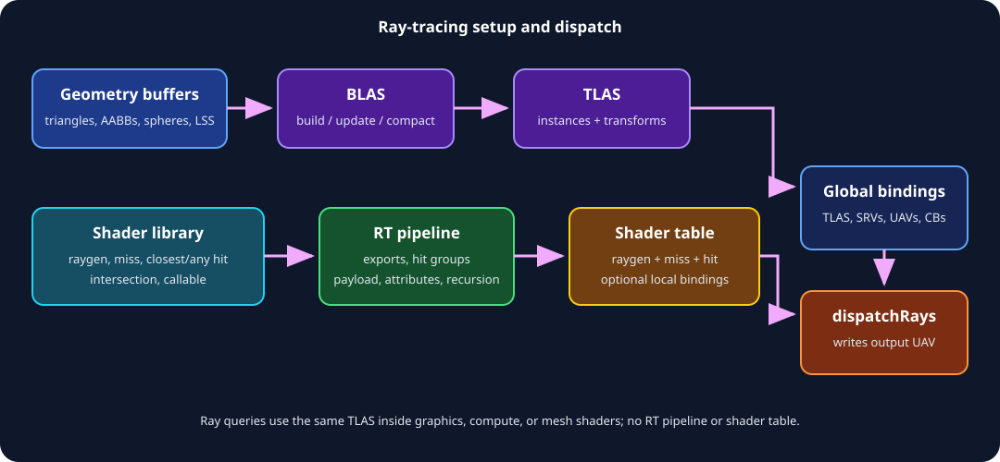

# Ray Tracing

[Previous](06-Compute.md) · [Home](README.md) · Next: [State and synchronization](08-State-and-Synchronization.md)



NVRHI supports acceleration structures shared by two execution models:

- ray queries from ordinary shader stages; and
- ray-tracing pipelines with ray-generation, miss, hit, intersection, and callable shaders.

Check features separately: `RayTracingAccelStruct`, `RayQuery`, and `RayTracingPipeline`.

## Geometry inputs

Bottom-level acceleration structures (BLAS) may describe:

- indexed or non-indexed triangles;
- procedural axis-aligned bounding boxes;
- hardware spheres where supported; and
- linear swept spheres (LSS) where supported.

All source buffers need `isAccelStructBuildInput = true`. If shaders also read them, add the appropriate raw/structured/typed view capability.

Triangle example:

```cpp
auto triangles = nvrhi::rt::GeometryTriangles()
    .setVertexBuffer(vertexBuffer)
    .setVertexFormat(nvrhi::Format::RGB32_FLOAT)
    .setVertexOffset(offsetof(Vertex, position))
    .setVertexStride(sizeof(Vertex))
    .setVertexCount(vertexCount)
    .setIndexBuffer(indexBuffer)
    .setIndexFormat(nvrhi::Format::R32_UINT)
    .setIndexCount(indexCount);

auto geometry = nvrhi::rt::GeometryDesc()
    .setTriangles(triangles)
    .setFlags(nvrhi::rt::GeometryFlags::Opaque);
```

`Opaque` skips any-hit invocation and can be substantially faster, but is incorrect for alpha-tested geometry. `NoDuplicateAnyHitInvocation` requests at most one any-hit call per primitive for a ray.

Procedural AABBs require an intersection shader in an RT pipeline. Spheres and LSS require their corresponding queried features and native extension support.

## Creating and building a BLAS

```cpp
auto blasDesc = nvrhi::rt::AccelStructDesc()
    .addBottomLevelGeometry(geometry)
    .setBuildFlags(nvrhi::rt::AccelStructBuildFlags::PreferFastTrace)
    .setDebugName("Mesh BLAS");

auto blas = device->createAccelStruct(blasDesc);

commandList->buildBottomLevelAccelStruct(
    blas, blasDesc.bottomLevelGeometries.data(),
    blasDesc.bottomLevelGeometries.size());
```

The creation descriptor defines maximum required capacity; the build supplies current buffer references and geometry. NVRHI may clear resource pointers from stored descriptors, so retain/reconstruct build geometry rather than assuming `getDesc()` is a complete rebuild command.

Build flags trade:

- `AllowUpdate`: permit in-place updates;
- `AllowCompaction`: permit a smaller final structure;
- `PreferFastTrace`: spend build cost/memory for traversal;
- `PreferFastBuild`: optimize build time;
- `MinimizeMemory`: reduce memory;
- `PerformUpdate`: request update on the build command;
- `AllowEmptyInstances`: validation-only TLAS relaxation.

An update must fit creation capacity and preserve required geometry/primitive compatibility. A compacted BLAS cannot later be rebuilt or updated.

Scratch memory is managed by the command list. Large one-time builds can permanently grow its scratch working set; use a dedicated command list and release it afterward.

## TLAS instances

A top-level acceleration structure (TLAS) references BLAS objects:

```cpp
auto tlas = device->createAccelStruct(
    nvrhi::rt::AccelStructDesc()
        .setTopLevelMaxInstances(maxInstances)
        .setBuildFlags(nvrhi::rt::AccelStructBuildFlags::AllowUpdate)
        .setDebugName("Scene TLAS"));

nvrhi::rt::InstanceDesc instance;
instance.setBLAS(blas)
    .setTransform(transform)
    .setInstanceID(materialIndex)
    .setInstanceMask(0xff)
    .setInstanceContributionToHitGroupIndex(hitGroupOffset);

commandList->buildTopLevelAccelStruct(tlas, &instance, 1);
```

`InstanceDesc` is a 64-byte GPU-compatible structure. The mask is eight bits; a zero mask makes the instance invisible. Contribution selects hit records based on the shader-table indexing formula.

For GPU-generated instances, fill a buffer with `InstanceDesc`-compatible records using BLAS device addresses and call `buildTopLevelAccelStructFromBuffer`. NVRHI cannot validate BLAS pointers, retain those BLASes, or infer their state from raw GPU addresses—your application must do so.

## Binding an acceleration structure

Declare `RayTracingAccelStruct(slot)` and supply `BindingSetItem::RayTracingAccelStruct`. Acceleration structures are read in `AccelStructRead`.

The same binding works for ray queries in compute/graphics/mesh shaders and for global RT-pipeline bindings.

## Ray queries

Ray queries execute inline in an ordinary shader:

1. Build BLAS and TLAS.
2. Bind the TLAS in a normal graphics/compute/mesh layout.
3. Compile shader code using the API's inline ray-query support.
4. Set the ordinary state and draw/dispatch.

No shader library, RT pipeline, or shader table is needed. This is often simpler for shadows, ambient occlusion, picking, and selective reflection queries.

## RT pipeline

Create a shader library and retrieve typed entry points:

```cpp
auto library = device->createShaderLibrary(bytes.data(), bytes.size());
auto rayGen = library->getShader("RayGen", nvrhi::ShaderType::RayGeneration);
auto miss = library->getShader("Miss", nvrhi::ShaderType::Miss);
auto closestHit = library->getShader("ClosestHit", nvrhi::ShaderType::ClosestHit);
```

Build named exports and hit groups:

```cpp
auto pipeline = device->createRayTracingPipeline(
    nvrhi::rt::PipelineDesc()
        .addBindingLayout(globalLayout)
        .setMaxPayloadSize(sizeof(Payload))
        .setMaxAttributeSize(sizeof(float) * 2)
        .setMaxRecursionDepth(1)
        .addShader(nvrhi::rt::PipelineShaderDesc()
            .setExportName("RayGen").setShader(rayGen))
        .addShader(nvrhi::rt::PipelineShaderDesc()
            .setExportName("Miss").setShader(miss))
        .addHitGroup(nvrhi::rt::PipelineHitGroupDesc()
            .setExportName("OpaqueHit")
            .setClosestHitShader(closestHit)));
```

Payload, attribute, and recursion limits directly affect native pipeline resource use. Keep them as small as the algorithm allows.

Procedural geometry hit groups set `isProceduralPrimitive = true` and provide an intersection shader. Any-hit and closest-hit are optional according to algorithm needs.

## Global and local bindings

Global layouts behave like other pipelines. A generic shader or hit group can additionally specify one local binding layout and each shader-table entry can provide a local set.

Local bindings map to D3D12 local root signatures. They are not supported by NVRHI's Vulkan backend. For portable RT code:

- prefer global resources;
- use bindless indices in instance/material records; or
- build a backend-specific local-binding variant.

## Shader tables

```cpp
auto table = pipeline->createShaderTable();
table->setRayGenerationShader("RayGen");
table->addMissShader("Miss");
table->addHitGroup("OpaqueHit");
table->addCallableShader("MaterialCallable");
```

Tables are mutable and versioned. An uncached table builds from upload memory when used. For a large, infrequently modified table:

```cpp
auto table = pipeline->createShaderTable(
    nvrhi::rt::ShaderTableDesc()
        .enableCaching(maxEntries)
        .setDebugName("Scene SBT"));
```

Cached tables reserve an additional buffer and update it after changes. `maxEntries` must be nonzero and cover all ray-generation, miss, hit-group, and callable records.

`addMissShader`, `addHitGroup`, and `addCallableShader` return their record indices and accept an optional local binding set. Their corresponding `clear*Shaders` methods replace those record arrays when rebuilding a mutable table. Local callable bindings have the same D3D12-only portability limitation as other local RT bindings.

Shader export names and TLAS `instanceContributionToHitGroupIndex` must agree with the shader-table layout. Keep this mapping in one scene-building module and validate indices before submission.

## Dispatch

RT pipelines write through UAVs; they do not target a framebuffer directly.

```cpp
auto state = nvrhi::rt::State()
    .setShaderTable(table)
    .addBindingSet(globalSet);

commandList->setRayTracingState(state);
commandList->dispatchRays(
    nvrhi::rt::DispatchRaysArguments().setDimensions(width, height, 1));
```

Composite or copy the output into a presentable framebuffer afterward. A fullscreen graphics pass is usually preferable because it can tone map, filter, and convert color space.

## Acceleration-structure memory and copying

Acceleration structures can be virtual. Query requirements, bind compatible heap memory, then build.

`copyRaytracingAccelerationStructure(destination, source)` clones an AS into another location. Destination capacity and backend restrictions must be respected.

When built with RTXMU:

- BLAS management, update, and compaction are delegated;
- `compactBottomLevelAccelStructs()` compacts eligible BLASes;
- this command has no effect without RTXMU;
- current RTXMU integration does not support OMM or LSS.

## Opacity micromaps

OMM encodes microtriangle opacity to reduce expensive any-hit work for alpha-tested geometry.

Flow:

1. Check `RayTracingOpacityMicromap`.
2. Prepare raw opacity data and per-OMM descriptors in build-input buffers.
3. Create `OpacityMicromapDesc` with usage counts per format/subdivision.
4. Create and `buildOpacityMicromap`.
5. Reference it plus an OMM index buffer from `GeometryTriangles`.
6. Permit OMMs in the RT pipeline when applicable.

Formats are 2-state or 4-state. Build flags include fast trace, fast build, and compaction. The public `ICommandList::buildOpacityMicromap` contract in header version 26 documents D3D12 OMM as requiring NVAPI, while Vulkan uses the micromap extension. The build also contains an experimental `NVRHI_D3D12_WITH_DXR12_OPACITY_MICROMAP` option for a native DXR 1.2 implementation; because that option is newer than the public comment, treat it as build-specific and verify the selected implementation and driver rather than assuming portable behavior. Capability and build configuration must both match.

## Spheres and linear swept spheres

`GeometrySpheres` describes position/radius streams and optional indices. `GeometryLss` additionally describes primitive format and endcap mode. Check `Spheres` and `LinearSweptSpheres`.

These are specialized hardware/vendor features, not generic procedural-AABB replacements on all devices. Provide a triangle or AABB fallback.

## Cluster acceleration structures

Cluster operations support moving, building cluster-level AS (CLAS), building/instantiating templates, and building cluster BLASes. They use GPU indirect argument, address, size, scratch, and destination buffers.

Safe sequence:

1. Check `RayTracingClusters`.
2. Populate `rt::cluster::OperationParams` with strict maxima.
3. Query `getClusterOperationSizeInfo`.
4. Allocate result and scratch capacity.
5. Fill all buffers in `OperationDesc`.
6. Transition/order producer writes.
7. Call `executeMultiIndirectClusterOperation`.

This public API documents cluster execution as D3D12 + NVAPI only. It is an expert path: native binary buffer layouts and extension specifications are part of the contract.

## Ray-tracing practices

- Build static BLASes once; update only genuinely dynamic geometry.
- Prefer fast trace for frequently traversed static geometry.
- Batch builds to reuse scratch memory, but isolate exceptional peaks.
- Keep TLAS instance data and shader-table indexing generated together.
- Use opaque geometry whenever semantically valid.
- Keep payload, attributes, and recursion depth minimal.
- Prefer ray queries for localized effects that fit an existing pipeline.
- Avoid local bindings when Vulkan portability matters.
- Keep BLAS handles alive for GPU-address-based TLAS builds.
- Provide fallbacks for OMM, spheres, LSS, and clusters.

