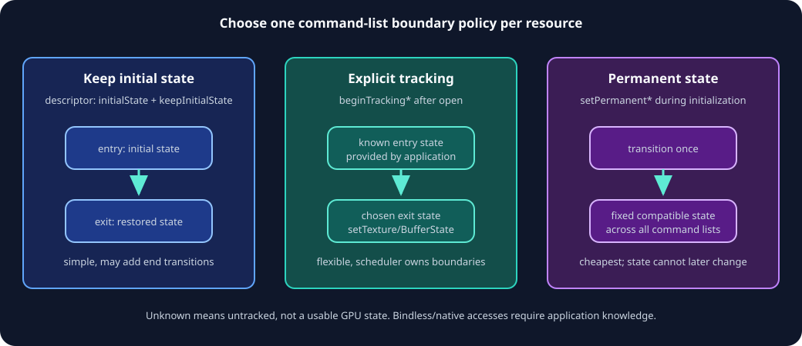

# State and Synchronization

[Previous](07-Ray-Tracing.md) · [Home](README.md) · Next: [Backends and interop](09-Backends-and-Interop.md)



## Three different problems

Do not conflate:

1. **Resource state:** how hardware may access memory (`RenderTarget`, `ShaderResource`, `CopyDest`, and so on).
2. **Memory ordering:** whether earlier UAV writes are visible before later dependent accesses.
3. **Execution synchronization:** whether one queue or the CPU waits for submitted GPU work.

A state transition can provide ordering in some cases, but a correct design reasons about all three.

## Resource states

Important `ResourceStates` values:

- `Common`;
- `ConstantBuffer`, `VertexBuffer`, `IndexBuffer`, `IndirectArgument`;
- pixel, non-pixel, or combined `ShaderResource`;
- `UnorderedAccess`;
- `RenderTarget`, `DepthWrite`, `DepthRead`;
- copy/resolve source and destination;
- `Present`;
- acceleration-structure read/write/build-input/build-BLAS;
- shading-rate surface;
- OMM build input/write; and
- cooperative-vector conversion input/output.

States are flags where the native API permits compatible combinations. Do not invent combinations without checking backend semantics.

## Why command-list boundaries need hints

Command lists can be recorded concurrently and submitted in a different order. While recording list B, NVRHI cannot know what final state list A will establish. Each resource therefore needs a predictable entry policy.

### Keep initial state

```cpp
desc.setInitialState(nvrhi::ResourceStates::ShaderResource)
    .setKeepInitialState(true);
```

Each command list assumes the resource enters in that state and transitions it back on close. Good for swap-chain images and resources with a natural stable boundary state. The restoration may be unnecessary overhead in tightly chained passes.

### Explicit begin tracking

```cpp
commandList->beginTrackingTextureState(
    texture, nvrhi::AllSubresources, knownEntryState);
```

Use after open and before first use. The pass scheduler must know the real state produced by prior submitted work. Textures can be tracked by subresource; buffers have one tracked state.

### Permanent state

```cpp
commandList->setPermanentBufferState(
    staticVertexBuffer, nvrhi::ResourceStates::VertexBuffer);
```

After the command list containing this operation is submitted, the resource is permanently fixed to that compatible state. This reduces tracking overhead for immutable textures, vertex/index buffers, and similar data.

The operation is global across command lists and only takes effect when its command list executes. If that list is discarded, the permanent state is abandoned. Do not permanently mark a resource that must later become copy destination or UAV.

## Automatic barriers

Automatic barriers are enabled on new command lists. Commands and binding types imply states:

- render-target attachment → `RenderTarget`;
- texture/buffer SRV → `ShaderResource`;
- UAV → `UnorderedAccess`;
- vertex/index buffer → corresponding state;
- write/copy destination → `CopyDest`;
- indirect arguments → `IndirectArgument`;
- AS binding/build → RT states.

NVRHI accumulates and emits required barriers before work. State structures make this efficient because all resources for a draw/dispatch arrive together.

Automatic tracking cannot see:

- resources reached through bindless descriptor indices;
- GPU addresses embedded in buffers;
- native commands recorded outside NVRHI;
- external API/device accesses; or
- application-level producer/consumer intent across queues.

Handle those explicitly.

## Manual barrier mode

```cpp
commandList->setEnableAutomaticBarriers(false);
commandList->setTextureState(texture, subresources,
                             nvrhi::ResourceStates::UnorderedAccess);
commandList->setBufferState(args, nvrhi::ResourceStates::IndirectArgument);
commandList->setAccelStructState(tlas, nvrhi::ResourceStates::AccelStructRead);
commandList->commitBarriers();
```

`setResourceStatesForBindingSet` and `setResourceStatesForFramebuffer` add convenience transitions. State setters append to a pending list; `commitBarriers` emits it.

The automatic-barrier enable flag persists when the command-list object is reopened. Make the intended mode explicit during command-list initialization.

## UAV barriers

NVRHI places UAV barriers between successive dependent-looking uses of the same tracked UAV. Disable them per texture/buffer only when operations provably do not depend on one another.

Manually add ordering with:

```cpp
nvrhi::utils::TextureUavBarrier(commandList, texture);
nvrhi::utils::BufferUavBarrier(commandList, buffer);
```

Typical need: repeated dispatches under the same `ComputeState` with only constants changed. No new state call means no natural automatic insertion point.

## Queue model

NVRHI exposes graphics, compute, and copy queues through `CommandQueue`. There is no separate public queue object. The backend receives native queues during device creation.

Create queue-specific command lists:

```cpp
auto computeList = device->createCommandList(
    nvrhi::CommandListParameters().setQueueType(nvrhi::CommandQueue::Compute));
```

Copy and compute queues support only command subsets legal for them. Check `Feature::ComputeQueue` and `Feature::CopyQueue`.

Submit to the matching queue:

```cpp
uint64_t instance = device->executeCommandList(
    computeList, nvrhi::CommandQueue::Compute);
```

The returned instance identifies that submission for inter-queue dependency.

## Inter-queue waits

```cpp
uint64_t producer = device->executeCommandList(
    computeList, nvrhi::CommandQueue::Compute);

device->queueWaitForCommandList(
    nvrhi::CommandQueue::Graphics, // waiting queue
    nvrhi::CommandQueue::Compute,  // producer queue
    producer);

device->executeCommandList(graphicsList, nvrhi::CommandQueue::Graphics);
```

Read the call as “make `waitQueue` wait for submission `instance` from `executionQueue`.”

Build an acyclic queue dependency graph. Circular waits deadlock. Batch work between waits; fine-grained cross-queue ping-pong usually costs more than it gains.

## CPU/GPU synchronization

### Event queries

```cpp
auto event = device->createEventQuery();
device->setEventQuery(event, nvrhi::CommandQueue::Graphics);

if (device->pollEventQuery(event)) { /* safe to consume */ }
device->waitEventQuery(event); // blocking
device->resetEventQuery(event);
```

Use polling for frame-buffered readback and resource retirement. Reset before reuse.

### Wait for idle

`waitForIdle()` waits for all queues. Use for shutdown, swap-chain recreation when simpler fencing is acceptable, or exceptional maintenance. Do not put it in the normal frame loop.

### Native present synchronization

Swap-chain acquire and present are native operations. Integrate native semaphores/fences with the queue that NVRHI submits to. The local Vulkan test backend shows binary-semaphore bridging. The local D3D12 smoke-test backend uses `waitForIdle()` before each present; use per-frame D3D12 fences instead in a production frame loop.

## Command-list lifetime trackers

On D3D12 and Vulkan, heavy multithreaded submission can use one `ICommandListLifetimeTracker` per submitting thread and queue:

```cpp
auto tracker = device->createCommandListLifetimeTracker(queue);
auto list = device->createCommandList(
    nvrhi::CommandListParameters()
        .setQueueType(queue)
        .setLifetimeTracker(tracker));
```

Call `tracker->runGarbageCollection()` frequently. This reduces contention on device-global tracking. DX11 does not support multithreaded work submission in this model.

The device-level `runGarbageCollection()` remains required for work tracked by the device.

## State handoff patterns

### Render-graph controlled

The graph computes entry and exit states for each pass. Each pass begins tracking known states and sets desired states. This avoids forced restoration while preserving parallel recording.

### Stable boundary

Every shared resource uses `keepInitialState`; independent command lists can be recorded with a common contract. Simpler but potentially more barriers.

### Permanent static data

Upload static assets, transition them once to combined compatible states where legal, mark permanent, and access from many command lists cheaply.

### Bindless

Keep descriptor-table resources in documented permanent/common states where possible. For mutable UAV resources, the scheduler explicitly tracks by resource identity even though NVRHI cannot infer descriptor-index usage.

## Synchronization checklist

- Every non-permanent resource has a known command-list entry state.
- `Unknown` is never used as an actual working state.
- Every dependent UAV sequence has an ordering point.
- Queue-specific lists contain only legal commands.
- Every producer/consumer queue edge has one correctly directed wait.
- Native acquire/present synchronization encloses NVRHI submission.
- CPU readback uses polling/frame latency instead of immediate blocking.
- `waitForIdle` is absent from the steady-state frame loop.
- Garbage collection runs frequently on each active tracker.
- Bindless, GPU-address, and native accesses are included in application-level tracking.

