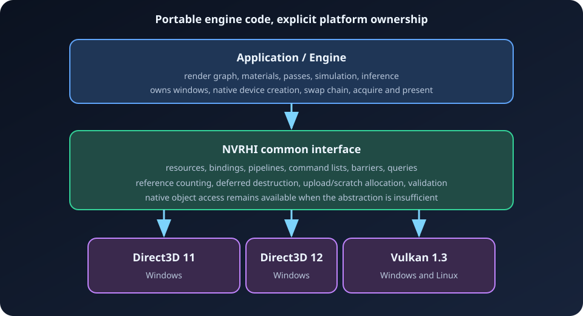

# NVRHI Wiki

This wiki explains the NVRHI revision vendored in this repository (public API header version **26**) from first device creation through advanced graphics, compute, ray-tracing, and neural-rendering features. It is written for C++ developers who know basic GPU concepts but do not yet know NVRHI.

> **Authority and scope:** API details in this wiki are based on [`ThirdParty/NVRHI/include/nvrhi`](../../ThirdParty/NVRHI/include/nvrhi) in this repository. The vendored [`ProgrammingGuide.md`](../../ThirdParty/NVRHI/doc/ProgrammingGuide.md) and [`Tutorial.md`](../../ThirdParty/NVRHI/doc/Tutorial.md) remain useful background, but do not cover every feature in header version 26.

## What NVRHI is

NVRHI (NVIDIA Rendering Hardware Interface) is a C++17 abstraction over:

- Direct3D 11 on Windows;
- Direct3D 12 on Windows; and
- Vulkan 1.3 on Windows and Linux.

It gives application rendering code one object model for resources, bindings, command recording, barriers, pipelines, queries, and GPU lifetime management. It deliberately does **not** create a window, native graphics device, or swap chain. The application owns those platform responsibilities and gives the resulting native objects to an NVRHI backend.



## Recommended learning path

1. [Getting started](01-Getting-Started.md) — build, create a backend device, wrap swap-chain images, and render a frame.
2. [Core concepts](02-Core-Concepts.md) — handles, descriptors, command lists, immutable state, and ownership.
3. [Resources and memory](03-Resources-and-Memory.md) — buffers, textures, heaps, uploads, readbacks, tiled resources, and formats.
4. [Bindings and shaders](04-Bindings-and-Shaders.md) — layouts, sets, descriptors, bindless access, constants, and shader portability.
5. [Graphics](05-Graphics.md) — input layouts, framebuffers, pipeline state, drawing, indirect drawing, mesh shaders, and VRS.
6. [Compute](06-Compute.md) — compute pipelines, UAV workflows, async compute, indirect dispatch, and cooperative vectors.
7. [Ray tracing](07-Ray-Tracing.md) — BLAS/TLAS, ray queries, RT pipelines, shader tables, OMM, spheres, LSS, and clusters.
8. [State and synchronization](08-State-and-Synchronization.md) — automatic/manual barriers, permanent states, queues, and CPU/GPU waits.
9. [Backends and native interop](09-Backends-and-Interop.md) — D3D11, D3D12, Vulkan, swap chains, and native handles.
10. [Debugging, performance, and practices](10-Debugging-Performance-Practices.md) — validation, profiling, markers, lifetime, and design rules.
11. [Feature and API reference](11-Feature-and-API-Reference.md) — capability queries, feature matrix, object inventory, and method map.
12. [Recipes](12-Recipes.md) — focused, copyable patterns for common graphics and compute tasks.

## Mental model in one minute

Most NVRHI work follows the same sequence:

1. The application creates a native device, queues, and swap chain.
2. A backend wraps the native device as `nvrhi::IDevice`.
3. The application creates resources and immutable descriptors:
   shaders, buffers, textures, binding layouts/sets, and pipelines.
4. A command list is opened.
5. The application uploads data, sets one complete pipeline state, and records draws or dispatches.
6. The command list is closed and submitted to a compatible queue.
7. NVRHI tracks referenced objects until GPU execution completes.
8. The application presents through the native API and calls
   `IDevice::runGarbageCollection()` at least once per frame.


## NVRHI's main abstractions

| Abstraction | Purpose |
|---|---|
| `IDevice` | Creates objects, submits command lists, queries capabilities, and performs queue/CPU synchronization. |
| `ICommandList` | Records copies, clears, barriers, draws, dispatches, acceleration-structure builds, queries, and markers. |
| Resource handles | Intrusive reference-counted ownership (`TextureHandle`, `BufferHandle`, and similar). |
| Descriptor structures | Value-like configuration objects such as `TextureDesc`, `GraphicsPipelineDesc`, and `BindingSetDesc`. |
| Binding layout | Declares the shader-visible resource interface. |
| Binding set | Supplies concrete resources matching one regular layout. |
| Descriptor table | Mutable, bindless resource array with manual lifetime and state responsibilities. |
| Pipeline | Immutable graphics, compute, meshlet, or ray-tracing configuration. |
| State structure | Dynamic command-time state: pipeline, bindings, targets, viewports, and indirect buffers. |
| Framebuffer | Immutable set of color, depth/stencil, and optional shading-rate attachments. |

## Responsibilities NVRHI does and does not take

NVRHI normally handles:

- intrusive object ownership and deferred GPU-safe destruction;
- command-list implementation details and reuse;
- upload-buffer and RT scratch-buffer suballocation;
- state caching;
- optional automatic resource-state transitions and UAV barriers;
- native view creation for binding sets;
- cross-API command and descriptor translation; and
- an API-level validation wrapper.

Your application still handles:

- native instance/adapter/device/queue creation;
- windows, surfaces, swap chains, acquire, present, and resize;
- shader compilation and binary selection (DXBC/DXIL/SPIR-V as appropriate);
- frame scheduling and high-level render dependencies;
- queue dependency design;
- descriptor-table synchronization and bindless resource lifetime;
- memory aliasing policy for virtual resources; and
- testing capability support before using optional features.

## Conventions used in this wiki

- **GAPI** means the underlying graphics API.
- **SRV/UAV/CBV** use Direct3D names because NVRHI exposes the same binding categories across all backends.
- Code examples omit application-specific error handling only where it would obscure the concept.
- Examples assume `nvrhi::DeviceHandle device` and a valid message callback.
- Optional features are always paired with the capability query that should guard them.
- A resource state is shown as `ResourceStates::X`; combinations use the enum's bit operators.

## Local working example

The repository's [`ArdaBackend`](../../Source/ArdaBackend) owns native device,
swap-chain, and presentation setup for both D3D12 and Vulkan. Its
[`ArdaBackend.h`](../../Source/ArdaBackend/Public/ArdaBackend.h) API exposes the
NVRHI device and a backend-independent presentation swap chain.

The [`NVRHITest`](../../Source/ArdaTests/NVRHITest) executable is the compact
GLFW/renderer integration test:

- [`ArdaGlfwWindow.cpp`](../../Source/ArdaTests/NVRHITest/Private/ArdaGlfwWindow.cpp) adapts a GLFW window to `ArdaBackend`;
- [`ArdaNVRHITestMain.cpp`](../../Source/ArdaTests/NVRHITest/ArdaNVRHITestMain.cpp) selects a backend and runs the swap-chain frame loop; and
- [`ArdaTriangleRenderer.cpp`](../../Source/ArdaTests/NVRHITest/Private/ArdaTriangleRenderer.cpp) contains backend-independent NVRHI rendering.

Build and run it before attempting advanced features:

```powershell
cmake -S . -B build
cmake --build build --config Debug
.\build\Source\ArdaTests\NVRHITest\Debug\NVRHITest.exe --backend d3d12
.\build\Source\ArdaTests\NVRHITest\Debug\NVRHITest.exe --backend vulkan
```

Use `--hidden --frames 1` for a one-frame smoke test.

